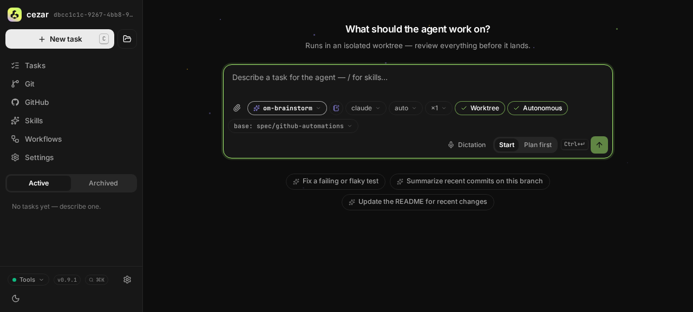
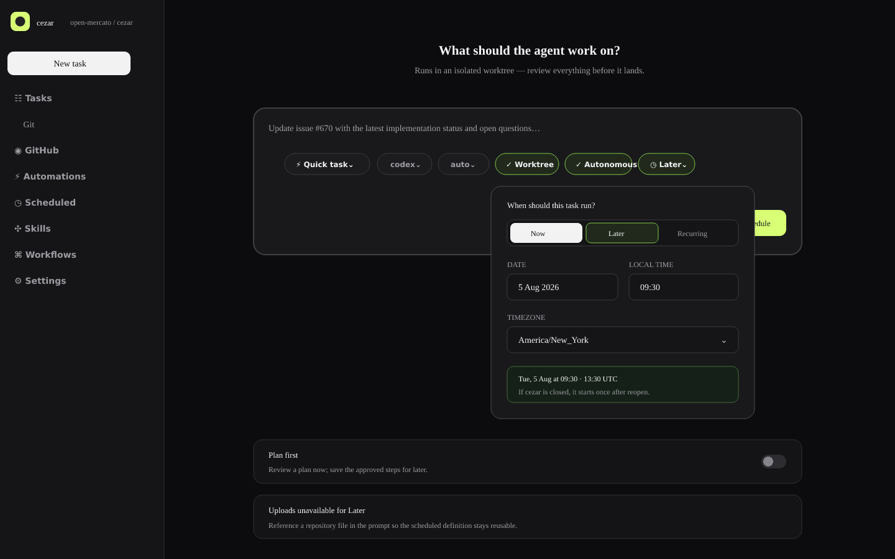
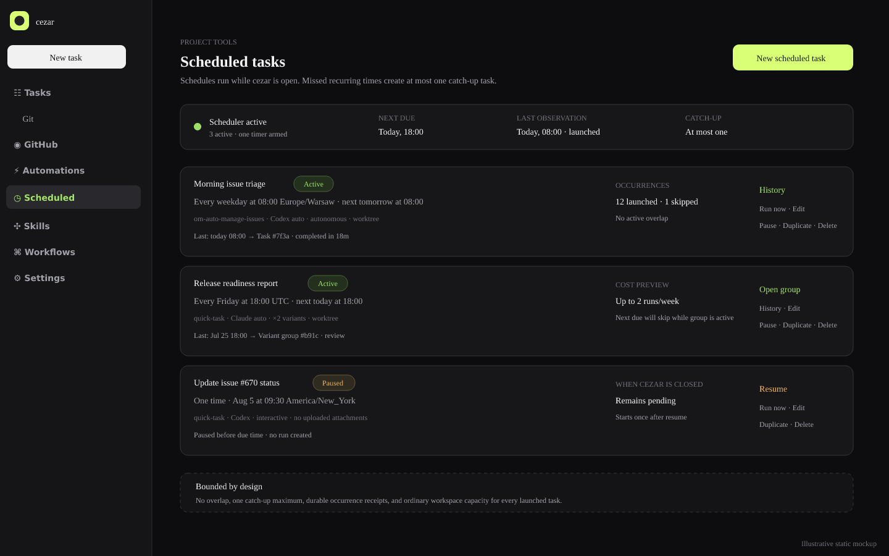

# Postponed Tasks

## TLDR

Let a user compose the same quick task, workflow, or planned inline chain as New task and choose **Later** instead of starting it immediately. Cezar persists one project-scoped scheduled-task definition; when its exact date/time becomes due, the running cezar server creates one ordinary run or variant group through the existing `RunManager` and workspace semaphore.

This specification is the complete one-time scheduling foundation: task-template serialization, optional local state, post-listen coordination, durable launch receipts, run provenance, New task timing controls, a Scheduled management page, and occurrence history. Recurrence is independently deployable and is specified separately in [`2026-08-01-recurring-tasks.md`](2026-08-01-recurring-tasks.md).

## Resolved assumptions (autonomous defaults)

| # | Question | Applied default | Why | Confirm? |
|---|----------|-----------------|-----|----------|
| Q1 | Should a postponed task run while cezar is closed? | No. It remains pending and launches once when the existing cezar server next opens. | An OS scheduler, daemon, or hosted service would violate local zero config and create another lifecycle to manage. | ok |
| Q2 | Should an overdue one-time task expire automatically? | No. It remains visibly overdue until launched, paused, rescheduled, or deleted. | Silently discarding explicitly postponed work is more surprising than one bounded late launch. | ok |
| Q3 | Should uploaded browser images be retained in a postponed definition? | No in version 1; the timing mode disables uploads and explains that repository files can be referenced in the prompt. | Reusable local attachment storage adds retention, privacy, and deletion semantics unrelated to timing. | ok |
| Q4 | Should the postponed definition expose all New task choices or only prompt plus workflow? | Reuse prompt, workflow/skill or reviewed inline plan, agent profile, runner, model, variants, worktree, autonomy, and follow-ups. | The user asked for the same task-building elements; using the existing serializer prevents a reduced parallel task model. | ok |
| Q5 | Should postponed and recurring timing ship under one specification? | No. Ship one-time postponement as the complete foundation and recurrence as a dependent specification. | Each capability works without the other; recurrence adds its own cadence, DST, catch-up, overlap, and repeated-cost contract. | ok |

## Problem Statement

New task can start work now, and monitoring sessions can revisit one already running conversation, but cezar cannot hold a new task until a chosen future time. Users fall back to calendar reminders, terminal `sleep`, OS cron, GitHub Actions, or a long-lived agent session. Those workarounds either require configuration outside cezar, waste a backend session, or lose the exact workflow/runner/worktree choices already available in the composer.

A postponed task is deliberately not a queued run. `queued` means the ordinary run exists and is waiting for workspace capacity. “Later” means no run exists yet, the definition is still editable/cancellable, and it should not participate in queue ordering or appear as an agent session.

## Goals

- Add a `Now`/`Later` timing choice to New task while preserving `Now` as the exact default.
- Persist one future date/time with an explicit IANA timezone and show the authoritative UTC instant before save.
- Reuse the existing prompt, task source, planned steps, agent profile, runner/model, variants, worktree, autonomy, and follow-up semantics.
- Create exactly one ordinary run/group when due, including after a server restart.
- Make reservation and launch crash-safe without creating duplicate work.
- Let users list, edit, pause/resume, run now, duplicate, delete, and inspect one-time definitions and their occurrence.
- Keep all state optional and boot-safe under missing, corrupt, read-only, or deleted files.

## Non-goals

- Recurring cadence, cron syntax, RRULE, weekday/monthly builders, DST recurrence calculation, missed-recurring catch-up, or per-schedule overlap policy; see the companion recurring spec.
- Running while cezar is stopped or installing OS/background schedulers.
- Arbitrary shell commands outside the selected workflow.
- Browser-uploaded reusable image attachments.
- Changing or cancelling an ordinary run after it has launched.
- Injecting timing through the protected `/new` bookmarklet/deep-link contract; bookmarklets remain immediate-only.

## Proposed Solution

Add `Later` as an orthogonal clock pill in the existing New task composer. Saving creates a `ScheduledTaskDefinition` whose version-1 timing discriminant is `{kind: 'once', at, timezone}` and whose task payload is derived from the canonical New task body minus browser-only images and inbox provenance.

A lightweight workspace coordinator starts only after the server listens. It discovers registered projects with enabled pending definitions, arms one timer for the earliest due instant, reserves one durable occurrence under a cross-process lease, and launches through ordinary `RunManager.startRun`/`startVariants`. A receipt plus optional additive run provenance reconciles a crash on either side of run creation.

The generic `Scheduled` route and storage names are intentional: the companion recurrence spec adds a new timing union member and calculation policy without replacing the one-time API or state.

## User Experience

### New task: Later

Add a clock pill to the composer’s existing picker row:

- `Now` keeps current behavior, submit copy, shortcuts, and API call unchanged.
- `Later` opens date, local time, and timezone fields plus an exact preview such as `Tue, 5 Aug 2026 at 09:30 America/New_York (13:30 UTC)`.

When Later is selected:

- the primary action becomes `Schedule task`;
- the composer preserves project, source, runner/model/profile, variants, worktree, autonomy, and follow-ups;
- attachments are disabled with an inline explanation;
- Plan first still runs the planner immediately, and approving the edited plan saves its inline steps into the definition instead of launching;
- successful save navigates to `/p/:projectId/scheduled/:scheduledTaskId`.

Current composer reused by the design:



Proposed Later timing controls:



### Scheduled management surface

Add `Scheduled` with a clock icon below `Automations` and above `Skills`. Before recurrence lands, the page lists only one-time definitions with:

- `Pending`, `Overdue`, `Paused`, `Launching`, `Completed`, or `Error` text status;
- exact local due time, timezone, and UTC instant;
- task source/agent/variants/worktree/autonomy summary;
- latest receipt and linked run/group;
- `Run now`, `Pause`/`Resume`, `Edit`, `Duplicate`, `History`, and confirmed `Delete`.

The header states: `Postponed tasks run while cezar is open. If cezar is closed at the due time, the task remains pending and starts once after reopen.`

The shared proposed Scheduled surface is shown in the companion visual set; the paused one-time row demonstrates this specification’s state:



Accessibility follows current controls: labelled date/time fields and timezone combobox, keyboard-operable timing radio, visible focus, status text beyond color, `aria-live` preview errors, responsive stacking, and `<time dateTime>` for exact instants.

## Architecture

### Additive task template

Do not migrate GitHub Automations as part of this slice. Follow its established schema direction additively:

- `packages/contract/src/scheduled-tasks.ts` derives `scheduledTaskTemplateSchema` from `createRunInputBaseSchema`, omitting `task`, `images`, and `todoId`, then adding `prompt`.
- `packages/web/src/routes/new-task-form.ts` adds `buildScheduledTaskTemplate` beside `buildAutomationTask`; both consume `buildCreateRunBody`, so task choice semantics have one source without changing existing automation exports.
- `packages/cezar/src/scheduled-tasks/task-template.ts` validates the postponed template and maps it into current workflow loading plus `RunManager`. It does not absorb GitHub placeholders or untrusted-event context.

This limits blast radius while leaving an obvious source-neutral extraction for a later refactor when a third caller needs it.

### Modules

- `packages/cezar/src/scheduled-tasks/types.ts` — storage schemas/inferred types for definitions, runtime state, and occurrence receipts.
- `packages/cezar/src/scheduled-tasks/store.ts` — optional project-local files, per-entry salvage, atomic writes, append-only occurrences, compaction, lease, and change notifications.
- `packages/cezar/src/scheduled-tasks/scheduler.ts` — one workspace coordinator plus project launch adapter, with injected clock/timer dependencies.
- `packages/cezar/src/scheduled-tasks/task-template.ts` — catalog resolution and ordinary single/variant launch.
- `packages/contract/src/scheduled-tasks.ts` — exact request/response wire schemas.
- `packages/web/src/routes/scheduled-tasks/` — timing controls, list/detail/editor/history states.

The coordinator is demand-independent and must not use the WebSocket topic bus. It publishes an additive `scheduled-task-change` event on the existing workspace SSE stream with project id, schedule id, revision, and optional occurrence id; only the Scheduled view subscribes/refetches at its lifetime.

### Lifecycle and exactly-one intent

1. Server listens, then the workspace coordinator scans registered non-missing roots for the optional definitions file without instantiating unrelated full project contexts.
2. With no enabled pending definition it owns no timer.
3. Otherwise it arms one unref’d timer for the earliest `at` across projects. Definition/registry changes recompute it. Each arm caps its delay below Node’s `2^31-1` millisecond timer limit; when that horizon wakes before the real due instant, the coordinator re-reads definitions and arms the next bounded segment instead of treating the task as due.
4. At or after due time, acquire `.ai/cezar/scheduled-task.lock` with PID/start-time stale recovery and re-read the definition.
5. Append one `reserved` occurrence with key `${scheduledTaskId}:${revision}:${at}`.
6. Launch through a scheduled-run creation option on `RunManager` that includes occurrence provenance in every run record at construction time. Persist and synchronously flush the single run or complete variant group before any manager pump can start an agent; normal workspace/per-project capacity may then leave the durable run queued.
7. Finalize the occurrence with run/group id, set runtime status `completed`, publish one change event, and rearm.
8. Shutdown clears timers and leaves any unresolved reservation for startup reconciliation; no other process remains.

The project lease is also the serialization boundary for every definition or runtime-state mutation: create, edit, pause, resume, run-now, retry, and delete acquire it, re-read the latest files while held, apply `expectedRevision` to that refreshed definition, merge the mutation, and atomically rename. Lock contention returns a bounded busy/409 response rather than writing unlocked. Atomic rename prevents torn files; the lease plus re-read prevents two cezar processes from losing each other’s successful changes.

Run/group records gain optional additive provenance:

```ts
scheduledTask?: {
  scheduledTaskId: string
  revision: number
  occurrenceId: string
  scheduledFor: string
  trigger: 'scheduled' | 'manual'
}
```

Startup reconciliation handles the crash window:

- reserved receipt plus matching run provenance → finalize without relaunch;
- reserved receipt with no run → mark `launch-error` and offer explicit retry of that same occurrence;
- a definition becomes completed only after the matching run is durably visible.

The launch adapter must never patch `scheduledTask` provenance onto a run after `startRun` returns: the current manager can pump immediately and `RunStore` normally debounces `runs.json`. The scheduled creation option carries provenance into `createRun`, builds every variant record before enqueue, calls the run store’s synchronous flush, and only then makes the jobs pumpable. Receipt finalization occurs after that flush. This closes the crash window in which paid agent work exists but reconciliation cannot find its occurrence id.

Editing increments `revision`; an already reserved/launched occurrence is immutable. `Run now` consumes the pending one-time definition: it reserves a manual occurrence, launches once, and marks the definition completed so the original time cannot launch later.

## Data Model

### `scheduled-tasks.json`

```ts
type ScheduledTaskDefinition = {
  id: string
  revision: number
  name: string
  description?: string
  enabled: boolean
  timing: { kind: 'once'; at: string; timezone: string }
  task: ScheduledTaskTemplate
  createdAt: string
  updatedAt: string
}
```

The file is `{version: 1, scheduledTasks: [], tombstones?: {}}`. Objects use `.passthrough()`; the loader salvages definitions entry by entry; unknown keys survive read-modify-write. Writes are re-read/merge-writes under the shared project lease, then use atomic temporary-file rename and `0600` where supported. A one-time `at` must be at least one minute in the future on create or when timing changes; metadata/task edits to an already-overdue definition remain possible without silently moving its instant. Server validation confirms `timezone` is an IANA identifier and that formatting `at` in that zone matches the submitted local choice.

### `scheduled-task-state.json`

Optional state per id: `revision`, `status`, `nextDueAt`, `lastOccurrenceId`, `lastRunId`, `lastObservedAt`, and `consecutiveFailures`. The cached due instant is validated against the current definition on boot; stale/corrupt cache is repaired, never trusted.

### `scheduled-task-occurrences.ndjson`

Append-only latest-state rows contain sequence, occurrence id/key, definition id/revision, scheduled/observed timestamps, trigger, status, reason, run/group id, and updated timestamp. They never store prompt/system-prompt text or credentials. Compact under the lease beyond 20,000 lines, retaining all unresolved rows plus the latest 10,000 terminal occurrences.

Add all filenames, temp variants, log, and lock to `ensureDataGitignore`.

## API Contracts

Define zod schemas first in `packages/contract`, infer all types, register one chained project-scoped route family, and validate JSON/params/query through middleware. Mount only under `/api/v1` with boot-project and `/api/v1/p/:projectId` parity.

- `GET /api/v1/scheduled-tasks` → coordinator state plus bounded definitions/state/latest occurrence/counts.
- `POST /api/v1/scheduled-tasks` → `201 {scheduledTask}` for timing kind `once`.
- `GET /api/v1/scheduled-tasks/:id` → definition, state, and latest occurrence.
- `PUT /api/v1/scheduled-tasks/:id` with `expectedRevision` → updated definition or 409.
- `DELETE /api/v1/scheduled-tasks/:id` → 204; already launched runs remain.
- `POST /api/v1/scheduled-tasks/:id/pause` and `/resume` → updated state; resuming an overdue definition makes it immediately due.
- `POST /api/v1/scheduled-tasks/:id/run-now` → `202 {occurrenceId}` and consumes the one-time definition.
- `POST /api/v1/scheduled-tasks/preview` → normalized local/UTC preview and warnings.
- `GET /api/v1/scheduled-task-occurrences?scheduledTaskId=&status=&cursor=&limit=` → maximum 100 rows.
- `POST /api/v1/scheduled-task-occurrences/:occurrenceId/retry` → 202 only for unresolved launch-error with no reconciled run.

## Failure Modes

| Failure | User-visible behavior |
|---|---|
| Server closed at due time | Definition stays overdue and launches once after next server start. |
| Workspace full | The created ordinary run is queued; the definition is completed because its one launch exists. |
| Crash before/after run creation | Receipt/provenance reconciliation finalizes or exposes one retry; never silently duplicates. |
| Workflow/skill/profile/runner/model missing at due time | Configuration-error occurrence; launch nothing; keep definition overdue and editable. |
| Invalid timezone after environment change | Mark only that definition error and require reschedule; boot continues. |
| Definitions/state corrupt | Salvage good entries, retain source file, warn once, and show affected state unavailable. |
| Project read-only | List readable definitions; disable mutations/launch with exact local-write error. |
| Compaction fails | Preserve data, warn once, and pause further scheduled launches before unbounded growth. |

## Compatibility and Rollback

- Immediate New task, `POST /api/v1/runs`, `/new` deep links/bookmarklets, workflow YAML, and skill Markdown remain unchanged.
- `RunRecord.scheduledTask` is additive/optional; old run files and clients parse unchanged.
- GitHub Automation schemas/serialization are not migrated in this spec.
- New API schemas live in `packages/contract`; routes use chained builders/middleware and are added to compatibility and route inventories.
- New local files follow `.passthrough()`, optional/additive, atomic, salvageable persistence rules.
- No new `CEZ_*` variable or required config.
- Rollback stops the coordinator and ignores optional files/provenance; already launched runs remain ordinary runs.

## Testing Strategy

- Storage tests: missing/corrupt/read-only state, per-entry salvage, unknown-key preservation, atomic writes, tombstones, compaction, receipt uniqueness, concurrent unrelated creates, and stale/conflicting cross-process edits under the shared lease.
- Fake-clock scheduler tests: exact/late/early timer, due instants beyond Node’s maximum timer delay, server restart overdue launch, timer rearm after edits/registry changes, cross-process lease, stale recovery, Run now consumption, pause/resume, shutdown, and crash reconciliation.
- Durable-launch tests: crash after reservation, during single/group record creation, after the synchronous run-store flush, and before receipt finalization; no agent starts before flushed provenance and retry never duplicates an existing occurrence.
- Task-template equality tests: scheduled serialization matches New task for workflow/skill/inline steps, profile, runner/model, variants, worktree, autonomy, and follow-ups while excluding images/todo id.
- Server tests: middleware validation, 400/404/409 shapes, optimistic revision, origin guard, project disposal, versioned surface, route aliases/parity, contract parity in both directions, and typed bodies.
- React tests: Now unchanged, Later draft/save/error states, timezone preview, Plan first save, attachment explanation, overdue/completed/history states, keyboard/accessibility, and responsive layout.
- Real browser: create postponed quick task, edit/pause/resume, restart after due, observe exactly one ordinary run, verify receipt/run links, create planned/variant definition, Run now, and delete without deleting runs.

## Phasing

### Phase 1 — Complete one-time vertical slice

Ship the task template, optional state, exact APIs, post-listen timer/lease/receipt/reconciliation, ordinary launch, New task Later control, Scheduled list/detail/history, and focused tests together. The capability is user-complete at phase end: a postponed task created in the cockpit launches exactly once and is auditable.

### Phase 2 — Hardening and release evidence

Add compaction/tombstone scale fixtures, multi-process and read-only/corruption matrices, packaging/docs, accessibility sweep, and the full real-browser restart/crash journey. The working phase-1 capability remains available throughout.

## Implementation Plan

1. Add scheduled-task storage and wire schemas plus compatibility fixtures; keep the accepted timing union to `kind: 'once'`.
2. Add `buildScheduledTaskTemplate` and server catalog-resolution/launch helpers with parity tests against New task serialization, without modifying GitHub Automations.
3. Add definitions/state/occurrence store, lease-serialized re-read/merge-writes, per-entry salvage, receipt primitives, compaction, cross-process lost-update tests, and `ensureDataGitignore` entries.
4. Add the chained versioned route family and exact middleware validation, typed-body, contract-parity, route-parity, and compatibility-inventory tests.
5. Add the post-listen workspace coordinator, bounded earliest timer segments, lightweight project discovery, rescheduling, stale lease recovery, and clean shutdown under fake clocks.
6. Add ordinary single/variant launch with provenance at record construction and a pre-pump synchronous flush, one-time completion, startup reconciliation, Run now, and retry behavior.
7. Add the composer clock pill/Later form, authoritative preview, Plan first schedule-save path, attachment guard, and unchanged-Now regression tests.
8. Add Scheduled navigation/list/detail/editor/history, SSE invalidation, run/group links, all degradation states, and accessibility/responsive tests.
9. Run the configured validation gate and browser restart/crash journey; capture evidence and update user-facing docs.

## Risks & Impact Review

- **High duplicate-launch risk:** mitigate with pre-launch durable receipt, immutable occurrence key, run provenance, lease, and startup reconciliation.
- **Medium shared-composer risk:** mitigate with one canonical `buildCreateRunBody`, additive scheduled serializer, and unchanged-Now/deep-link tests.
- **Medium persistence/concurrency risk:** mitigate with project-local optional state, atomic writes, `.passthrough()`, per-entry salvage, and cross-process lease.
- **Medium cost risk:** one explicit definition creates at most one run/group; review shows variant multiplier before save and workspace capacity stays authoritative.
- **Low rollback risk:** optional state/provenance can be ignored and no existing route/file format narrows.

## Alternatives Considered

- **Create a queued run immediately:** conflates waiting for time with waiting for capacity, exposes an agent run before it exists operationally, and makes edits/cancellation mutate protected run state.
- **Calendar/OS scheduler integration:** runs while closed but adds platform-specific configuration and another lifecycle.
- **Long monitoring session:** consumes a backend session and ties independent future work to one conversation.
- **Bundle recurrence now:** shares implementation primitives but fails the independently deployable-capability test; the linked recurring spec builds on this complete foundation.
