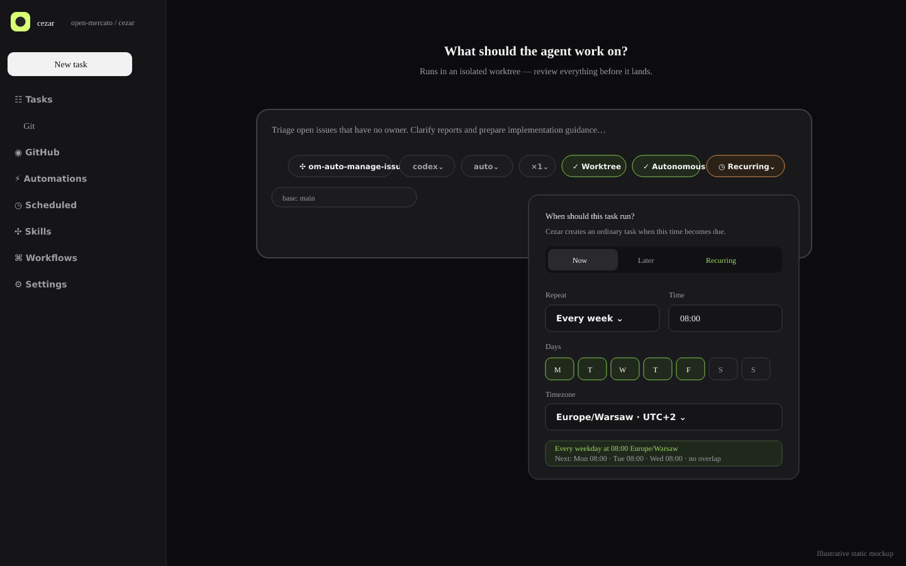
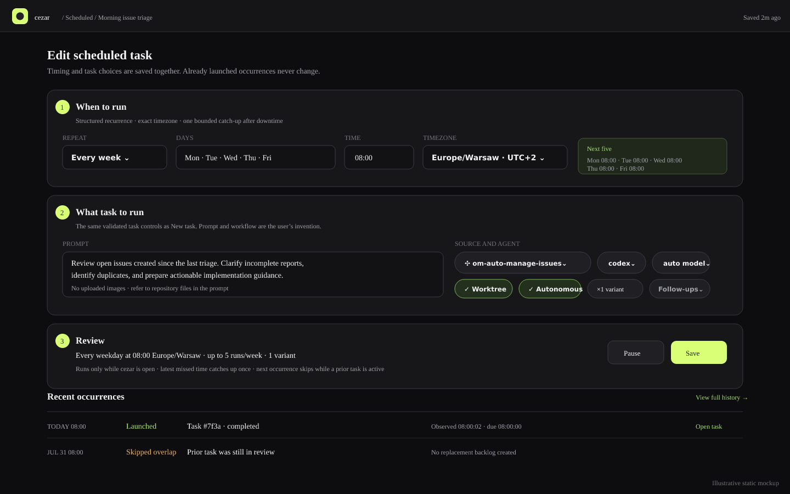

# Recurring Scheduled Tasks

## TLDR

Extend the project-scoped postponed-task foundation with recurring schedules such as “every weekday at 08:00.” Recurring tasks reuse the same New task composer controls, durable launch receipts, ordinary `RunManager` path, and workspace semaphore, so users define maintenance work entirely through the prompt and selected workflow.

Schedules are explicit, local, and cost-bearing. They run only while the existing cezar server is open, never require another daemon or config file, create at most one catch-up occurrence after downtime, and never overlap occurrences from the same schedule. A structured recurrence builder and exact next-run preview provide cron-like power without asking users to author cron expressions.

## Resolved assumptions (autonomous defaults)

| # | Question | Applied default | Why | Confirm? |
|---|----------|-----------------|-----|----------|
| Q1 | Should schedules run while cezar is closed, or only while the existing local server is running? | Run only while the existing cezar server is running. | A second daemon, OS cron entry, or hosted scheduler would violate cezar’s local zero-config contract and create a process the user must manage. | ok |
| Q2 | When cezar restarts after several recurring occurrences were missed, should it launch every missed occurrence, one catch-up run, or skip to the next future time? | Launch at most one catch-up occurrence for the latest missed time, then advance to the next future time. | This preserves intended maintenance without creating a surprise burst of expensive agent runs. | ok |
| Q3 | If the prior occurrence is still active when the next one is due, should the schedule allow overlap, queue one replacement occurrence, or skip the new occurrence? | Skip the new occurrence, record why, and calculate the next future occurrence. | The workspace queue already handles global capacity; a per-schedule backlog would grow without bound when a task runs longer than its cadence. | ok |
| Q4 | Should the first release expose raw cron syntax, a structured recurrence builder, or both? | Expose only a structured builder with human-readable summaries and a preview of the next five instants. | It covers common maintenance schedules, validates combinations before save, and can define DST behavior without leaking cron dialect differences into the persisted contract. | ok |
| Q5 | Should postponed one-time tasks and recurring tasks be one cohesive feature or separate specifications? | Split them into independently deployable specs; this spec depends on the postponed-task foundation. | One-time deferral is a useful vertical slice by itself. Recurrence adds materially different catch-up, overlap, timezone, cost, and history semantics. | ok |

## Problem Statement

After the postponed-task foundation exists, cezar can launch a saved task now or once in the future, but teams still cannot use that familiar task definition for recurring local maintenance such as:

- triaging new issues every morning;
- reviewing stale pull requests each weekday;
- updating a specific issue’s status on a weekly cadence;
- drafting a changelog or dependency-health report before a release;

The workaround is an operating-system scheduler, GitHub Actions, or a long-lived monitoring agent. Those options either add configuration outside cezar, require a remotely hosted runner, couple timing to a particular backend session, or waste an agent slot while waiting. The requested capability is simpler: extend a postponed task’s timing rule to recurrence and create an ordinary cezar task whenever that rule becomes due.

## Goals

- Add `Recurring` alongside the existing `Now` and `Later` timing choices without changing either existing behavior.
- Let a recurring definition reuse the postponed-task foundation’s task template, editor, coordinator, receipt, launch, provenance, API, and history contracts.
- Make common recurrence patterns friendly: every N minutes/hours/days/weeks/months, specific weekdays, monthly day, local time, and IANA timezone.
- Show a plain-language summary and the next five exact run instants before save.
- Create every due occurrence through the ordinary run/group path so workspace/per-project concurrency, worktrees, run persistence, review gates, and provider degradation remain authoritative.
- Bound downtime recovery and overlap so enabling a schedule cannot create an unbounded model-cost backlog.
- Make every occurrence auditable and link it bidirectionally to the run or variant group it created.
- Degrade quietly when state is missing, corrupt, read-only, or the selected workflow/skill/runner is no longer available.

## Non-goals

- Running while cezar is stopped, installing OS cron/launchd/systemd jobs, another daemon, or a hosted scheduling service.
- Raw cron text, arbitrary JavaScript expressions, calendar RRULE import/export, or natural-language schedule parsing in the first release.
- Event-driven GitHub filters; those remain the separate GitHub Automations capability.
- Scheduling arbitrary shell commands outside a workflow check step.
- Replaying every missed recurring occurrence or guaranteeing an exact wall-clock start. A due occurrence first enters cezar’s normal task scheduler and may wait for capacity.
- Per-schedule concurrency modes such as allow/replace. Version 1 uses one fixed, safe no-overlap policy.
- One-time postponed execution; it is specified in [Postponed Tasks](2026-08-01-postponed-tasks.md) and is a prerequisite for this work.
- Reusable browser-uploaded image attachments. Recurring timing retains the foundation’s attachment restriction; prompts may refer to repository files instead.
- Editing, cancelling, or otherwise changing an ordinary run after an occurrence has launched.

## Market and Prior-Art Review

GitHub Actions validates the five-field schedule model, explicit IANA timezone, five-minute minimum, and showing users that a requested time is not a guaranteed start time. GitHub also documents that scheduled runs can be delayed or dropped under load, which supports cezar presenting “due at” separately from “started at” rather than promising exact execution ([GitHub workflow schedule syntax](https://docs.github.com/en/actions/reference/workflows-and-actions/workflow-syntax#onschedule), [scheduled-event caveats](https://docs.github.com/en/actions/reference/workflows-and-actions/events-that-trigger-workflows#schedule)). Cezar can improve on the authoring experience by storing a structured rule and rendering its cron-like meaning rather than exposing raw POSIX syntax.

Kubernetes CronJobs surface the two failure policies this feature must make explicit: missed-start handling and concurrency handling. They also warn that scheduler creation is approximate and consumers should be idempotent. Cezar adopts the safe subset—one bounded catch-up and no overlap—without carrying `Allow`, `Replace`, or a hundred-entry missed-run scan into a local agent product ([Kubernetes CronJob behavior](https://kubernetes.io/docs/concepts/workloads/controllers/cron-jobs/)).

The existing GitHub Automations implementation is the closest repository-native precedent: optional project-local definitions, post-listen background coordination, cross-process lease/receipts, ordinary task launch, global SSE invalidation, and a durable log. Scheduled tasks reuse those contracts and extracted primitives, but remain a separate source because no GitHub capability, polling, rate-limit, cursor, or untrusted event payload is involved.

## Proposed Solution

Extend the scheduled-task definitions in [Postponed Tasks](2026-08-01-postponed-tasks.md) with a `recurring` timing discriminant. The existing lightweight workspace coordinator continues to start only after the HTTP server listens; it calculates recurring due instants, bounds catch-up after downtime, prevents per-definition overlap, and writes a durable occurrence receipt before launching an ordinary run.

The New task composer keeps `Now` as its default and the postponed feature’s `Later` choice. This spec adds `Recurring` to the same clock pill. The Scheduled tasks page adds recurring summaries, upcoming instants, pause/resume, run-now, edit, duplicate, delete, and occurrence history.

This is not an extension of the GitHub Automations source filter. It is an extension of the postponed-task scheduler and task-template infrastructure:

```text
postponed-task foundation ── recurring timing calculator
                                      │
workspace schedule coordinator ── recurring occurrence receipt
                                      │
                    ordinary RunManager.startRun/startVariants
```

## User Experience

### New task timing

Extend the postponed-task clock pill with a third choice:

- **Recurring** — structured frequency controls, local time, timezone, and next-five preview.

Selecting Recurring:

- leaves prompt, project, workflow/skill, runner, model, profile, variants, worktree, autonomy, follow-ups, and Plan first available;
- changes the submit label and accessible name from `Start task` to `Schedule task`;
- disables browser image attachments with “Scheduled tasks cannot retain uploaded images; refer to a repository file instead”;
- keeps the draft until the schedule save succeeds;
- navigates to the new definition’s detail page rather than an as-yet nonexistent run.

In Plan first mode, planning and review still happen immediately. Confirming the reviewed inline plan saves it into the scheduled task template instead of launching it. There is no unattended planning at occurrence time.

Current composer reused by this design:


Proposed timing popover:



### Recurrence builder

The builder offers these version-1 patterns:

- every N minutes, minimum 15 and maximum 1,440;
- every N hours, minimum 1 and maximum 168;
- every N days, minimum 1 and maximum 365, at a chosen `HH:mm`;
- every N weeks, minimum 1 and maximum 260, on one or more weekdays at `HH:mm`;
- every N months, minimum 1 and maximum 120, on day 1–28 at `HH:mm`.

Day 29–31 and “last weekday” are excluded in version 1 because silent month skipping is surprising. The UI can add those later as new discriminants without changing existing definitions.

Timezone defaults from `Intl.DateTimeFormat().resolvedOptions().timeZone` in the browser and is always stored as an explicit IANA identifier. UTC is the fallback when browser resolution or server validation fails. The editor shows both the zone name and current offset, but the zone—not a fixed offset—is authoritative.

For daylight-saving transitions:

- a nonexistent local time advances to the first valid instant after the gap;
- an ambiguous repeated local time runs once at the earlier occurrence;
- the next-five preview uses the same server calculator as execution, so the UI never invents different semantics.

The summary is generated from validated fields, for example: `Every weekday at 08:00 Europe/Warsaw · next: Mon 08:00`. It is not reparsed as input.

### Scheduled tasks page

Add `Scheduled` with a clock icon in the project sidebar below `Automations` and above `Skills`. The page lives at `/p/:projectId/scheduled` with new/edit/detail/history routes.

Each recurring definition row shows:

- name and `Active`, `Paused`, or `Error` status text;
- human schedule summary and explicit timezone;
- next due time, last due/start result, and current linked run when one exists;
- task source, runner/model, variants, worktree, and autonomy summary;
- `Run now`, `Pause`/`Resume`, `Edit`, `Duplicate`, `History`, and destructive `Delete` behind confirmation.

The page header states: `Schedules run while cezar is open. Missed recurring times create at most one catch-up task.` A status strip reports coordinator state, earliest due time, and any read-only/corrupt-state degradation.


### Create/edit and history

The full editor groups `When to run`, `What task to run`, and `Review` while reusing the actual composer controls rather than reproducing them with independently managed inputs. The Review section shows cost-relevant facts: cadence, maximum runs per day, catch-up/no-overlap rules, variants, and autonomy.

Occurrence history shows scheduled time, observed time, result (`launched`, `skipped-overlap`, `catch-up`, `configuration-error`, `launch-error`), reason, and linked run/group. `Run now` creates a manual occurrence with its own immutable key and does not move the normal recurrence.



Accessibility follows existing cockpit conventions: fieldsets and native date/time semantics, keyboard-operable radio groups and weekday toggles, status text in addition to color, visible focus, responsive stacked sections, `aria-live` for next-run preview errors, and `<time dateTime>` for every exact instant.

## Architecture

### Foundation dependency

This spec consumes the source-neutral reusable task template, scheduled-task store, coordinator, occurrence receipts, provenance, project-scoped route family, and composer timing controls delivered by [Postponed Tasks](2026-08-01-postponed-tasks.md). It does not migrate or widen GitHub Automations. If implementation discovers a missing generic seam, add it behind the postponed-task contract and prove existing GitHub Automation wire parity rather than coupling recurrence to GitHub-specific types.

No public existing API narrows. The protected `POST /api/v1/runs`, workflow YAML, GitHub Automation contracts, and New task deep-link contracts remain unchanged.

### New modules and ownership

- `packages/cezar/src/scheduled-tasks/types.ts` — add recurring cadence schemas and inferred types to the foundation’s definition model.
- `packages/cezar/src/scheduled-tasks/calculator.ts` — pure timezone-aware next/previous occurrence calculations and next-five preview. It owns DST semantics and receives a clock in tests.
- `packages/cezar/src/scheduled-tasks/scheduler.ts` — extend the project scheduler to apply recurring catch-up/no-overlap rules while retaining one workspace coordinator and earliest-due timer.
- `packages/cezar/src/server/server.ts` — extend the existing chained project route family through contract-first schemas and middleware validation.
- `packages/web/src/routes/scheduled-tasks/` — add recurrence builder, preview, summaries, cost review, and recurring history states.

The scheduler is demand-independent because tasks must become due while no browser is open. It must not use the demand-driven WebSocket bus. The existing workspace SSE stream gains an additive `scheduled-task-change` event containing only project id, schedule id, revision, and optional occurrence id; the project view subscribes at its own lifetime and invalidates bounded queries.

### Lifecycle

1. The HTTP server begins listening.
2. A workspace coordinator scans registered, non-missing project roots for the optional definitions file without constructing unrelated full `ProjectContext`s.
3. If no enabled pending definition exists, it owns no timer and performs no work.
4. Otherwise it computes the earliest due instant across projects and arms one unref’d timer. Each arm is capped below Node’s `2^31-1` millisecond delay limit; a horizon wake re-reads and recomputes rather than observing an occurrence early. Definition writes, project registry changes, manual runs, and occurrence completion recompute it.
5. At due time, acquire a project-local `.ai/cezar/scheduled-task.lock` using create-exclusive semantics with PID/start-time metadata and stale recovery.
6. Re-read definitions under the lease, calculate every definition now due, and reduce each recurring definition to at most its latest missed occurrence.
7. Skip and record an occurrence when the same schedule has a queued/running/waiting run (monitoring is `status: 'running'` with monitoring activity), an unresolved reserved receipt, or a run parked at the `review` gate. `review` is engine-terminal—the agent is done—but deliberately remains a schedule-level block until the user accepts/closes it, preventing a new autonomous occurrence while prior changes still await disposition. Other terminal prior runs do not block.
8. Append a durable `reserved` occurrence receipt keyed by schedule id, definition revision, and scheduled time.
9. Launch through `RunManager.startRun` or `startVariants`; the ordinary workspace semaphore decides when execution actually starts.
10. Finalize the receipt with run/group id and update runtime state/next due.
11. Publish one `scheduled-task-change`, release the lease, and arm the next earliest timer.
12. On shutdown, clear timers and await only the bounded in-flight launch reservation; never leave another process or daemon.

Create, edit, pause, resume, run-now, retry, delete, and scheduler state updates all use the foundation’s same project lease. Each operation re-reads definitions/state while holding the lease, applies optimistic revision checks to that refreshed value, and atomically merge-writes before release. A process that cannot acquire the lease returns a bounded busy/409 response; it never writes from a stale in-memory snapshot.

### Occurrence identity and reconciliation

Scheduled execution is at-least-once intent with durable deduplication:

```text
occurrenceKey = `${scheduledTaskId}:${revision}:${scheduledFor}`
manualKey     = `${scheduledTaskId}:${revision}:manual:${uuid}`
```

The receipt is written before run creation. Every launched run carries optional additive provenance at record construction time:

```ts
scheduledTask?: {
  scheduledTaskId: string
  revision: number
  occurrenceId: string
  scheduledFor: string
  trigger: 'scheduled' | 'catch-up' | 'manual'
}
```

Variant occurrences share one receipt/group id and each run receives the same occurrence provenance. Startup reconciliation scans unresolved reservations against bounded run provenance:

- matching run/group exists → finalize without relaunch;
- no run exists → mark `launch-error`; a user may retry that same occurrence explicitly;

Scheduled creation uses the foundation’s `RunManager` option that constructs every single/group record with provenance, synchronously flushes `runs.json`, and only then enqueues or pumps the jobs. Callers never attach provenance after `startRun` returns. Receipt finalization follows that durable flush, so a crash cannot leave an already-started agent invisible to reconciliation.

Editing a definition increments `revision`; already reserved/launched occurrences keep their old revision and are never reinterpreted. Editing timing recomputes future due times from the edit instant. Pausing prevents new due observations but never cancels an ordinary run. Resuming calculates one bounded catch-up using the same policy as server restart.

### No-overlap semantics

No-overlap is scoped to a scheduled definition, not the whole project. A prior occurrence blocks while any run in its group is engine-active (`queued`, `running`, or `waiting`; monitoring is running activity) or parked at `review`. The review gate is the intentional exception to engine terminality: it blocks until the user accepts/closes the reviewed run because its changes remain unresolved. At the next due time the scheduler records `skipped-overlap`, links the blocking run, advances to the next future time, and never adds a replacement to a hidden backlog.

Workspace capacity remains independent: a new occurrence may be created as an ordinary `queued` run when other schedules/tasks fill the semaphore. Because that queued run counts as the schedule’s active occurrence, later due times skip until it leaves the engine-active states; if it then parks at review, the explicit review block continues until acceptance/closure.

## Data Model and Persistence

All state is optional, deletable, project-local, and added to `ensureDataGitignore`. Missing files mean no schedules; corrupt/read-only files degrade to a smaller cockpit and never block boot.

### `scheduled-tasks.json`

```ts
type RecurringTiming = {
  kind: 'recurring'
  timezone: string
  cadence:
    | { unit: 'minute'; interval: number }
    | { unit: 'hour'; interval: number; minute: number }
    | { unit: 'day'; interval: number; time: string }
    | { unit: 'week'; interval: number; weekdays: number[]; time: string }
    | { unit: 'month'; interval: number; dayOfMonth: number; time: string }
}
```

`RecurringTiming` becomes one additive member of the foundation’s `ScheduledTaskDefinition.timing` discriminated union. Existing `{kind: 'once'}` definitions remain byte-compatible and retain their original lifecycle.

The file is `{version: 1, scheduledTasks: [], tombstones?: {}}`. File objects and entries use `.passthrough()`; fields accept defaults only where absence has unambiguous old-reader behavior. The loader validates entries independently so one invalid timezone or cadence does not evict the rest. Writes re-read and merge under the shared project lease, preserve unknown keys, use atomic temp/rename, and use `0600` where supported.

### `scheduled-task-state.json`

Runtime state is separate so machine updates do not churn definitions:

```ts
type ScheduledTaskRuntimeState = {
  revision?: number
  status?: 'pending' | 'error'
  nextDueAt?: string
  lastScheduledFor?: string
  lastObservedAt?: string
  lastOccurrenceId?: string
  lastRunId?: string
  consecutiveFailures?: number
}
```

Every key is optional and unknown keys survive. The scheduler treats derived `nextDueAt` as a cache claim, validates it against definition revision and calculator output at startup, and repairs stale values rather than trusting them blindly.

### `scheduled-task-occurrences.ndjson`

Append-only rows include `seq`, occurrence id/key, schedule id/revision, `scheduledFor`, `observedAt`, trigger, status, reason, run/group id, and update timestamp. Prompt text, system prompts, provider credentials, and full task templates never enter the log.

Compact under the schedule lease beyond 20,000 lines, retaining the latest row per occurrence plus at least the most recent 10,000 terminal occurrences and all unresolved reservations. Deleting a definition tombstones its id for 90 days so delayed writers cannot resurrect it; history remains readable until ordinary compaction removes it.

## API Contracts

Add zod schemas first in `packages/contract`; infer every TypeScript type. Register one chained project-scoped family and validate JSON, params, and query through route middleware. Mount only under `/api/v1`, with the required boot-project and `/api/v1/p/:projectId` parity.

- `GET /api/v1/scheduled-tasks` → coordinator status plus bounded definitions, runtime state, latest occurrence, and counts.
- `POST /api/v1/scheduled-tasks` → the existing response; accepts the additive `recurring` timing member after validating cadence and timezone. `enabled` remains explicit because a user who chose `Schedule task` has reviewed a future side effect.
- `GET /api/v1/scheduled-tasks/:id` → definition, runtime state, latest occurrence, and next five instants.
- `PUT /api/v1/scheduled-tasks/:id` with `expectedRevision` → updated definition; stale writes return 409.
- `DELETE /api/v1/scheduled-tasks/:id` → `204`; never deletes already created runs.
- `POST /api/v1/scheduled-tasks/:id/pause` and `/resume` → updated definition/state.
- `POST /api/v1/scheduled-tasks/:id/run-now` → `202 {occurrenceId}`; uses the same lease, no-overlap check, receipt, and launch path without moving recurrence.
- `POST /api/v1/scheduled-tasks/preview` with a timing rule → `{summary, occurrences[5], warnings[]}` from the authoritative server calculator.
- `GET /api/v1/scheduled-task-occurrences?scheduledTaskId=&status=&since=&cursor=&limit=` → cursor-paginated history, maximum 100.
- `POST /api/v1/scheduled-task-occurrences/:occurrenceId/retry` → `202`, only for a launch-error receipt that has no reconciled run.

The editor consumes existing workflow, skill, provider, model, profile, config, and planning endpoints. It does not duplicate catalogs in scheduled-task responses.

## Schedule Calculation Contract

- All persisted instants are ISO-8601 UTC strings; local wall-clock fields always pair with an explicit validated IANA zone.
- Recurring interval bounds are exact and enforced in both storage and request schemas: minute 15–1,440, hour 1–168, day 1–365, week 1–260, and month 1–120.
- Next occurrence calculation is deterministic over `(definition, afterInstant)` and never reads ambient process timezone.
- A timer firing early recomputes and waits; firing late observes the persisted scheduled instant and applies catch-up rules.
- Clock moving backward cannot repeat an occurrence because the receipt key contains the scheduled UTC instant. Clock moving forward yields at most one catch-up.
- Invalid/removed timezone data marks only that definition `error`, launches nothing, and surfaces an edit action.
- The UI next-five preview is server-authored; client-local formatting may change display but never the instants.

## Security, Privacy, and Cost

- Scheduling is explicit user state; no task is scheduled by default and zero definitions means zero timer work.
- No new `CEZ_*` variable or required config key. A missing home, absent optional file, or read-only project degrades without boot failure.
- Free-form prompts and system prompts may contain sensitive user-authored text. Definitions stay local, use `0600`, are absent from logs/events/health, and are never uploaded as evidence.
- APIs inherit the global Host/DNS-rebinding and mutating-request origin guards.
- Schedule ids, revisions, timezone names, and request values are validated; no value is interpolated into a shell command.
- At due time the current workflow/skill/backend/profile catalogs are authoritative. Missing or unavailable selections produce a configuration-error occurrence and no runner invocation.
- Review displays the worst-case runs per day and multiplies by variants, e.g. `Every 15 minutes × 3 variants = up to 288 runs/day`, before enable.
- Manual Run now obeys no-overlap and ordinary workspace capacity; it is not a bypass around cost or concurrency controls.

## Failure Modes and User-visible Behavior

| Failure | Behavior |
|---|---|
| Cezar is closed across recurring times | Launch at most the latest missed occurrence as one catch-up, then schedule the next future time. |
| Prior occurrence engine-active or parked at review | Record `skipped-overlap`, show the blocking run, and advance without a replacement backlog. |
| Workspace has no capacity | Create an ordinary queued run; later occurrences treat it as active and skip. |
| Timer fires early/late or wall clock changes | Recompute from persisted UTC occurrence keys; never duplicate, burst, or trust timer precision. |
| Crash after receipt reservation before run creation | Reconcile; absent run becomes launch-error and offers explicit retry of the same receipt. |
| Crash after run creation before receipt finalization | Find the run by optional provenance and finalize without relaunch. |
| Workflow, skill, agent profile, runner, or model disappears | Log configuration-error and launch nothing; definition stays editable and enabled, with exact remediation. |
| Definition/state file corrupt | Salvage other entries, retain the source file, warn once, and show affected definitions as unavailable. |
| Project state read-only | List readable definitions/history; disable create/edit/resume/run-now with a clear local-write error. Boot remains healthy. |
| App process shuts down during launch reservation | Finish only the bounded reservation/finalization or leave it for startup reconciliation; no orphan daemon. |
| Occurrence compaction fails | Preserve append-only rows, warn once, and pause new scheduled launches before unbounded disk growth. |

## Compatibility and Rollback

- `POST /api/v1/runs`, its body schema, response shapes, and immediate New task behavior remain unchanged.
- The `/new` bookmarklet query/launch-key contract always means immediate run; timing cannot be injected through that protected URL.
- `RunRecord.scheduledTask` is additive and optional; old `runs.json` records and clients remain parseable.
- The postponed-task foundation preserves existing GitHub Automation accepted values and wire shapes; recurrence neither migrates nor imports GitHub-specific task-template code.
- Every new response/request schema lives in `packages/contract`, routes use validators as middleware, and the chained family is inventoried in `BACKWARD_COMPATIBILITY.md` §2 in the implementation commit.
- New state fields/files are optional, `.passthrough()`, per-entry salvageable, atomic, and included in `ensureDataGitignore`.
- Existing workflow YAML and skill Markdown formats do not gain schedule fields.
- Removing/rolling back the feature stops the coordinator and ignores optional files/provenance. Existing launched runs stay ordinary runs; deleting schedule files resets only future scheduling.
- No env variable is added, so `.env.example` and the README env table do not change.

## Observability

- Structured redacted events: coordinator started/stopped, timer armed/fired, lease acquired/contended/recovered, occurrence due/skipped/reserved/finalized, run launched, reconciliation, and compaction.
- Logs never include prompt/system-prompt text, tokens, credentials, or agent output.
- Health may gain only an additive aggregate summary: enabled count, next due, last observation/error. Detailed definitions remain project-scoped.
- The Scheduled history page is the user-facing source of truth and survives restart.

## Testing Strategy

- Calculator unit tests use a fake clock and pinned IANA zones for every cadence, interval bounds, next-five parity, month boundaries, leap years, DST gap/fold, timezone edits, early/late timers, and forward/backward clock jumps.
- Storage tests cover missing/corrupt/read-only files, per-entry salvage, `.passthrough()` unknown-field preservation, atomic writes, tombstones, receipt uniqueness, compaction, unresolved reservation retention, concurrent unrelated mutations, and conflicting revisions across processes.
- Scheduler tests use fake timers and multiple stores/processes to prove zero definitions means zero timer, earliest-due rearming including instants beyond Node’s maximum delay, post-listen startup, registry add/remove/gone-root behavior, one catch-up maximum, no overlap across engine-active states plus the deliberate parked-review exception, ordinary queueing, lease exclusion/stale recovery, crash reconciliation, run-now semantics, and clean shutdown.
- Launch-boundary tests prove single and variant run records contain occurrence provenance and reach `runs.json` before any agent pump; crashes before/after the flush reconcile without duplicate retry.
- Foundation compatibility tests prove recurring definitions retain the same workflow/skill/runner/model/profile/variants/worktree/autonomy/follow-up values without accepting images or inbox provenance.
- Server tests cover middleware validation, exact 400/404/409 responses, optimistic concurrency, origin guard inheritance, project context disposal, boot-project aliases, route parity, contract parity in both directions, and typed request bodies.
- React tests cover Now/Later regression stability, Recurring draft persistence, Plan first schedule save, timezone fallback, recurrence validation/preview, cost summary, attachment explanation, list/history states, responsive layout, and keyboard/screen-reader behavior.
- Real-browser E2E creates a recurring workflow, restarts across missed times under a fake clock, observes one catch-up, verifies no overlap and one receipt/run link, pauses/resumes, runs now, edits the timezone, and deletes without affecting launched runs.
- Final gate: `npm run typecheck`, `npm test`, `npm run test:unit`, `npm run build`, `npm run test:package`, and the focused scheduled-task E2E journey.

## Phasing

### Phase 1 — Daily and weekly recurrence, end to end

On the complete postponed-task foundation, add daily and weekly cadence schemas, the authoritative timezone calculator and next-five preview, the Recurring composer choice, recurring list/editor/history states, cost review, and real run launch through the existing coordinator. Include bounded catch-up, fixed no-overlap, pause/resume, run-now, durable receipts, provenance, and browser coverage. At the end of this phase, users can create, observe, edit, pause, resume, run, and delete functional daily/weekly schedules.

### Phase 2 — Full cadence set and production hardening

Add bounded minute, hour, and monthly cadences; complete the DST gap/fold matrix, multi-process/restart and compaction fixtures, corrupt/read-only degradation, accessibility/responsive coverage, package validation, docs, and PR evidence. At the end of this phase, every recurrence pattern specified here is functional and verified; no inert definitions or preview-only occurrence modes are introduced.

## Implementation Plan

1. Verify the postponed-task spec is implemented and its schemas, coordinator, routes, receipts, provenance, and UI regression suite are green; do not duplicate or bypass that foundation.
2. Add the `recurring` timing discriminant and the exact daily 1–365 / weekly 1–260 cadence bounds in `packages/contract`, then extend the persisted union with per-entry salvage and unknown-field preservation.
3. Implement the pure timezone-aware calculator and authoritative next-five preview for daily/weekly rules, including DST gap/fold and clock-jump tests.
4. Extend the existing chained route family with recurring create/update/preview behavior through middleware validators; update route/version/backward-compatibility inventories and parity tests.
5. Add the Recurring clock-pill choice, daily/weekly builder, draft persistence, Plan first save path, cost summary, attachment explanation, and accessible preview states without changing Now or Later.
6. Extend Scheduled list/detail/editor/history with recurring summaries, upcoming instants, catch-up/skipped-overlap results, and responsive/accessibility coverage.
7. Extend the coordinator’s due selection to calculate recurring occurrences, bound long timer arms, apply at-most-one catch-up and fixed no-overlap (including the explicit parked-review policy), advance to the next future instant, and cover run-now/state transitions under fake-clock/multi-process tests.
8. Connect recurring receipts to the foundation’s durable pre-pump single/variant launch and provenance path; prove crash reconciliation and bidirectional run/group links without introducing a second launch adapter.
9. Complete the phase-1 daily/weekly real-browser journey and full configured validation gate before adding more cadence variants.
10. Add minute 15–1,440, hour 1–168, and month 1–120 cadences and their calculator, schema, UI, cost, history, boundary tests, and E2E matrices as a complete vertical extension.
11. Harden missing catalogs/providers, corrupt/read-only state, compaction failure, shutdown races, and large history; prove no boot path rejects.
12. Run the configured validation gate and final real-browser scenario; capture current/proposed evidence and document recurrence behavior in user-facing help.

## Risks & Impact Review

- **High autonomous-cost risk:** a misfire or replay bug can create many agent runs. Mitigate with explicit save/enable, cadence bounds, variants/day review, occurrence keys, durable pre-launch receipts, one catch-up, no overlap, and ordinary semaphore enforcement.
- **High scheduling-correctness risk:** timezone/DST and process restarts can duplicate or lose work. Mitigate with a pure server calculator, persisted UTC scheduled instants, authoritative next-five preview, fake-clock zone matrix, receipts, and reconciliation.
- **Medium shared-contract risk:** extracting the task template touches GitHub Automations and New task serialization. Mitigate with schema consumption rather than redeclaration, compatibility exports, compile-time equality, and bidirectional contract tests.
- **Medium persistence/concurrency risk:** multiple cezar processes can observe the same project. Mitigate with create-exclusive leases, PID/start-time stale recovery, definition re-read under lease, atomic state, and idempotent occurrence keys.
- **Medium UX risk:** schedule timing and Plan first are orthogonal modes that can become confusing. Mitigate with a separate clock pill, unchanged Now default, explicit primary-action copy, and a final review summary.
- **Low rollback risk:** all state and run provenance are additive/optional; stopping the coordinator returns cezar to manual/event-driven launch behavior.

## Alternatives Considered

- **Raw cron field:** compact and familiar to operators, but exposes dialect/timezone/DST ambiguity, provides poor validation/accessibility, and makes common daily/weekday cases harder for the intended cockpit user.
- **OS cron/launchd/systemd:** runs while cezar is closed, but requires platform-specific configuration, a separately managed process, working-directory/env/token handling, and concurrent ownership of cezar state.
- **GitHub Actions schedule:** reliable hosted option for GitHub work, but requires committed workflow configuration and a runner, and cannot express a local cezar task template/account/worktree choice without additional plumbing.
- **Long-lived monitoring session:** preserves agent context, but consumes a live backend session, is the wrong lifecycle for independent daily work, and couples recurrence to one runner rather than `RunManager`.
- **Store future runs as `queued` immediately:** reuses the run store but mixes “waiting for time” with “waiting for capacity,” shows a run before it exists operationally, complicates edits/recurrence, and makes a year-long postponed task part of every queue scan.
- **Merge with GitHub Automations:** both create tasks automatically, but their trigger, cursor/rate-limit, security, availability, and UI contracts differ. Sharing task-template/receipt/coordinator primitives is cleaner than one polymorphic definition with mostly inapplicable fields.
