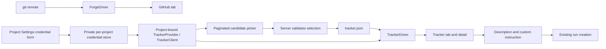

> **Updated 2026-09-19:** this is the single authoritative browsing and project-credential specification. The two 2026-09-19 connection/storage documents are non-normative redirects. This is a design contract, not a claim that these surfaces already exist on the base branch; implementation is maintained separately.

# Browse Jira and Linear tasks alongside GitHub

## 📝 TLDR

Add read-only browsing and hand-to-agent for **Jira Cloud and Linear**, alongside the existing
GitHub tab. A narrow `TrackerClient` / `TrackerDriver` seam handles discovery, scoped reads and
explicit failure results. Credentials are entered in project Settings and stored privately per
canonical repository. A user selects one
Jira project or Linear team from a paginated picker; cezar stores the non-secret association in
that repo's `.ai/cezar/tracker.json`. Jira and Linear implement the same provider seam; subsequent integrations reuse the same flow.

This is the current design contract, not evidence of a released feature. The design covers: one spec covering both providers, read-only vendor access, per-project credentials,
API-discovered project/team selection and one non-GitHub tracker per repo. No OAuth, write-back
or full-backlog background sync. Visible-list checks are defined by the local
[auto-refresh extension](2026-09-19-tracker-auto-refresh.md). Encryption at rest / an OS credential vault is explicitly deferred.

## 📝 Problem Statement and Business Outcome

Today `packages/cezar/src/server/forge/` and the cockpit's GitHub view let a user browse issues
and hand one to an agent. Teams using Jira or Linear must copy their task context manually.
`ForgeDriver` also owns PRs, merge state and draft creation, and resolves from the git remote;
an issue tracker has neither that anchor nor those capabilities. Keep the two seams independent.

The value is **finding the right task and starting the right workflow with sufficient context
without routine copy-paste**. Rendering another backlog alone is not acceptance. The journey is:
connect → find a task, including beyond the first page → inspect its context → select workflow,
skills and backend → launch with the user's instruction → reopen the source URL from run history.

A Jira project or Linear team can span several repositories. MVP does not infer repo ownership
or promise a curated per-repo queue: show the selected scope clearly, provide server-side search
and label filtering, and let the user choose the task. Validate that this is useful on an actual
shared backlog before calling the feature ready. No custom JQL configuration or board mapping.

## 📝 Proposed Solution and Scope

- A project-bound provider discovers candidates using only that repository's credentials,
  before the user selects its vendor project/team. No global credential fallback exists.
- An associated driver lists, searches and retrieves tickets within the selected project/team.
- Every vendor failure is an explicit result. Empty data, unavailable service and missing ticket
  are different states; a successful connection probe does not guarantee a subsequent read.
- Both candidate discovery and issue results have continuation cursors. Submitted searches go
  to the vendor regardless of local matches. Local filtering never claims to search the backlog.
- Saved associations keep the vendor tab visible during outages. Settings can read and remove
  an association without vendor access.
- Hand-to-agent always includes ticket identity and the fetched description, even with a custom
  prompt. Lost or unsupported context is visible before launch.

**Non-goals:** Jira Server/Data Center, multiple trackers or accounts per repo, merged forge/tracker
feeds, writes to vendors, comments/attachments/custom-field ingestion, sync, webhooks, and automatic
run deduplication. No tracker status chips or extension of `task-refs.ts`: retain the identifier,
source URL and description snapshot in the existing task prompt. No automatic completion status
is sent back to the vendor. Opening a source URL does not depend on reference-chip support.

`ForgeDriver`, GitHub API shapes and GitHub search/composer behavior remain unchanged. Reuse visual
components and workflow/engine selection; share pure label helpers only when their input really
is common. Do not widen `GithubItem` or reinterpret its numeric `number` as a tracker identifier.

## 📝 Architecture



`packages/contract/src/tracker.ts` owns all data schemas and inferred types; the api-client
re-exports them. Server code imports the contract directly, never the private api-client at
runtime. Contract and api-client remain Node-free. Only behavioral interfaces belong in
`packages/cezar/src/server/tracker/types.ts`:

```ts
// All argument/result/data types below are z.infer exports from the contract.
export interface TrackerClient {
  readonly kind: TrackerKind;
  listCandidates(query: TrackerCandidatesQuery): Promise<TrackerCandidatesResult>;
  resolveAssociation(input: TrackerAssociationInput): Promise<TrackerAssociationResult>;
}

export interface TrackerDriver {
  readonly association: TrackerAssociation;
  listIssues(query: TrackerListQuery): Promise<TrackerItemsResult>;
  searchItems(query: TrackerSearchQuery): Promise<TrackerItemsResult>;
  getItem(id: string): Promise<TrackerItemResult>;
}

export interface TrackerProvider extends TrackerClient {
  driver(association: TrackerAssociation): TrackerDriver;
  clearCache(): void;
}
```

Search is required for both providers. Methods never throw for vendor/network/validation failures.
There is no redundant `detect()` requirement: candidate/association reads validate access, each
operation reports its own failure, and health never probes a vendor. `getItem` supplies the web URL;
there is no separate URL builder exposed through the seam.

- `tracker/jira.ts` and `tracker/linear.ts` implement the client and associated driver factories.
- `tracker/index.ts` creates providers and resolves drivers from project state and its private
  credential record. `tracker/connections.ts` owns the credential store and revision IDs.
  Missing credentials and mismatched source identity produce an unavailable result, not an empty
  successful list. Read the association even when no usable driver can be built.
- `src/tracker-association.ts` owns local association reads/writes via the project's `dataDir`.
- All remote reads are demand-driven by an open view or explicit action. No startup probe, unobserved timer,
  global health request or sidebar render starts a vendor call. The visible-list auto-refresh extension uses the existing WS bus and demand-driven server checks.

**Bounds and cache:** 10-second total deadline per operation (including discovery/fallback),
2 MiB maximum vendor response per request, one vendor page per listing request, 50 results by
default and at most 100. Fail with a controlled reason when a bound is exceeded. Cache successful
pages for 60 seconds; detail freshness belongs to the browser cache (60 seconds), and every
new detail request revalidates with the vendor, including explicit Refresh. Coalesce identical
in-flight reads, and do not serve expired results
as current after a failed refresh. Cache keys include canonical project, vendor, source identity, credential generation,
association, query, cursor and limit; secrets never appear in logs or persisted keys. Bound the
in-memory cache to 200 entries per provider with LRU eviction. A rate-limit result sets an in-memory
cooldown from the vendor's reset/retry hint, or 60 seconds if absent; manual refresh respects it.
No inline retry loop. `refresh=1` bypasses successful-data cache only.

## 📝 Vendor Behavior and Credentials

Credentials are entered in **project Settings → Issue tracker**, never global Settings. A save
validates the input and stores it locally without contacting the vendor. Browse and Connect
validate remote access. Replacing credentials takes effect without a server restart, creates a
new connection revision and requires explicit scope selection again. GET responses expose only
`{id, kind}`, never the secret. Existing `JIRA_*` / `LINEAR_API_KEY` environment values are ignored;
there is no automatic import into projects. GitHub authentication remains unchanged.

| Provider | Project form fields | Supported access |
| --- | --- | --- |
| Jira Cloud | Site URL, account email, API token | HTTPS `https://<site>.atlassian.net` site origin; scoped and unscoped API tokens |
| Linear | Personal API key | Read access to the selected team and its issues |

### Managed project credential storage

Use `cezarHomeDir()/tracker-connections/<sha256(canonicalRoot)>.env`; `CEZ_HOME` applies.
The interim choice is a managed dotenv representation for the agreed environment-file storage
workflow, while keeping secrets outside repositories and out of the process environment. It is
not a security improvement over private JSON and is not encryption. The tradeoff is explicit:
we keep the requested interim environment-file representation, accept a parser dependency and
managed-only rotation, and do not claim the format is simpler than a private JSON record. A store interface isolates
this temporary representation so a future vault can replace it without changing provider clients
or Settings. Users do not author a file to enable the feature.

`canonicalRoot` is the absolute result of `fs.realpath` for the existing repository root, using the
registry's realpath-normalized root convention. Resolve it once per operation, before computing
the SHA-256 of its UTF-8 spelling; do not hash a project slug, `browseRoot`, or a user-entered path.
Symlink aliases resolving to that same path share a connection; separate worktrees and copies do
not. Bind mounts are not deduplicated by inode. A missing root cannot create a connection (the
existing project-context 409 applies). If an already registered root resolves to a different path,
require reconnect under the new identity; never move/reuse credentials implicitly. Cleanup can
still address the old credential file by its opaque filename, without resolving the missing root.

The version-1 record contains `RECORD_VERSION`, a fresh UUID `CONNECTION_ID`, `PROJECT_ROOT`
(the canonical root, non-secret but private), `CREDENTIAL_SHA256`, and exactly the selected
provider's fields: `JIRA_BASE_URL`, `JIRA_EMAIL`, `JIRA_API_TOKEN`, or `LINEAR_API_KEY`.
The digest is SHA-256 of a stable JSON array of normalized credential strings: Jira
`["jira", origin, email, token]`, Linear `["linear", key]`. Validate the root against the filename.
The digest detects accidental edits; it cannot authenticate a file against its owner or encrypt
its contents. Never expose it through the API. Require a Zod-validated record after parsing. Every Settings replacement generates a new UUID,
even for identical values, to invalidate associations, providers, cursors and cached responses.

Write a header comment: "Managed by cezar. Rotate credentials in project Settings; do not edit
this file." Encode values as safely quoted dotenv literals and prove parser round trips for every
accepted value; reject unrepresentable input before replacing the previous file. Parse with
`dotenv.parse` only, never `config`, `source`, `eval`, or interpolation. The direct runtime dependency
belongs to `packages/cezar/package.json`, the workspace that imports it and ships the CLI; use a
Node 20-compatible version and update the lockfile. Parsed values stay in a project-local object,
never `process.env`. Browsing and ordinary manual handoffs do not forward them to agents.
The separately authorized event-automation extension may pass only the captured project/source/
connection revision to its workflow process after revalidation; see the automation plan below.

Require a bounded regular file, reject symlinks, duplicate/unknown keys, invalid field combinations,
unsupported versions and digest mismatches. POSIX directory/file modes are 0700/0600; use exclusive
private temporary files plus atomic rename, with no credential backups. Check the directory and
file safety before access; on platforms without POSIX modes use platform-appropriate access
controls, without claiming 0600 enforcement there. An invalid record disables that connection;
show a controlled actionable reason to re-save credentials in Settings, never raw parser content.
Missing/corrupt/read-only storage never prevents boot. Failed encoding or replacement preserves
the previous record and reports an action error.

There is one supported on-disk format at first release. The private JSON prototype was never
shipped: no automatic JSON migration, JSON fallback, migration tombstone or compatibility promise
for prototype processes is part of this design. Development installations reconnect through
Settings after stopping old prototype processes; any prototype secret file requires explicit
local cleanup. Format versioning stays to identify unsupported future data safely, not to invent
an unshipped migration. An unsupported record is never overwritten automatically.

`Disconnect` deletes the association only. `Remove project credentials` unlinks the credential
record, retains the association as unavailable, and invalidates the old revision; neither action
revokes the vendor token. Serialize store mutations for the same root across processes. Re-read
revision/existence before using a cached provider and after vendor I/O, so another process's
removal/replacement cannot expose a stale response. Bound the provider cache to 100 instances.
No delayed migration writer exists to resurrect a deleted record. Report failed removal as an
action error; never claim the file was deleted when unlink failed.

Unregistering a repository does not implicitly delete its credentials. To make retention visible,
add local CLI commands `cez tracker-connections list` and `cez tracker-connections remove <id>`.
They work without a running server or vendor call, through the same store and `cezarHomeDir()`.
List returns the opaque 64-hex filename ID, canonical root, provider and local record validity;
never tokens, email, digest or raw record text. Corrupt records remain listed with unknown owner
and an invalid status. Removal accepts only that 64-hex ID, never a path, and deletes only the
corresponding store entry without following symlinks. It is explicit per-entry removal, not
age-based garbage collection. Registered projects retain their saved association as unavailable.
Document the commands in Settings help; state that local deletion does not revoke vendor access.
List prints a tabular inventory (ID, root, provider, status); an absent directory is an empty
successful list. Removal of an already absent valid ID succeeds idempotently. Both commands return
exit 0 on success and exit 1 for invalid arguments or inaccessible/failed storage operations,
with controlled non-secret errors on stderr. They do not alter the project registry or revoke tokens.
Dry-run uses fixtures and cannot enumerate, write or remove real credential files.

### Protected surfaces and deliberate storage exception

Public association responses use the exact contract shape; preserving unknown disk fields must
not expose them through the API.

The implementation must declare these additions in `BACKWARD_COMPATIBILITY.md` in the same change:

| Section | New surface / compatibility requirement |
| --- | --- |
| §1 CLI | `tracker-connections list` and `remove <id>`; document output, argument validation and failure exit behavior before release |
| §2 HTTP / SSE | All tracker routes, project-list classification and the new workspace-only `tracker-changed` event defined below; no change to the boot-project event stream or global health shape |
| §3 project state | `.ai/cezar/tracker.json`; register with `ensureDataGitignore`, preserve unknown association fields on round trip, reject invalid required identity before vendor access |
| §9 per-user state | `tracker-connections/<hash>.env`, owned by its own store, respecting `CEZ_HOME`, private atomic writes and graceful boot degradation |

**Explicit proposed §9 exception:** this credential record is validated as a complete unit rather
than using `.passthrough()` and per-key salvage. Combining partial authentication fields can select
the wrong account; unknown versions/keys must disable the connection rather than silently reuse
or discard credentials. Older readers must refuse unsupported records, and older writers must
not rewrite them. Intentional replacement/removal happens only through an explicit user action.
This exception applies only to this credential store, not workspace config or agent accounts.
The implementation must record the exception in §9 before release; this spec does not imply it
was already accepted or implemented on the base branch.

Jira base URL is the **web site origin**, not the API gateway. Reject embedded credentials, paths,
query/fragment and non-Cloud hosts in this MVP; do not send auth across arbitrary redirects.
Discover cloudId on demand from the site's `/_edge/tenant_info`, validate the response and store
that identity in the association. Discovery failure is recoverable in Settings, not a boot error.
Atlassian documents this lookup in [cloud ID discovery](https://support.atlassian.com/jira/kb/retrieve-my-atlassian-sites-cloud-id/).

Scoped Jira tokens require `https://api.atlassian.com/ex/jira/{cloudId}`; unscoped tokens support
the site origin. Use the gateway first and permit one site-origin fallback on 401/403 only, within
the same deadline; remember the successful transport in memory for that credential generation.
Do not infer token type from its spelling or persist it outside the private credential store. No fallback for timeout, 429 or 5xx.
If neither transport succeeds, surface a controlled credential/permission message. Ticket URLs
always use the site origin, never the gateway. [Atlassian token documentation](https://support.atlassian.com/atlassian-account/docs/manage-api-tokens-for-your-atlassian-account).

Jira uses project search, project lookup, enhanced `/rest/api/3/search/jql` with its continuation
token, and direct issue lookup. The old `/rest/api/3/search` is being removed; do not implement
against it. Request only mapped fields and the project identity needed for scope validation.
[Official issue-search API](https://developer.atlassian.com/cloud/jira/platform/rest/v3/api-group-issue-search/).

Linear uses GraphQL variables and connection cursors. Check `errors` before accepting `data`:
HTTP 200 can contain partial failure, and rate limiting uses HTTP 400 with
`errors[].extensions.code = RATELIMITED`. Treat partial required data as unavailable, never an
apparently complete page. Handle ordinary HTTP 401/403/429/5xx too; numeric rate ceilings are not
hard-coded. [GraphQL errors](https://linear.app/developers/graphql),
[rate-limit protocol](https://linear.app/developers/rate-limiting).

Implementation must enumerate the read scopes required by the actual project/team, identity and
issue queries in the setup documentation and verify minimal-scope fixtures. Do not add a `/myself`
probe that requires extra permissions solely to detect a connection. Scope access and token expiry
are diagnosed on the operation that needs them. No write scope is required by cezar.

**Credential handling:** secrets must never enter read responses, logs, query-cache metadata or
agent prompts or browsing/manual-handoff agent environments. The event-automation extension
(`docs/superpowers/plans/2026-09-19-tracker-automation-event-parity.md`) deliberately passes
revision-bound credentials into that workflow’s process environment, without widening the global
allowlist. It redacts literal secrets and Basic authorization from persisted/live run text, and
refuses credential substitution after rotation or scope changes. This is not an OS sandbox.
Environment-based redaction is not a guarantee for form-entered tokens
or derived base64(email:token). Drivers must never log
Authorization headers or raw HTTP/GraphQL error bodies; expose only controlled reason strings.
Do not extend the default agent env allowlist with these credentials. Ticket content enters the
existing run prompt/history when the user launches a task; document that behavior in the composer.

## 📝 Data Model

All following shapes are schemas in `packages/contract/src/tracker.ts`, with types inferred using
`z.infer`. This schema inventory is normative, including response envelopes, not just entities.
Implementations must preserve discriminants and conditionally omit absent keys on the wire.

| Schema / inferred type | Fields and validation |
| --- | --- |
| `trackerKindSchema` / `TrackerKind` | Enum `jira`, `linear` |
| `trackerCredentialsSchema` / `TrackerCredentials` | Strict write-only union `{kind: "jira", origin, email, token}` or `{kind: "linear", key}`; validated site/email, trimmed nonempty secret up to 8192 characters |
| `trackerConnectionSchema` / `TrackerConnection` | Public `{id: UUID, kind: TrackerKind}`; id is a revision, not an authentication token |
| `trackerConnectionResponseSchema` | `{connection: TrackerConnection \| null, demo: boolean, reason?: string}`; shared GET/PUT/DELETE response; optional controlled local-storage reason only when unavailable, no raw parser/filesystem messages |
| `trackerSourceSchema` / `TrackerSource` | `{id: nonempty string, webUrl: HTTPS URL}`; Jira cloudId/site origin or Linear organization ID/workspace web URL, resolved by server |
| `trackerCandidateSchema` / `TrackerCandidate` | `{id: nonempty string, name: nonempty string}`; canonical Jira project ID or Linear team UUID, not display key |
| `trackerAssociationSchema` / `TrackerAssociation` | `{kind, source: TrackerSource, externalId: string, externalName: string, connectionId?: UUID}`; connectionId optional only for demo parsing and required to match the current connection for real reads; canonical ID/name and source from vendor |
| `trackerAssociationInputSchema` / `TrackerAssociationInput` | Strict `{kind, externalId: nonempty string, sourceId: nonempty string, connectionId?: UUID}`; real selections require the current connection UUID; sourceId from discovery, no client-authored name or URL |
| `trackerItemSchema` / `TrackerItem` | `{kind: 'issue', id: string, title: string, author: string, createdAt: ISO timestamp, updatedAt: ISO timestamp, labels: string[], body: string, bodyTruncated: boolean, unsupportedContent: boolean, url: HTTPS URL, status: string}`; `id` is the human key such as `PROJ-123` or `ENG-42`; status retains the vendor label |
| `trackerFailureSchema` / `TrackerFailure` | `{available: false, code, reason: string, retryAfterSeconds?: nonnegative integer}`; codes `not_configured`, `credentials_missing`, `unauthorized`, `rate_limited`, `unavailable`, `source_changed`, `invalid_response` |
| `trackerInvalidCursorSchema` | `{available: false, code: 'invalid_cursor', reason: string}`; distinct driver result mapped to HTTP 400 |
| `trackerCandidatesResultSchema` / `TrackerCandidatesResult` | Success `{available: true, source: TrackerSource, candidates: TrackerCandidate[], truncated: boolean, nextCursor?: string}` OR `TrackerFailure` OR the `invalid_cursor` branch |
| `trackerItemsResultSchema` / `TrackerItemsResult` | Success `{available: true, items: TrackerItem[], truncated: boolean, nextCursor?: string}` OR `TrackerFailure` OR the `invalid_cursor` branch |
| `trackerItemResultSchema` / `TrackerItemResult` | Success `{available: true, item: TrackerItem}` OR `TrackerFailure` OR `{available: false, code: 'not_found', reason: string}` |
| `trackerAssociationResultSchema` / `TrackerAssociationResult` | Success `{available: true, association: TrackerAssociation}` OR `TrackerFailure` OR the same `not_found` branch |
| `trackerAssociationResponseSchema` | `{association: TrackerAssociation \| null}`; local GET and successful PUT |
| `trackerClearedResponseSchema` | `{cleared: true}` |
| `trackerErrorResponseSchema` | `{error: string}` for HTTP validation/action/not-found errors |

Derive `trackerCandidatesResponseSchema` and `trackerItemsResponseSchema` for HTTP 200 from the
respective result branches excluding `invalid_cursor`; derive `trackerItemResponseSchema` from
the item result excluding `not_found`. Reuse the underlying branch schemas rather than redeclaring
fields. Driver outcomes and HTTP status-specific responses have intentionally distinct types.

Failure branches omit data arrays entirely: the UI cannot accidentally display an outage as an
empty backlog. An empty success has `available: true`, an empty array and `truncated: false`.
On successful pages `truncated` means further results exist, not merely that the page is full;
when true, `nextCursor` is required. When false, omit it. Enforce this with a schema refinement.
Cursor values are opaque bounded data, never a client-supplied URL; bind them to canonical project,
connection revision, operation, source, scope, query and ordering. An expired/invalid cursor yields HTTP 400 and a restart-search affordance.

**Query and parameter schemas:**

- `trackerCandidatesQuerySchema` / `TrackerCandidatesQuery`: required `kind`, optional `q`
  (trimmed, 1–256 chars), `cursor` (1–4096 chars), `limit` (integer 1–100, default 50).
- `trackerListQuerySchema` / `TrackerListQuery`: optional cursor/limit as above, `refresh` (`0`/`1`),
  `state` (`active`/`all`, default `active`), `labels` (at most 20 nonempty strings, AND semantics).
  Encode labels as a JSON array in the single `labels` query parameter; the query middleware
  validates and decodes it to the inferred array type. Malformed encoding is HTTP 400.
- `trackerSearchQuerySchema` / `TrackerSearchQuery`: list fields, required trimmed `q` (1–256),
  with `state` defaulting to `all` so completed tickets are discoverable.
- `trackerItemParamsSchema`: one bounded nonempty `id` path segment; vendor adapters validate
  identifier syntax and encode paths. Use the existing projectId middleware on scoped mounts.

State and ordering are provider adapters, not arbitrary JQL: active excludes Jira's Done status
category and Linear's completed/canceled states. List/search sort by updated time descending,
using vendor cursor semantics. Label filtering is applied at the vendor, not just to a cached
page. Candidate queries search names/keys at the vendor and allow loading all pages. If a provider
cannot express a needed candidate filter, keep explicit continuation through the unfiltered
pages and label any current-page filtering honestly; never present it as an exhaustive search.

**Association storage:** `.ai/cezar/tracker.json` contains `TrackerAssociation`; absent or malformed
means `null`. Use project `dataDir`, atomic tmp+rename and serialize local mutations. Register the
file in `ensureDataGitignore` and its cross-check. A read-only filesystem does not block boot;
a failed save/delete reports an action error and never claims success. Do not use workspace
`PATCH /projects/:projectId`: it rejects single-project mode and unregistered boot entries.

PUT first validates connectionId against the project's current connection, then resolves
`externalId` directly at the vendor and checks sourceId against the current credential's
source, and saves the canonical name/ID/source only after success. Discovery's first-page cap
must not restrict valid selections. Never use client text as raw JQL or GraphQL syntax.

Every list/search/detail read enforces the saved source and project/team scope, including direct
lookup. A ticket outside that scope returns not-found. Before using a saved association, validate
source identity for the project's current credential generation; a changed Jira site/cloudId or
Linear organization yields `source_changed`, requiring explicit reconnect. Do not silently
retarget reused IDs. Identity validation can be cached for this process; a restarted process must
revalidate before serving vendor data. Labels/names may be stale display metadata, never identity.

No ticket mirror is persisted; the task prompt snapshot remains in existing run storage. Deleting
an association does not remove already-created runs or their prompts.

## 📝 API Contracts

**Chain routes into family builders** to retain Hono `AppType`; no loose `app.get(...)` statements.
Validate JSON, query and params through the existing Zod middleware trio. Define every request,
success and error schema in the contract, and re-export through the api-client. Compare each
response with `InferResponseType` in BOTH directions; parsing fixture data alone is not parity.

All routes exist regardless of credentials. All tracker routes, including discovery and connection
management, are defined once and dual-mounted for boot and `/api/v1/p/:projectId`. Register static
routes before `:id` (reserve `candidates`, `search`, `association`, `connection` as item IDs).
Add the complete inventory to `BACKWARD_COMPATIBILITY.md` §2 with implementation.

| Route under `/api/v1` | Request → response | Scope |
| --- | --- | --- |
| `GET /tracker/connection` | No query → `trackerConnectionResponseSchema` | Project; local, no credential values |
| `PUT /tracker/connection` | `TrackerCredentials` → `trackerConnectionResponseSchema` | Project; local write-only save/replacement |
| `DELETE /tracker/connection` | No body → `trackerConnectionResponseSchema` | Project; local credential removal, not vendor revocation |
| `GET /tracker/candidates` | `TrackerCandidatesQuery` → `trackerCandidatesResponseSchema` | Project; only its own credentials |
| `GET /tracker/association` | No query → `{association: TrackerAssociation \| null}` | Project; entirely local, usable offline |
| `PUT /tracker/association` | `TrackerAssociationInput` → `{association: TrackerAssociation}` | Project; validate remotely before save |
| `DELETE /tracker/association` | No body → `{cleared: true}` | Project; local and idempotent |
| `GET /tracker` | `TrackerListQuery` → `trackerItemsResponseSchema` | Project |
| `GET /tracker/search` | `TrackerSearchQuery` → `trackerItemsResponseSchema` | Project |
| `GET /tracker/:id` | `trackerItemParamsSchema` → `trackerItemResponseSchema` | Project; direct scoped lookup, not a list filter |

Read operations answer HTTP 200 for success and `TrackerFailure`, including absent association,
missing credentials or vendor outage. Detail maps only `not_found` to HTTP 404 `{error}`; an auth
failure/timeout must not become 404. Connection PUT/DELETE failures return controlled 409 errors;
invalid credential input returns a generic 400 without echoing values. Association PUT maps missing candidate to 404, inaccessible source or
vendor failure to 409 `{error}`; filesystem mutation failure is also a controlled 409 `{error}`.
Malformed requests/cursors are 400 `{error}`. Existing project-context 404/409 rules still apply.
No vendor error becomes an unhandled exception or 5xx. Specify the detail 200 schema as the result
union excluding `not_found`, and test its exact HTTP-specific parity.

**Health and project classification:** do not add `capabilities.trackerJira` or `trackerLinear`
to global health. These would be new fields, not legacy compatibility fields, and cannot describe
project readiness. `GET /tracker/connection` is the sole connection-status source, including demo
mode; it reports local configuration, not a promise of vendor access. Neither health nor
connection-status reads contact a vendor or hide saved associations. Add optional
`tracker?: TrackerKind` to project-list entries through one local helper used by registered,
synthetic unregistered boot and single-project construction sites.

Connect/disconnect and credential mutations invalidate association, project classification and
tracker queries after successful persistence. Clear scoped server caches and discard stale
in-flight UI responses. Browser keys include projectId, connectionId and association identity.
Introduce a **new workspace-stream SSE event** `tracker-changed`, with JSON data `{project: string}`,
where `project` is the canonical API project ID (the boot alias resolves to that ID). Define
`trackerChangedEventSchema` in `packages/contract/src/tracker.ts`, infer/re-export its type and use
it at publisher and consumer boundaries. Publish only after a successful mutation. Its payload
contains no provider content or credentials. Inventory it in BACKWARD_COMPATIBILITY.md §2.
Do not widen `/api/v1/events` or add a socket. Existing consumers ignore unknown workspace events;
Current consumers conservatively invalidate all tracker queries and project classification on this event;
cache keys remain project/connection-scoped, so this causes extra reads, not cross-project data reuse. Reconcile authoritative local state
on reconnect and visibility, including remote mode. The separate auto-refresh extension may
protect paginated lists from replacement, but never skip credential/source invalidation.

## 📝 UI/UX and Handoff

**Settings:** `/p/:projectId/settings/tracker` shows provider setup cards and a write-only form:
Jira site/email/token or Linear key. Saving validates and stores locally, then enables a searchable,
paginated candidate picker. The token field clears on save, failure, cancellation and project change;
secrets are not stored in browser storage or query/mutation variables. Credentials can be replaced
but never revealed. GET association supplies the saved scope name after reload and during outages.

Browse/Connect fetch candidates using the selected project's connection only; users can reach the
51st candidate, change the query and load more. Persist the association only after validated PUT.
`Disconnect` removes scope selection offline and retains credentials. `Remove project credentials`
removes the private file offline and leaves the association unavailable. Neither revokes the vendor
token. Rotation requires reconnection even when the token is unchanged. Failed replacement retains
the previous state; failed removal reports an action error. Discard late responses from an old
project/connection. Storage failure help points to re-saving in Settings and the local credential
listing/removal commands; no manual digest editing is part of the supported setup flow.

**Navigation:** `/p/:projectId/tracker` and `/p/:projectId/tracker/:id`, labeled Jira or Linear,
are visible when a saved association matches the current local credential identity and provider
(or in demo mode). Missing/removed credentials hide the nav item and direct navigation offers setup.
Vendor outages or rejected vendor credentials do not remove a locally configured navigation entry;
show their recoverable read errors with Retry and Settings links. A transport failure while checking
local connection metadata is an unknown state, not a confirmed disconnect: block launching, offer
Retry, and preserve the same-project draft through recovery. Settings must not display an old saved
scope as connected after credential removal. External CLI/file removal reconciles association,
connection and project classification when the active watch detects a terminal source change. Any flat page alias follows boot-project redirect
conventions. Both sidebar and command palette use the same gate.

**Layout:** reuse the GitHub compact split-pane shell and workflow/skills pickers. Desktop
keeps the list beside full detail; mobile opens detail with Back to the list navigation. Keep
per-issue instructions in view-local memory and share workflow/engine/skills preferences across
row changes. Pin the implicit first selection during automatic refresh, resetting it on explicit
filter changes. URL-selected issues remain open. Hidden mobile lists create no watch demand.

**Browse/search:** show scope, active/all state, label filter, updated ordering, and Load more.
Submitting a nonempty query searches the vendor even if the first cached page has local matches;
clearing the query returns to the list. Query/filter changes reset the cursor. Distinguish no
results from unavailable. An explicit Retry exits the failure state after access is restored;
rate-limited retries remain disabled until the indicated cooldown ends. Direct detail links work
outside the loaded page, but only within the selected scope. No PR-only controls or chips.

**Description and context:** list previews cap converted markdown at 8000 characters. Detail and
handoff fetch directly with a 60000-character description cap; always set `bodyTruncated` if text
was lost. Both tiers set `unsupportedContent` if conversion omitted information. Jira ADF mapping
must preserve paragraphs, headings, lists, links, quotes, code fences and tables; unsupported
nodes retain readable text when possible and set the flag. Do not silently remove rich content.
Linear markdown follows the same caps. Render through existing safe Markdown components.

A handoff opens with freshly fetched detail, not the cached list preview. Always compose the
identifier, title, source URL and detail body, plus skills and the user's custom instruction;
keep the user's instruction last as in the existing composer contract. Preserve workflow / skills
chain / quick-task selection and the resolved backend/model/account triple. A drag into the
composer uses the same detail-loading path; it must not bypass context checks by inserting a
truncated row body. An unavailable detail blocks launch from this handoff with Retry available.

The composer says the snapshot contains the description only; comments, attachments and custom
fields are not fetched. If `bodyTruncated` or `unsupportedContent` is true, show the specific loss,
link to the source, provide an editable supplemental-context field, and require acknowledgment
before launching. Include that limitation in the resulting prompt too. Normal complete descriptions
require no extra confirmation. An empty description is shown explicitly so the user can supplement
it. The final composed task respects the existing 100000-character create-run limit: show a length
error and allow editing supplemental/custom text; never silently truncate the final prompt.

No claim that the agent can retrieve omitted context via the URL: tracker credentials are not
forwarded by default. Once created, run history retains the same source URL and snapshot.

## 📝 Onboarding and Documentation

Document project Settings setup, supported Jira Cloud/token transports and minimal read permissions
for the actual vendor queries, with links to obtaining/revoking credentials. Explain that saving
locally does not prove vendor access: Browse and Connect perform that verification. Replace expired
tokens through Settings and select the scope again; no server restart is required.

README, `.env.example` and setup help must explain that global Jira/Linear environment credentials
are ignored. Existing associations require explicit per-project setup; no broad key is silently
imported. Document private plaintext storage, CEZ_HOME, file permissions, deletion versus revocation,
no write-back and the prompt snapshot persisted on launch. Unregistering a project does not delete
its credential file. Troubleshooting covers missing credentials, invalid permissions, wrong site,
unavailable discovery and rate limiting. Help remains readable without network access.

The extension guide (`docs/adding-issue-tracker.md`, delivered with implementation) must identify the shared provider/client/driver seam, exhaustive provider
registrations, contract and UI metadata changes, project-scoped credential handling, isolation tests
and mocked versus live verification requirements. Adding a provider must not reintroduce global
secrets, per-vendor branches in shared browsing flows or forge-only capabilities.

## 📝 Edge Cases, Risks and Defaults

| State / event | Behavior and exit |
| --- | --- |
| No credentials, no association | Existing cockpit works; setup help only, stable API answers unavailable; no vendor calls |
| Incomplete credential form | Local validation rejects save; no vendor call or startup probe |
| Credentials saved, not working | Candidate/read returns controlled failure; replace credentials and reconnect or restore permission and Retry |
| No association | Local GET returns null; vendor list returns `not_configured`; Connect creates state |
| Saved association, locally configured but vendor offline/expired token | Navigation remains; reads report failure; Retry after repair or use Settings |
| Saved association, removed/mismatched local credentials | Hide tracker navigation; direct page offers setup; Settings shows no active connection; retain only non-secret metadata |
| Connection-status transport failure | Show Retry, block launch, preserve same-source draft; do not claim credentials were deleted |
| Project/team deleted or inaccessible | Never serve expired cache as live; banner with reconnect; detail may be not-found when vendor deliberately hides existence |
| Credentials replaced/removed or association copied from another project | Revision mismatch blocks reads and stale results; explicit project setup/reconnect required |
| Vendor source changes under the current connection | `source_changed`; no reads of an old ID in the new source; explicit reconnect required |
| Renamed project/team | Stable external ID continues to work; refresh display name on explicit reconnect; no silent identity change |
| Rate limit / timeout / oversized or malformed response | Bounded explicit failure; cooldown where appropriate; no boot impact or retry loop |
| Read-only/corrupt local state | Malformed state reads as null; failed mutation leaves prior state and reports error; no boot failure |
| Exactly full final page | `truncated: false` if vendor says no continuation; do not infer more from length alone |
| Query changed with outstanding request | Discard old result and reset cursor; no cross-project or cross-source cache reuse |
| `CEZ_DRY_RUN=1` | Deterministic Jira/Linear fixtures; no vendor network access or real credential reads/writes/removal |

The feature adds network access only after per-project credential setup and a user-requested
read/connect action. No new `CEZ_*` switch is needed for this explicitly connected integration. Unlike GitHub's `gh`
discovery, setup cannot be fully automatic, but the rest of cezar still requires no configuration.
Automations' default-on behavior is not a precedent for unsolicited polling: its timer arms only
for an automation the user enabled. The auto-refresh extension checks only while a list is observed; it introduces no unattended sync job.

Credentials, discovery, caches and cursors are project-bound. Vendor permissions still constrain
the token itself; choosing a project does not reduce its vendor permissions. Application isolation
is not tenant authorization or a boundary against processes running as the same OS user. Such
processes, including broadly permitted agents, can read the plaintext store. Association state
binds to project credential revision and source identity, not just a reused numeric ID. Ticket text sent to an agent uses the same storage
and disclosure model as other task prompts; there is no claim all ticket content has equal sensitivity.

Rollback: disconnect removes the association and nav; removing credentials may retain non-secret association metadata, but hides tracker navigation
and the connected scope card. Settings remains reachable to configure and select a scope again. No issue mirror needs cleanup.
Old GitHub and global health contracts remain unchanged. New-client/old-server mixing is not
promised merely because old clients can ignore new routes/events. Unsupported credential formats
remain untouched and unavailable; no prototype-format migration or downgrade machinery is shipped.

## 📋 Phasing and Implementation Plan

One spec and delivery covering both vendors; each phase leaves existing behavior functional.

**Phase 1 — Contract and Jira driver**

1. Define every entity, query, param, result and HTTP envelope schema listed above in contract;
   infer/re-export types. Keep server interfaces behavioral. Test schema branches and pagination
   invariants; these are not a substitute for route parity in Phase 2.
2. Implement Jira Cloud discovery, both token transports, source binding, candidate pagination,
   scoped list/search/detail, safe JQL construction, ADF conversion, response validation, deadlines,
   response bounds, bounded cache and cooldown. Add minimal-permission fixtures and document the
   exact required scopes from the chosen endpoints. No identity-only permission expansion.
3. Test valid and incomplete credential input, 200/401/403/404/429/5xx, failed read after successful discovery,
   timeout/malformed/oversized body, source change, cross-project lookup, unsafe query characters,
   pagination after local matches, and ADF loss flags. Verify raw and derived credentials never
   reach logs/reasons. Add credential-free dry-run fixtures.

**Phase 2 — Association, API and classification**

4. Implement local read/write/delete with atomic persistence, failure semantics and gitignore
   registration. Test absent/corrupt/read-only state, failed replacement preserving old state,
   canonical selection, source mismatch and direct candidate validation beyond the first page.
5. Add per-project connection readiness (including demo mode), without global health booleans,
   local classification and all project construction sites. Test registered, unregistered boot,
   `default` alias and single-project paths. No network from health/project-list/boot.
6. Chain and dual-mount all tracker routes, including discovery and credential management. Add middleware schemas, exact
   HTTP-specific response parity in both directions, typed-body/query tests, route parity and
   versioned-surface tests. Cover static/dynamic path separation and scoped search.
7. Implement cache invalidation and the new workspace `tracker-changed` SSE reconciliation on mutations;
   cover switching providers during an outstanding response. Inventory routes and any event
   additions and the §1/§3/§9 storage/CLI declarations and exception in `BACKWARD_COMPATIBILITY.md`
   alongside implementation, not as claims that these surfaces already exist.

**Phase 3 — Jira UI and documentation**

8. Build per-project write-only credential forms, setup help, offline-readable association,
   searchable candidate picker with Load more,
   validated connect/disconnect, nav, list/search/filter/detail states, Retry and cooldown. Preserve
   keyboard access, light/dark themes and mobile layout. Test reconnect, reload and offline flows.
9. Add tracker-specific composer helpers and integrate both action and drag paths, preserving
   workflow/skills/backend choices. Test a requirement beyond character 8000, the 60000 cap,
   unsupported ADF, empty description, custom prompt, supplemental context, acknowledgment and
   the existing final prompt limit. Ensure the source URL survives run creation/history.
10. Deliver README and `.env.example` setup/troubleshooting material at the same time as the
    working Jira feature. Existing GitHub tests remain green if shared UI helpers change.

**Phase 4 — Linear and end-to-end acceptance**

11. Implement the same seam for Linear with organization binding, team pagination/filtering,
    scoped issue lookup, GraphQL variables and validated errors. Explicitly test HTTP 200 with
    partial errors and HTTP 400 `RATELIMITED`, plus auth/transport failures and dry-run fixtures.
12. Wire Linear credential form, readiness and picker option; add its setup documentation. Run the same driver
    behavior tests for both providers, not just different mocked success payloads.
13. Run repository validation gates required by `AGENTS.md` for the implementation, and the
    separate UI smoke path. No automated test requires real credentials. Record a manual acceptance
    exercise with consenting test data on supported vendor accounts before declaring release
    support for token transports and vendor query semantics.

**Phase 5 — Project-bound credentials and isolation**

14. Implement the private atomic managed dotenv store and public revision-only status; enforce no
    global fallback, no secret readback, safe file handling and graceful unavailable state. Implement
    the single initial format, canonical-root identity, managed-rotation guidance and explicit
    local list/remove commands. No prototype JSON migration or deletion marker.
15. Bind providers, cache, signed cursors, association selection and pending results to project and
    connection revision. Validate before network access and after asynchronous vendor responses.
16. Cover save/replace/remove, project switching, cross-cockpit invalidation, stale picker rejection,
    identical vendor IDs under different keys and isolation between real-mode fixture projects.
17. Update setup/extension documentation and run full gates plus browser evidence, clearly separating
    fixture-based verification from live vendor acceptance. Verify the protected-surface inventory
    and strict credential-store exception; companion files contain no additional requirements.

## 📋 Acceptance Criteria

- A user can save credentials per project without vendor I/O or secret readback, then browse and
  select its scope. Rotation/removal invalidates old cursors, associations and late responses; no
  other project or global environment can supply credentials. Dry-run never touches real secrets.
- A user can select candidate 51+, search with pagination, reload Settings and see the same
  canonical association, in single-project mode and an unregistered boot folder too.
- A query that matches cached ticket A still finds ticket B beyond the first page; completed
  tickets are discoverable, labels apply beyond the local page, and scope never crosses projects.
- A requirement after character 8000 reaches the launched task without copy-paste; context lost
  beyond the detail cap or in unsupported rich content is disclosed and acknowledged. A custom
  instruction does not remove source identity/body, and workflow/skills/backend selection survives.
- Two repos associated with Jira and Linear can be used in one cockpit session without cache or
  identity leakage. Changed source, offline mode, rate limit and failed persistence have the
  recoverable states above; visible-list checks remain demand-driven, with no boot dependency.
- On a representative shared backlog, record setup friction, time from finding a ticket to launch,
  and manual copying required versus the existing copy-paste path. The normal supported-description
  path requires zero manual body copying and must be faster after setup; record exceptions rather
  than claim universal improvement. This is a local acceptance note, not new telemetry infrastructure.
- The created run preserves a usable source link; it does not claim live ticket status, write-back
  or deduplication. Existing GitHub behavior and default zero-configuration operation are preserved.

## 📝 Open Questions

None blocking this design revision. Resolved decisions: managed per-project dotenv is the interim
store; rotation is through Settings; the digest is accidental-edit detection only; readiness is
project-scoped; the first release has no prototype JSON migration. Encryption/vault storage,
manual file rotation remain deferred. Event automations are specified separately in
`docs/superpowers/plans/2026-09-19-tracker-automation-event-parity.md`, including the bounded
credential forwarding exception above. Visible-list refresh does not enable those automations
or authorize a startup vendor probe.

## 📋 Storage and compatibility acceptance

- Resolve aliases to one canonical root; separate copies/worktrees remain separate. A missing root
  cannot create a different credential identity, and a changed realpath requires reconnect.
- Test valid parser round trips, unknown/duplicate keys, unsupported versions, digest mismatch,
  symlinks, unsafe permissions, read-only storage and failed atomic replacement. No test prints secrets.
- Cross-process replacement/removal invalidates old providers and rejects late results. A failed
  removal is visible; no migration/fallback can restore a deleted record.
- Local credential listing identifies an unregistered repository without revealing secrets; explicit
  removal works after its directory is gone. Invalid records are visible and removable by bounded ID.
- Global health has no tracker capability additions. The new workspace event has exact contract
  coverage and no boot-stream change; old consumers continue working.
- Implement and verify §1/§2/§3/§9 declarations, association unknown-field preservation, and the
  narrowly scoped credential-record exception. This document is not evidence those fixes shipped.
