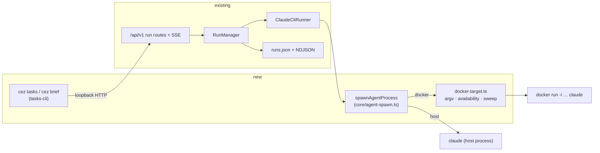

# Remote sessions and execution targets — a terminal client for a running cockpit, and a Docker target

> Slug: `remote-sessions-execution-targets` · Status: proposed (design only — nothing here is implemented)
> Two phases, each independently shippable on its own PR.

## 📝 TLDR

A developer who runs cezar on a VPS wants to start several tasks, close the laptop, and later recover
the picture from a plain terminal; some of those tasks should run in a container instead of on the
host. Today the first half already works for anyone with a browser — runs belong to the server
process, not to the client — but there is **no terminal client**: the only CLI entry, `cezar run`,
executes in-process and dies with the shell. This spec proposes (future behavior) a thin
`cez tasks …` / `cez brief` client over the existing `/api/v1` run routes, and an opt-in
`executionTarget: 'docker'` that wraps the Claude agent spawn in `docker run`, recorded as one
optional field on the run.

## 📝 How the pieces fit

`npx cezar-cli`, `cezar` and `cez` are one program under three names (`cezar-cli` is an alias package
that loads `@open-mercato/cezar` and passes the arguments through). The first word picks a
subcommand; with none, it defaults to `serve`.

| Command | Process model |
| --- | --- |
| `cezar` (no subcommand) | Starts the server and the cockpit. Tasks run **inside this process** — on a VPS it is the systemd service `server-install` sets up. |
| `cezar run "<task>"` | Runs one task in the terminal with no server. Ends with the shell. Unchanged. |
| `cezar tasks …`, `cezar brief` (new) | A **client** of an already-running server on the same machine: it finds the server on loopback and talks to the same `/api/v1` API the browser uses. Never starts a server, never runs an agent; with no server for this repo it exits 2. |
| `cezar task …`, `cezar automation …` | Existing clients of the same kind, used by agents from inside a running task. Unchanged. |

So the terminal flow is two terminals, or one service and one SSH session: the server keeps the
tasks alive, and `cezar tasks` / `cezar brief` are a second way — beside the browser — to look at
them and start new ones.

## 📝 Problem Statement

What a cockpit run already guarantees on `main` (0.11.1), and what is missing:

| Capability | State |
| --- | --- |
| A run continues after the client disconnects | Exists. The run lives in `RunManager` inside the server process (a systemd service on a VPS, `docs/server-install/ubuntu-vps.md`); a browser tab is only an SSE reader. |
| Persistent inspection | Exists: `runs.json` + `runs/<id>.ndjson` + `runs/<id>.handoff.md` (BACKWARD_COMPATIBILITY.md §3). |
| Reattach to a live run | Exists over HTTP: `GET /runs/:id/events` replays the NDJSON, then streams live, deduped by `seq` (`server.ts`, `sseRoutes`). |
| Survives a process restart | Exists: `RunManager.recover()` re-queues queued runs and resumes interrupted ones from their last agent session (`workflows/run.ts`). |
| One run list | Exists: `GET /runs`. |
| A terminal client for any of the above | **Missing.** `cezar run "<task>"` builds its own `RunManager` with no server (`index.ts` `runCommand`) — it is the one run that *does* die with the terminal. `cez task` and `cez automation` are HTTP clients, but only for their own families. |
| A digest of recent activity | **Missing.** |
| A container execution target | **Missing.** Every backend spawns its CLI directly on the host (`claude-cli-runner.ts`, `codex-app-server-transport.ts`, `opencode-server-runner.ts`, `pi-runner.ts`). |

So there are three gaps — a terminal client, a digest command, and a container target — and the
design reuses everything else.

## 📝 Design decisions

| # | Decision | Choice | Why |
| --- | --- | --- | --- |
| D1 | Delivery | One spec, two phases, **two PRs**. Phase 1 has no dependency on Phase 2 and ships alone; Phase 2's only tie to Phase 1 is the `--target` flag and the target column. | Keeps the risk-high runner-seam change away from the additive CLI. |
| D2 | CLI spelling | New nouns routed before `parseArgs`, like `task`/`automation`: `cez tasks [list\|start\|attach\|logs\|inspect]` and `cez brief`. `cezar run "<task>"` is untouched. | `runCommand` joins every positional after `run` into the task text, so sub-commands under `run` would change what an existing input does (BACKWARD_COMPATIBILITY.md §1). New nouns are purely additive. |
| D12 | The user-facing noun | **task**, plural for the list command: `cez tasks`. The API, the store and this spec's internals keep saying *run* (`runs.json`, `GET /runs`, `RunRecord`) — the CLI never exposes that word. | It is the word the product already uses everywhere a user reads: the cockpit's "Tasks" page, the README ("Every task gets its own git worktree"), the composer. `cezar projects` is the established shape for a plural listing noun in this CLI. |
| D13 | `cez tasks` vs the existing `cez task` | Both keep their meaning, and each names the other. `cez task …` (singular) stays the **agent-facing** dispatch client — it only works inside a running task (`CEZ_TASK_ID`), and its exit-2 line gains "for the tasks in this project, use `cez tasks`". `cez tasks --help` says the singular form is for agents dispatching from inside a task. | Renaming `cez task` is breaking (BC §1) and its audience is different: one is typed by a human at a shell, the other by an agent mid-run. The near-identical spelling is the cost of not breaking it; cross-referencing both help texts is the mitigation. |
| D3 | How the CLI finds the cockpit | `CEZ_API_URL` when set (the existing contract of `cez task`); otherwise probe loopback ports `4321…4370` on `/api/v1/health` and take the cockpit that serves the current repo. No state file is written. | Zero config: discover, don't configure. The range is exactly `pickPort`'s (`start + 50`). |
| D4 | Laptop → VPS over the network | Out of scope. The CLI talks to loopback only; the remote story is `ssh box`, then `cez brief`. | cezar has no built-in auth (nginx Basic-Auth is the gate) and CODE_REVIEW.md forbids secrets in state files; a credential-carrying CLI is its own design. |
| D5 | HTTP routes for the CLI | No new ones. `GET /runs`, `GET /runs/:id`, `POST /runs`, `GET /runs/:id/events`, `GET /runs/:id/handoff`, `GET /projects`, `GET /health`. | Least new surface. |
| D6 | Configuration | None for the terminal client. The Docker target has one env var that is both the gate and the only setting: `CEZ_DOCKER_IMAGE=<image>`. Unset (the default) = the target does not exist. No `config.json` key. | AGENTS.md § Zero config: features that widen exposure are opt-in behind a `CEZ_*` flag, off by default. A boolean plus an image key would be two knobs; an image cezar picks for the user would be a supply-chain commitment the project has not made. |
| D7 | Which runners run in Docker | Claude only. `codex`/`opencode`/`pi` with `executionTarget: 'docker'` are refused at start with a one-line 400. | Claude is a plain stdio process; Codex is an app-server and OpenCode an HTTP server on a port. Never fall back to host silently — that would misreport isolation. |
| D8 | Mount layout | **Identity-path bind mounts** (host path = container path) for the worktree, the repo's `.git` and every directory `agentDirectories()` grants the run. The agent's config dir is mounted per the account rule in § Agent home. | A worktree's `.git` is a *file* holding an absolute path into `<repo>/.git/worktrees/<id>`; `claude --resume` keys sessions by cwd; `CEZ_HANDOFF_FILE`/`TMPDIR` are absolute. Identity mounts make all three correct with no path mapping. |
| D9 | Dispatch and automations CLIs (`cez task`, `cez automation`) inside a container | Unavailable, and the agent is **never told about them**: the reachability gate becomes run-aware (false for a Docker run), which drops `CEZ_API_URL`/`CEZ_BIN` from the env **and** skips both prompt preparers. | Reaching the cockpit from a bridge network would mean binding beyond `127.0.0.1` or loosening the Host guard — both blockers in CODE_REVIEW.md. |
| D10 | What "isolation" is claimed | Environment isolation (toolchain, filesystem outside the mounts, processes). **Not** a security boundary. | The repo's `.git` is mounted read-write (the agent commits), so it can plant hooks the host later runs; Docker-socket access for the service user is root-equivalent. |
| D11 | Out of scope | Per-project default target, container cleanup policies, `runs --watch`, a cockpit target picker, Docker + parallel variants (`variants > 1` with `docker` is refused). The cockpit gains only a read-only target badge. | Smallest scope that ships something working. |

## 📝 Proposed Solution

**Phase 1 — terminal client.** `packages/cezar/src/tasks-cli/` holds a thin HTTP client in the shape
of `dispatch/task-cli.ts`: injected `fetch`/`log`/`error`, plain `fetch`, exit 2 without a cockpit,
1 on a refusal, 0 otherwise. It never opens `runs.json` — two processes saving that file is exactly
a lost-update race. Responses are validated with the contract's `apiRunSchema` /
`healthResponseSchema` (the contract is inlined into `dist/` by `inline-contract.mjs`, so a value
import is safe; `@open-mercato/cezar-api-client` is **not** importable at runtime — AGENTS.md
§ Repository layout).

**Phase 2 — Docker target.** One optional `executionTarget` on the run; one spawn helper that
either calls `node:child_process.spawn` as today or wraps the same argv in `docker run -i`. The
agent's stdio protocol, the v1/v2 event mappers and the run lifecycle do not change, which is what
keeps BC §7 (event protocol + backend parity) untouched.

Alternatives considered:

- *Sub-commands under `cezar run`* — `cezar run start the dev server` is a valid task today, so
  this changes what an existing input does (D2).
- *A CLI that reads `.ai/cezar/` directly* — works offline, but cannot start or follow a live run,
  duplicates the store's reconciliation, and races the server's writes.
- *A new `docker` backend beside `claude`/`codex`* — forks product logic and multiplies the parity
  matrix; the target is an axis of *where*, not *which agent*.
- *A long-lived container + `docker exec` per turn* — needs container lifecycle state; `docker run
  --rm -i` per agent session has none and matches how a host session already maps to one process.
- *`--network host` so dispatch works* — Linux-only and gives up the network namespace for a
  convenience.

## 📝 Architecture



Takeaway: the CLI is a second reader of routes the cockpit already uses, and the Docker target is a
different way to start the same process — neither adds a state owner.

### Phase 1 components

- **Routing** — `index.ts` routes `process.argv[2] === 'runs' | 'brief'` before `parseArgs`, beside
  `task` and `automation`, and lists both in `HELP`.
- **Discovery** (`tasks-cli/discover.ts`) — `CEZ_API_URL` wins. Otherwise probe
  `http://127.0.0.1:<port>/api/v1/health` for `4321…4370` concurrently with a 300 ms timeout each;
  for every cockpit that answers, `GET /api/v1/projects` and pick the project whose root equals the
  current repo root (`getRepoInfo(cwd).root`, the same resolution `main()` uses), giving the scope
  `/api/v1/p/<projectId>`. `CEZ_PROJECT_ID` overrides the match. No cockpit, or none serving this
  repo → exit 2 with one line naming what *was* found ("cockpit on :4321 serves /srv/other").
- **Console renderer** — the event `switch` in `runCommand` (`index.ts`, `store.on('event', …)`)
  moves to `run-console.ts` and is used by both `cezar run` and `cez tasks attach`, so a replayed run
  reads identically to a headless one. A pure move; BC §3 already names `cezar run`'s console
  rendering as a consumer of the v1 `type` strings.
- **SSE reader** — a ~40-line parser over `fetch`'s body stream (`event:`/`id:`/`data:` frames),
  reading `run-event` (v1 — the console has no v2 renderer) and `run`, ignoring `ui-event`. Reconnects with
  `Last-Event-ID`, which the route already honors. No new dependency.

### Phase 2 components

- **`core/agent-spawn.ts` — `spawnAgentProcess(bin, args, { cwd, env, container? })`.** The single
  place a Claude agent process is created. `claude-cli-runner.ts` calls it instead of `nodeSpawn`.
  The other three runners keep their direct spawn and are refused upstream (D7), so there is no
  half-wrapped backend.
- **`core/docker-target.ts`** — pure `buildDockerArgv(spec)` plus three impure helpers:
  `dockerAvailability()` (`docker version --format …`, cached, never throws →
  `{ available: false, reason }`), `killContainer(name)`, `sweepOrphanContainers(dataDir, activeRunIds)`.
- **`AgentRunSpec.container?`** — `{ image, name, mounts: string[] }`, built by `RunManager` from the
  run record. `runner.startSession(…)` is called at exactly two sites in `workflows/run.ts` —
  `runAgentStep` (the path `execute` takes) and `runContinuation` (Continue **and** restart
  recovery). Both must pass it (AGENTS.md § "Find every construction site of a shared in-memory
  object" — #811 shipped exactly this half-fix), through one helper, `containerSpecFor(run)`.
- **Run-aware reachability gate.** `dispatchReachable()` reads the *server's* `process.env.CEZ_API_URL`,
  which `serveCommand` always sets — so merely omitting the variable from the container would still
  compose the dispatch and automations prompts, and the agent would take `cez task`'s refusal
  ("stop and report that dispatch is unavailable") as its instruction and abandon the work, the
  exact failure that method's comment describes for headless runs. The gate takes the run and
  answers false for a Docker target; `agentEnv`, `prepareDispatchSession` and
  `prepareAutomationsSession` all read it, at both session sites.
- **Host-side helpers stay on the host.** `planner.ts` and `runs/auto-name.ts` also start Claude
  through the runner; they never receive `container`. git push, `gh` and draft-PR creation are
  already server-side routes and are untouched — no SSH agent or `gh` credential enters a container.
- **Capability** — `capabilities.docker: boolean` in `healthResponseSchema`: `CEZ_DOCKER_IMAGE` is
  set **and** the daemon answered. The CLI and the cockpit read it; neither probes Docker itself.

### The `docker run` invocation

```
docker run --rm -i --init
  --name cez-<id8>-<sessionOrdinal>
  --label cezar.run=<runId>  --label cezar.data=<sha256(dataDir)[0:12]>
  --user <uid>:<gid>  -w <worktree>
  -v <worktree>:<worktree>
  -v <repoRoot>/.git:<repoRoot>/.git
  -v <dir>:<dir> …                 # one per entry of agentDirectories(run) — runs/, tmp/<runId>, attachments/, the dispatch tree dir
  -v <runHome>:<runHome>           # <dataDir>/docker-home/<runId>, created 0700 before the spawn
  -v <agent home mount>            # see § Agent home
  -e HOME=<runHome>
  -e NAME …                        # names only — see below
  <CEZ_DOCKER_IMAGE>  claude <same args as the host spawn>
```

- Built as an argument array for `spawn('docker', argv)` — never a shell string (CODE_REVIEW.md
  § Security).
- **Environment — an allowlist of its own, narrower than the host's.** `buildChildEnv`
  (`core/agent-env.ts`, #427) forwards host toolchain variables (`NVM_*`, `GOROOT`, `JAVA*`,
  `CARGO_*`, `XDG_*`, `NODE_*`, `SSH_AUTH_SOCK`) that are wrong or dangling inside an image, and
  `CEZ_AGENT_ENV_FULL=1` forwards everything. The container gets only: the per-run `spec.env`
  (`CEZ_HANDOFF_FILE`, `TMPDIR`/`TEMP`/`TMP`, `CEZ_TASK_ID`, … — identity mounts keep those paths
  valid), the backend auth prefixes (`ANTHROPIC_*`, `CLAUDE_*`), `CEZ_ENV_PASSTHROUGH` names, locale
  and `TZ`/`TERM`, and `GIT_AUTHOR_*`/`GIT_COMMITTER_*` resolved on the host from `git config` (the
  container has no `~/.gitconfig` and its uid has no passwd entry, so commits would otherwise fail
  for lack of an identity). `CEZ_AGENT_ENV_FULL` is ignored for Docker runs. Values are placed in the
  **docker client's** process env and forwarded with `-e NAME`, so no secret value ever appears in
  argv or `ps`.
- **Binary:** inside the container the command is the bare `claude`; `CEZ_CLAUDE_BIN` is a host path
  and is ignored for Docker runs.
- **The mounted set is *derived from* `agentDirectories(run)`**, not re-listed — so it follows
  `CEZ_AGENT_TMPDIR=0` (no per-run tmp dir), an absent `attachments/`, and the dispatch tree dir
  without a second source of truth. Every bind source is checked to exist (and `<runHome>` is
  `mkdir`'d) before the spawn: Docker creates a missing bind source **as root**, which would leave a
  root-owned directory in the user's repo. `$HOME` is never mounted.
- **`--init`** — claude handles SIGTERM itself, but the children of its Bash tool need a reaper.
- **Signals:** `docker run` proxies SIGTERM to the container, so the runner's existing
  SIGTERM→SIGKILL escalation works. SIGKILL kills only the client, so whenever the runner escalates
  to SIGKILL (and on cancel) `killContainer(name)` also runs, fire-and-forget.
- **Startup sweep:** the Docker daemon is host-global but a run registry is per project, and a
  VPS can host several cockpits. So the sweep is keyed on `cezar.data=<hash of this dataDir>` and
  runs where `pruneOrphans` runs for that project (boot project in `serveCommand`, other projects
  when their context is built): it removes containers carrying **this** data dir's label whose run
  is not active in **this** store. Another instance's containers are never listed, let alone
  removed. Skipped silently when Docker is absent.

### Agent home

Where Claude keeps its state is not uniform (`paths.ts` `claudeStateFilePath`): a **named account**
is always spawned with `CLAUDE_CONFIG_DIR=<dir>` and keeps `.claude.json` *inside* that dir; the
**discovered default** account is spawned with nothing added, and its `.claude.json` is a *sibling*
of `~/.claude`. Setting `CLAUDE_CONFIG_DIR` unconditionally would make the default account read a
state file that does not exist.

| Account | Mount | Env |
| --- | --- | --- |
| spawned with `CLAUDE_CONFIG_DIR` — a named account (`profileEnv`), or a cezar process that carries the variable itself | `<dir>:<dir>` | `CLAUDE_CONFIG_DIR=<dir>` (already in `spec.env`) |
| discovered default, no override | `~/.claude:<runHome>/.claude` | none — `HOME=<runHome>` resolves it |

Either way the session store is the host directory itself, and the cwd is identical, so
`claude --resume <sessionId>` finds a session whichever side created it. For the default account the
sibling `~/.claude.json` is **not** mounted (a single-file bind mount breaks on rename-writes) and
**not** copied (it can hold MCP server tokens, and CODE_REVIEW.md forbids secrets under
`.ai/cezar/`): a Docker run of the default account therefore has no user-scope MCP servers — whose
binaries would not be in the image anyway. File credentials (`.credentials.json`, Linux) live inside
the dir and do travel. **This table is an assumption until Phase 2 step 1 proves it against the
shipped CLI.**

### What the host spawn was load-bearing for

Per AGENTS.md § "Changing a mechanism that already works", the guarantees a direct host spawn
provided implicitly, and what replaces each:

| Guarantee | Depends on | Docker replacement |
| --- | --- | --- |
| git works in the worktree | `<repo>/.git/worktrees/<id>` reachable at its absolute path; an author identity from `~/.gitconfig` | identity mount of `<repoRoot>/.git`; `GIT_AUTHOR_*`/`GIT_COMMITTER_*` from the host |
| Continue / restart recovery (`claude --resume <sessionId>`) | the session store under the agent home, keyed by cwd | the agent home mounted per § Agent home + identical cwd |
| handoff journal, pasted attachments, per-run `TMPDIR` | absolute paths in env and prompt | identity mounts of those paths |
| files the agent writes are owned by the user | same uid | `--user <uid>:<gid>` + a pre-created writable `<runHome>`; bind sources verified so Docker never creates one as root |
| cancel actually stops the agent | the child *is* the agent | SIGTERM proxy + `docker kill` + labeled startup sweep |
| `memoryLimitMb` sees the run | agent is a descendant process (`core/process-usage.ts`) | **not replaced** — see Risks |
| dispatch / automations CLIs | loopback reachability | **deliberately removed** for Docker runs, prompt included (D9) |
| user-scope MCP servers (default account) | `~/.claude.json` | **not replaced** — see § Agent home |

## 📝 Data Model

One optional field, no migration:

- `RunRecord.executionTarget?: 'host' | 'docker'` in `packages/contract/src/runs.ts`
  (`runRecordSchema`) and the store schema in `runs/store.ts`. **Absent means `host`**; it is written
  **only as `'docker'`**, so a host run's record is byte-identical to one written before this spec
  (the `pinned`/`askParked` precedent in BC §3). An older cezar reading a newer file drops the key
  and, on Continue, runs the task on the host — a loss of isolation, not a parse failure; BC §3 gains
  a bullet saying so.
- Dispatched children are always host runs: a Docker parent cannot dispatch (D9), and
  `cez task create` gains no target flag here.
- New scratch state: `.ai/cezar/docker-home/<runId>/` — the container's `HOME`. Same rules as
  `tmp/<runId>/` (BC §3): purely additive, re-created on demand, removed when the run leaves the
  active registry plus a startup sweep, and **added to `ensureDataGitignore`** in the same PR
  (`data-gitignore.test.ts` enforces it).
- No secrets are persisted: the image name is read from the environment at spawn time and is not
  written to the record. A `note` event records `running in docker (<image>)` at session start, for
  the transcript.

## 📝 API Contracts

### HTTP (additive only)

- `POST /runs` body: `executionTarget: z.enum(['host','docker']).optional()`. `startRunSchema`
  currently lives in `server.ts`; the new field's enum is defined once in the contract
  (`executionTargetSchema`) and referenced from both. Refusals, all `{ error }` 400:
  `docker` while `capabilities.docker` is false (with the availability reason); `docker` with a
  resolved runner other than `claude` (checked *after* `defaultRunner` resolution, and per step for
  multi-step workflows); `docker` with `variants > 1`, with `worktree: false`, or outside a git repo.
- `POST /runs/:id/continue` accepts a `runner` too: continuing a Docker run under a non-claude
  runner, or while the capability is off, is refused in `runContinuation` with the same one-liners —
  never silently continued on the host.
- `apiRunSchema` carries the field through `runRecordSchema`; `capabilitiesSchema` gains
  `docker: z.boolean()`. `contract-parity*.test.ts` must pass in both directions. No new route, so
  BC §2's inventory is unchanged.
- `executionTarget` is per run. Workflow YAML gains **no** key (BC §4 untouched).

### CLI (BC §1 gains one bullet: the `tasks` and `brief` commands)

```
cez tasks [list] [--all] [--json]         one line per task: id8 · status · runner · age · title (+ target, from Phase 2)
cez tasks start "<task>" [--target host|docker] [--workflow <name>] [--runner <id>] [--model <m>]
                                          POST /runs; prints the task id and its cockpit URL, returns at once
cez tasks attach <id>                     replay the transcript, then follow live; Ctrl-C detaches, never cancels
cez tasks logs <id> [--tail <n>]          replay only, then exit
cez tasks inspect <id> [--json]           status, target, steps, branch, worktree, diffStat, cost, PR, handoff resume notes
cez brief [--since <dur>] [--json]        digest of the tasks touched in the window (default 24h)

Unchanged and deliberately adjacent: `cez task …` (singular) remains the dispatch client an agent
uses from **inside** a running task, and `cez automation …` the automations client. Each help text
names the other two, and `cez task`'s no-`CEZ_TASK_ID` exit-2 line points at `cez tasks`.
```

- `<id>` accepts any unique prefix of a run id; an ambiguous prefix exits 1 listing the matches.
- `list` hides archived runs unless `--all`. The target column arrives with Phase 2 and prints
  `host` for an absent field.
- `attach` listens to two SSE event names on the one stream: `run-event` (v1 transcript lines) and
  `run` (the record, which is where a status change arrives). It exits when the run reaches a state with nothing more to stream — `done`, `failed`,
  `cancelled`, `review`, or `waiting` — printing the status and the next action (`review → open
  <url>`, `waiting → answer in the cockpit`). Exit code is always 0 for a clean detach: `attach` is
  an observer, and scripts that need a verdict read `inspect --json`.
- `brief` is a pure function `buildBrief(runs, now, since)`: counts per group, then "Most
  important", ordered *needs you* (`waiting`, `askParked`) → `failed` → `review` → `running`, each
  line `id8 · title · one-line reason` (the failed step's name, the diffStat for review, the target
  for running). Capped at 10 lines; the footer names the cockpit URL.
- Exit codes follow the existing thin clients: 2 no cockpit / no matching project, 1 refusal or not
  found, 0 otherwise.
- `--target docker` against a cockpit without the capability prints the server's one-line reason
  and exits 1; the CLI does not second-guess it.

### Environment (`.env.example` + `docs/reference.md` env table, same commit)

- `CEZ_DOCKER_IMAGE` — opt-in, unset by default. An image with `claude` and `git` on `PATH` and a
  shell. `docs/reference.md` ships an example `Dockerfile`; the project publishes no image.

## 📝 UI/UX

Cockpit change is one read-only marker: runs with `executionTarget: 'docker'` show a small "docker"
badge next to the runner chip in the task list and the task header (text + icon, not color-only;
light/dark). No composer control in this spec (D11) — Docker runs start from `cez tasks start
--target docker` or a scripted `POST /runs`.

Terminal output is plain text, no cursor control, readable over a dumb SSH session; color only when
`stdout.isTTY` and `NO_COLOR` is unset. `--json` on the read commands prints the validated API
payload for scripting.

## 📝 Edge Cases & Failure Scenarios

| Scenario | Behavior |
| --- | --- |
| No cockpit on loopback | exit 2: `no running cockpit found on 127.0.0.1:4321–4370 — start one with \`cez\`; for a cockpit on another port (--port) set CEZ_API_URL`. |
| Cockpit found, serves another repo | exit 2 naming the repo it serves. Never silently operates on the boot project. |
| Several cockpits (multi-instance VPS, `--domain`) | the one whose project root matches; two matches → exit 2 listing both, asking for `CEZ_API_URL`. |
| `attach` while the server restarts | SSE drops → reconnect with `Last-Event-ID` for 30 s, then exit 1 with one line. The run itself is `recover()`'s business. |
| `attach` on a finished run | replays, prints the outcome, exits 0. |
| `CEZ_DOCKER_IMAGE` set, daemon down / no `docker` binary | boot is unaffected; `capabilities.docker = false`; `POST /runs` with `docker` → 400 with the reason. |
| Image missing locally | `docker run` pulls; pull output goes to stderr, which the runner already collects. A failed pull surfaces as the step's one-line error (`wrapSpawnError` gains a Docker case). |
| Image lacks `claude` | container exits 127 → `failed` with `claude not found in image <image>`. |
| Agent login is macOS Keychain-backed | no file credential to mount → the agent reports unauthenticated → the step fails with the agent's message plus a hint naming `ANTHROPIC_API_KEY` / `CLAUDE_CODE_OAUTH_TOKEN`. Documented as a limitation: the target is built for Linux hosts. |
| Task started with `worktree: false` and `docker` | refused 400 — mounting the user's live working tree into a container is out of scope. |
| Not a git repo (tasks run in place) + `docker` | refused 400, same reason. |
| cezar restarts during a Docker run | the container was `--rm -i` on a dead client's stdio; the sweep removes it if it lingers, `recover()` resumes the session in a fresh container (agent home is mounted, so `--resume` finds it). |
| `CEZ_DOCKER_IMAGE` unset after a Docker run was recorded | Continue is refused with one line; the record is not rewritten to `host`. |
| `CEZ_DRY_RUN=1` | the mock runner runs on the host whatever the target; `capabilities.docker` follows the env var only (no daemon probe), so the badge and the refusals work offline. |
| Docker run and `cez task` / `cez automation` | never described to the agent (run-aware gate), so it does the work itself instead of reading a refusal as an instruction. If it tries anyway: the existing exit-2 line. |
| A bind source is missing at spawn time | the step fails with one line naming the path; Docker is never allowed to create it as root. |
| Two cockpits on one host, both with Docker runs | each sweeps only its own `cezar.data` label. |

## 📝 Risks & Impact Review

- **Runner seam (risk-high per SDLC.md).** The spawn helper sits under `ClaudeCliRunner`. Mitigation:
  the host branch of `spawnAgentProcess` is a literal pass-through, pinned by the existing
  `claude-cli-runner.test.ts` suite running unchanged; the Docker branch is reached only when
  `spec.container` is set.
- **Isolation is easy to over-claim (D10).** Docs and the PR must say "environment isolation". A
  follow-up could mount `.git` read-only and have the *host* commit, which would make it a real
  boundary; that changes the autosave/commit path and is not in scope.
- **Docker-socket access.** On a VPS the service user must be able to run `docker`. That is
  root-equivalent and is the operator's explicit choice (they set `CEZ_DOCKER_IMAGE`);
  `docs/server-install/ubuntu-vps.md` gains a warning paragraph. `server-install` does **not** add
  the user to the `docker` group.
- **`memoryLimitMb` does not see container processes** — they are children of the Docker daemon, not
  of cezar. Accepted for the MVP and documented; the natural follow-up is `--memory` from the same
  workspace setting.
- **Hard-to-reverse surfaces:** the `runs`/`brief` command names and the `executionTarget` field
  name and values. `CEZ_DOCKER_IMAGE` is a new env contract. All additive; removal later needs the
  BC deprecation path.
- **Product direction, not a rule violation:** whether cezar should ship or bless an agent image. This
  spec deliberately does not; adding a default image later is additive.
- **Rollback:** Phase 1 — delete the two routed nouns; nothing persists. Phase 2 — unset the env var;
  recorded Docker runs stay readable and refuse Continue with a clear line.

## 📋 Phasing

- **Phase 1 — terminal client** (`risk-medium`: new CLI surface, no engine change). Ships alone.
- **Phase 2 — Docker target** (`risk-high`: runner seam, state-file field, HTTP body). Needs
  integration-level evidence per SDLC.md: a real `docker run` exercised in CI-optional tests plus the
  unit suite below.

Acceptance (both phases): a task started with `cez tasks start`
over SSH keeps running after the SSH session closes; a second SSH session's `cez brief`, `cez tasks`
and `cez tasks attach <id>` recover it; one run with `--target host` and one with `--target docker`
appear in the same list with the same statuses and end at the same review gate.

## 📋 Implementation Plan

### Phase 1 — terminal client

1. **Extract the console renderer.** Move the event `switch` from `runCommand` to
   `packages/cezar/src/run-console.ts`; `cezar run` output is unchanged. *Test:* a fixture NDJSON
   rendered before and after the move is byte-identical.
2. **Discovery.** `tasks-cli/discover.ts` with injected `fetch`. *Tests:* `CEZ_API_URL` wins; probe
   picks the matching project; other-repo, two-match and none cases exit 2 with the named lines.
3. **Read commands.** `list`, `inspect`, `logs`, prefix resolution, `--json`; responses parsed with
   the contract schemas. *Tests:* table rendering, ambiguous prefix, 404, a payload that fails the
   schema → one-line error, not a stack trace.
4. **`brief`.** Pure `buildBrief`. *Tests:* grouping, ordering, the `--since` window, the 10-line
   cap, empty state ("nothing happened in the last 24h").
5. **`attach`.** SSE reader + renderer + terminal-state exit + reconnect. *Tests:* frame parser on
   split chunks; replay-then-live dedupe by `seq`; exits on `review`; Ctrl-C sends no cancel.
6. **`start`.** `POST /runs` with `workflow: 'quick-task'` default. *Tests:* body shape; server 400
   is printed verbatim with exit 1.
7. **Route + document.** `index.ts` routing and `HELP`; the three help texts cross-reference one
   another and `cez task`’s exit-2 line points at `cez tasks` (D13); BC §1 bullet; README/`docs/reference.md`
   section "From a terminal". *Regression test (must be red without the routing order being right):*
   `cezar run start the dev server` still reaches `runCommand` with the task `start the dev server`.
   `npm run test:package` gains a case: built CLI, `cez tasks` with no cockpit → exit 2.

### Phase 2 — Docker target

1. **Spike — prove the agent-home table.** By hand, on Linux, with the shipped `claude`: a named
   account and the default account each (a) authenticate inside a container with the mounts of
   § Agent home, (b) commit with the forwarded identity, (c) `--resume` a session the *host*
   created and vice versa. Record the CLI version and the result in this spec; if the default
   account cannot work without `.claude.json`, restrict the target to named accounts (a 400) rather
   than copying the file. *No code lands from this step.*
2. **Contract + store field.** `executionTargetSchema`, optional on `runRecordSchema`, the store
   schema and `POST /runs`; `capabilities.docker` hard-wired `false`. *Tests:* a pre-spec
   `runs.json` parses unchanged; a host run's record has no new key; contract parity both ways.
3. **`buildDockerArgv` (pure).** *Tests:* mounts equal worktree + `.git` + `agentDirectories()` +
   run home + the account's row; with `CEZ_AGENT_TMPDIR=0` no tmp mount; env passed by name only —
   assert no value from the input env appears anywhere in argv; host toolchain vars,
   `SSH_AUTH_SOCK`, `CEZ_API_URL`, `CEZ_BIN` absent even under `CEZ_AGENT_ENV_FULL=1`; both labels
   and `--init` present.
4. **`spawnAgentProcess` + `ClaudeCliRunner`.** Host branch is a pass-through. *Tests:* existing
   runner suite green unchanged; with `container` set, the injected spawn receives `docker` + the
   built argv; SIGKILL escalation also calls `killContainer`; a missing bind source fails before
   any spawn.
5. **Availability + capability + refusals.** `dockerAvailability()`, `capabilities.docker`, the
   start and Continue 400s. *Tests:* no binary / daemon down → `false` and boot succeeds; refusals
   for non-claude runner (start **and** Continue), `variants > 1`, `worktree: false`, capability
   off; `CEZ_DRY_RUN=1` path.
6. **Wire the run lifecycle.** `containerSpecFor(run)` at both `startSession` sites; the run-aware
   reachability gate in `agentEnv` and both prompt preparers; session-start `note`;
   `docker-home/<runId>` lifecycle + `ensureDataGitignore`. *Tests (each proven red without its
   fix, per AGENTS.md):* a Continue on a Docker run spawns with `container` set — red if only
   `runAgentStep` is wired; a Docker run's system prompt contains no dispatch or automations text
   while a host run's still does; Continue with the env var unset is refused.
7. **Sweep.** `sweepOrphanContainers(dataDir, activeRunIds)`. *Tests:* only containers with **this**
   `cezar.data` label and an inactive run are removed; a container labeled for another data dir is
   untouched; Docker absent → no-op, no log noise.
8. **Surface it.** `--target` in `cez tasks start`, target column, cockpit badge (component test,
   light/dark), `.env.example`, `docs/reference.md` env table + example `Dockerfile`, VPS warning
   paragraph, BC §1/§3 bullets, CHANGELOG.
9. **Integration evidence.** An opt-in test (`CEZ_TEST_DOCKER=1`, skipped loudly otherwise — the
   `TEST_E2E_STATUS=skipped` convention) that runs a stub image whose `claude` replays a golden
   fixture: asserts the transcript, a commit made inside the container is visible on the host branch
   with the host uid and the host identity, no root-owned path appears under the repo, and cancel
   leaves no container behind.
