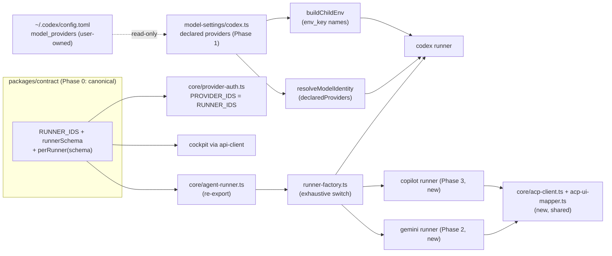

# Runner seam: native backends — seam de-duplication, provider identity, Gemini and Copilot runners

> Slug: `runner-seam-native-backends` · Status: **designed, awaiting implementation** ·
> Issues: #581 (Gemini CLI runner), #582 (Copilot CLI runner over ACP), #583 (Azure-hosted models
> on codex), #584 (Grok on a native agent CLI) · Handoff brief:
> [`briefs/2026-09-19-runner-seam-native-backends.md`](briefs/2026-09-19-runner-seam-native-backends.md) ·
> Delivery: **four phases, one implementation PR each** (`om-auto-implement-spec` per phase).

## 📝 TLDR

Today cezar runs four native coding-agent CLIs (`claude`, `codex`, `opencode`, `pi`). Adding a fifth
means editing ~50 places that still list the runner ids by hand, and you can use Azure or xAI models
on codex only after editing `~/.codex/config.toml` by hand, with no per-task choice. Gemini and
Copilot users cannot drive their own CLI from cezar at all. This spec proposes, in four
independently shippable phases:

0. deriving every runner enumeration from one tuple, so a new backend is one line plus typecheck;
1. letting codex serve any provider the user already declared in `config.toml` (Azure, xAI, …)
   per task, with the provider recorded truthfully and credentials forwarded by name, not by prefix;
2. a `gemini` runner over Gemini CLI's Agent Client Protocol mode (`gemini --acp`);
3. a `copilot` runner over the same protocol (`copilot --acp --stdio`), reusing Phase 2's ACP client.

## Resolved assumptions (autonomous defaults)

Rows U1–U11 come from the handoff brief. Rows the brief marked *human* keep its recommendation
and carry the confirmation marker. Q12–Q15 came up while designing this spec.

| # | Question | Applied answer | Why | Confirm? |
|---|---|---|---|---|
| U1 | Split the four issues into separate specs? | **No — one spec, four phases**, each its own implementation PR. | Triage comment on #581–#584 (2026-07-21) and #881 Wave 1 row 9; the phases share one seam and one provider-identity decision. | reversible |
| U2 | Explicit Phase 0 (seam de-duplication)? | **Yes**, merged before any new runner. | Halves the diff of every later runner PR and of Cursor (#807). | reversible |
| U3 | Provider identity model | **Build on the existing `configuredProvider` path**: widen it to the *declared* provider set read from `config.toml`, and pass the chosen provider to codex explicitly per run. No generic served-provider set in `BACKEND_MODEL_MAP`. | Keeps the #405 invariant (only persist a provider that served the run) with the smallest contract change; see § Phase 1. | ⚠ NEEDS HUMAN CONFIRMATION |
| U4 | Document or generate the `model_providers` entry? | **Document.** cezar never writes `~/.codex/config.toml`. | `agent-config/catalog.ts` treats vendor config as the user's file; config writes are localHandoff-gated (AGENTS.md). | reversible |
| U5 | #584: codex + custom provider (A) or a dedicated Grok runner (B)? | **Option A**, conditional on xAI serving the Responses API (codex removed `wire_api = "chat"`). If Step 1.1 finds it does not, #584 is documented as unsupported on codex and stays open. Option B stays out of scope. | No official headless xAI coding CLI was found. Option A needs no new `RunnerId`, and the Phase 1 mechanism is provider-agnostic, so nothing is built specifically for xAI. | reversible |
| U6 | Gemini: one long-lived process or a new process per turn? | **One long-lived process over ACP** (`gemini --acp`), follow-ups as further `session/prompt` calls, resume via `session/load`. Headless `-p` with `--resume` per turn is the documented fallback, not the design. | Gemini CLI 0.60 ships an ACP mode with `loadSession`, `cancel` and token counts (§ Research). That beats both options the brief listed, and it shares a client with Copilot. | ⚠ NEEDS HUMAN CONFIRMATION |
| U7 | Copilot: ACP stdio server or one-shot commands? | **ACP stdio server** (`copilot --acp --stdio`), persistent. | Issue #582 preference; same shape as the codex JSON-RPC runner. | reversible |
| U8 | Cover Kimi (#510) and GLM (#511)? | **No**, but Phase 1's declared-provider path is backend-agnostic, so an Anthropic-compatible provider on `claude` can reuse it later. | Bounds the spec. | reversible |
| U9 | Merge order vs Cursor (#807) and multi-model harness (#925) | **Phase 0 first; #807 and #925 rebase onto it.** | Phase 0 is small and mechanical; rebasing a runner onto it removes edits rather than adding them. | ⚠ NEEDS HUMAN CONFIRMATION |
| U10 | Mockups for this spec PR | **Text-only.** | No test-env descriptor (`.ai/qa/test-env.json` absent); the UI deltas are a pill and a hint line. | reversible |
| U11 | Which Google CLI does the `gemini` runner drive? | **Gemini CLI**, for users with an API key, Vertex, or a Workspace/Code Assist license. Its detection hint must say individuals need an API key. **Antigravity CLI (`agy`) is a named follow-up runner**, not part of this spec. | Google retired "Sign in with Google" for Gemini CLI on 2026-06-18 (google-gemini/gemini-cli#28229); `agy` is the free individual successor, with a different wire format. | ⚠ NEEDS HUMAN CONFIRMATION |
| Q12 | How do Azure/xAI credentials reach codex without widening its env prefixes (#850)? | **By name, from the user's own `config.toml`**: forward exactly the variables named by the chosen provider's `env_key` / `env_http_headers`. No new static `XAI_` prefix. | Keys access to the backend's own declared configuration instead of a prefix that happens to match, which is the direction #850 asks for. | reversible |
| Q13 | Where does the canonical runner tuple live? | **`packages/contract`** (`runners.ts`); `agent-runner.ts` re-exports it. | The contract is the one package all four workspaces already import; the service already imports contract values (AGENTS.md, repository layout). | reversible |
| Q14 | Agent accounts (multiple logins) for `gemini` / `copilot` | **`PROFILE_ENV_VAR` = `null` for both** until a test proves one variable moves credentials *and* config. | Same rule that keeps opencode and pi `null` (`core/agent-profiles.ts:30-45`); being wrong here bills the wrong account. | reversible |
| Q15 | Permission modes for the new runners | **`auto` only**: each CLI's "approve everything" start mode, plus an automatic `allow_always` answer and a `note` for any request that still arrives. Interactive presets wait for the permission-modes spec's card, which is not built yet. | Spec `2026-07-17-permission-modes` is approved but unbuilt. No runner emits `permission.requested` today, and parking on a request nothing can answer would leave the run stuck. | reversible |

## 📝 Problem Statement

- **The seam still costs ~50 hand edits per runner.** `RUNNER_IDS` (`packages/cezar/src/core/agent-runner.ts:24`)
  is meant to be the single source of truth, but the tuple is repeated by hand in
  `packages/contract/src/health.ts:4` and `:17`, `core/provider-auth.ts:7`, `core/ui-events.ts:28` and its mirror
  `packages/api-client/src/protocol/ui-events.ts:19`, `core/backend-detect.ts:7`, and eight or more per-runner
  `z.object({claude, codex, opencode, pi})` shapes across `packages/contract/src/workspace.ts`,
  `contract/src/agent-profiles.ts:98-103`, `server/server.ts:3097,5645`, `config.ts:98`,
  `workspace/config.ts:153` and `workspace/agent-accounts.ts:127`. The cockpit repeats it again in
  `web/src/lib/provider-status.ts:3`, `lib/provider-auth-alert.ts:7`, `routes/settings/accounts-section.tsx:147`,
  `routes/automations/editor-draft.ts:217`, `routes/task-thread/thread-state.ts:73,217`,
  `components/tools-menu.tsx:32` and `web/e2e/tools-menu.e2e.ts:24`. A `z.object` literal that misses the new id still
  typechecks, and the value is dropped silently. Adding `pi` touched 68 files (PR #470), and Cursor (PR #807) is
  now paying the same cost.
- **Azure and xAI models on codex work only by accident of configuration.** Since PR #726, codex's
  `model_provider` from `config.toml` flows into `resolveModelIdentity` as `configuredProvider`
  (`agent-config/model-settings/codex.ts`, `workflows/run.ts:110`). So `azure/<deployment>` already resolves
  **if** the user's global default provider is `azure`. A user whose default is OpenAI and who wants one task on
  Azure gets `ModelIdentityError` (`core/model-identity.ts:154-163`), and nothing in the cockpit says why. xAI is
  worse: codex's env allowlist (`core/agent-env.ts:223`) drops `XAI_API_KEY`, so a correctly configured xAI provider
  fails with an auth error from inside codex.
- **Gemini and Copilot users cannot use their own agent.** Both CLIs have a documented headless or streaming
  surface (#581, #582), and cezar has no runner for either.

## 📝 Proposed Solution

One seam, extended in dependency order:

| Phase | Delivers | Closes | New `RunnerId` | Protected surfaces touched (BACKWARD_COMPATIBILITY.md) |
|---|---|---|---|---|
| 0 | Every runner enumeration derived from one tuple; `runs.json` survives unknown runner ids | — (enabler, #881 row 9) | no | §2/§7 schemas re-derived with byte-identical output; §3 loader made downgrade-safe (per-record salvage, additive) |
| 1 | Per-task provider choice on codex from providers declared in `config.toml`; credentials by name | #583, #584 | no | §2 additive (`providers` on model defaults), §3 `runs.json` unchanged |
| 2 | `gemini` runner (Gemini CLI over ACP) + the shared ACP client and mapper | #581 | `gemini` | §2, §3 (`runner` enum widened), §4 (workflow `runner` value added), §7 (new backend meets parity) |
| 3 | `copilot` runner (ACP over stdio, reusing the client) | #582 | `copilot` | same as Phase 2 |

**Alternatives considered and rejected:**

- *Route Azure and Grok through OpenCode.* The issues were revised on 2026-07-21 to require native CLIs; it adds a
  second runtime and no capability.
- *A generic "served-provider set" in `BACKEND_MODEL_MAP`* (#583 candidate 2). It hard-codes in cezar which providers
  codex may serve, while codex already knows: the user's `model_providers` table *is* that set. Reading it keeps
  cezar ignorant of vendors (the #548 "no provider allowlist" rule, `model-identity.ts:48-56`).
- *`providerByModel`* (#583 candidate 1). It is keyed by bare model id, and Azure deployment names are user-chosen,
  so the keys collide.
- *A dedicated Grok runner* (#584 Option B). No official headless xAI coding CLI exists (see § Research).
- *Antigravity CLI instead of Gemini CLI now* (U11 option b). `agy` is what individuals can log in to for free, but its
  wire format (`init` / `step_update` / `result`), keyring credentials and permission model are all different and
  unverified in cezar. Gemini CLI is what #581 asked for and what API-key, Vertex and Workspace users run. Keeping the
  mapper and fixture layout per CLI lets `agy` land later as its own runner id without reshaping this one.
- *One `gemini` id with two transports* (U11 option c). Rejected: a runner id that means two different binaries breaks
  `resumeCommand()`, detection, the auth probe and fixtures, all of which key on the id.

## 📝 Research (verified 2026-09-19; re-verify at implementation time)

Versions: codex 0.154/0.155, Gemini CLI 0.60, Copilot CLI (`@github/copilot`) 1.0.x. Facts marked *unverified* must
be confirmed in the phase's first Step against the installed CLI before code depends on them.

Method: `--help` output, the documentation and JS bundle shipped in the installed `@google/gemini-cli` 0.60.0
package, strings in the codex 0.154.0 binary, and the codex app-server's own JSON schema
(`codex app-server generate-json-schema`, offline). Web access was not available to the research step, so rows
marked *unverified* come from prior knowledge. Each phase's first Step re-checks them.

**Codex (Phase 1)**

- `thread/start` and `thread/resume` both accept `modelProvider: string | null` and a free-form `config` object
  (`ThreadStartParams` / `ThreadResumeParams` in `codex_app_server_protocol.v2.schemas.json`, codex 0.154.0).
  `codex app-server` also accepts `-c key=value` at spawn. A per-thread provider is therefore a documented request
  field, not a config write. **Verified.**
- `wire_api = "chat"` is removed. The binary rejects it with "set `wire_api = "responses"`". Any provider cezar
  documents must be a Responses-API provider. **Verified.**
- The `model_providers` keys are `base_url`, `env_key`, `env_key_instructions`, `query_params`, `http_headers`,
  `env_http_headers`, `experimental_bearer_token`, `requires_openai_auth`, plus retry/timeout keys. There is also a
  command-based auth-token struct, a likely Entra ID route whose key names are *unverified*. **Verified** (binary
  strings).
- Codex recognizes Azure by host substring (`openai.azure.`, `cognitiveservices.azure.`, `aoai.azure.`, `azure-api.`,
  `windows.net/openai`) but ships **no built-in Azure provider entry**, so the user defines `[model_providers.azure]`.
  What the host match changes on the wire is *unverified*. **Verified** (binary strings).
- Azure stanza: `base_url = "https://<resource>.openai.azure.com/openai/v1"`, `env_key = "AZURE_OPENAI_API_KEY"`,
  `wire_api = "responses"`, model = deployment name, no `api-version` on the v1 endpoint (older endpoints need
  `query_params`). **Unverified**; confirmed in Step 1.1 before `docs/providers.md` states it.
- xAI: no built-in entry (`x.ai` and `XAI_API_KEY` absent from the binary). Whether `https://api.x.ai/v1` serves the
  **Responses** API is *unverified*, and it is the deciding fact for #584 now that `chat` is gone. No official
  headless xAI coding CLI was found. The known `grok-cli` projects are community-made (*unverified* as of 2026-09).

**Gemini CLI 0.60.0 (Phase 2)** (all **verified** against the installed package unless marked)

- **ACP mode exists:** `gemini --acp` (`--experimental-acp` deprecated), JSON-RPC over stdio
  (`docs/cli/acp-mode.md`). It advertises `loadSession: true` and image prompts, implements `newSession`,
  `loadSession`, `prompt`, `cancel`, `authenticate`, `setSessionMode`, `unstable_setSessionModel`, and emits
  `agent_message_chunk`, `agent_thought_chunk`, `tool_call`, `tool_call_update`, `user_message_chunk`,
  `available_commands_update`. Token counts arrive on the `prompt` result as
  `_meta.quota.token_count{input_tokens,output_tokens}` (+ per-model `model_usage`). No `plan` update kind was found.
- Headless `-p --output-format stream-json` is one prompt per process (`init`, `message`, `tool_use`, `tool_result`,
  `error`, `result{stats}`). `--resume <uuid>` and `--session-id <uuid>` work in `-p` mode. Stdin is not a follow-up
  channel.
- Exit codes: 41 auth, 42 input, 44 sandbox, 52 config, 53 turn limit, 54 tool execution, 55 untrusted workspace,
  130 cancelled.
- `--approval-mode default|auto_edit|yolo|plan`. `--yolo` and `--allowed-tools` are deprecated (the Policy Engine
  replaces them). In headless mode a policy `ask_user` is treated as **deny**.
- Env: `GEMINI_API_KEY`, `GOOGLE_API_KEY`, `GOOGLE_CLOUD_PROJECT`, `GOOGLE_CLOUD_LOCATION`,
  `GOOGLE_APPLICATION_CREDENTIALS`, `GEMINI_MODEL`, `GEMINI_CLI_HOME` (moves the whole `.gemini` home),
  `GEMINI_CLI_TRUST_WORKSPACE`. `GOOGLE_GENAI_USE_VERTEXAI` was not found in the bundled env reference
  (*unverified*).
- Quotas (bundled docs): free API key 250 requests/day, Flash only; Workspace Standard 1,500/day.
- **Auth reality:** the bundled 0.60 docs still describe "Sign in with Google" for individuals, but on this host on
  2026-09-19 a completed Google login failed every request with `IneligibleTierError UNSUPPORTED_CLIENT`
  (handoff README §4 item 8; google-gemini/gemini-cli#28229). The spec designs for the observed behavior: individuals
  need an API key.

**Copilot CLI (Phase 3)**

- The ACP method set (from the ACP SDK bundled with Gemini CLI, `PROTOCOL_VERSION = 1`): `initialize`, `session/new`,
  `session/load`, `session/prompt`, `session/cancel`, `session/update`, `session/request_permission`,
  `session/set_mode`, `session/set_model`, `session/set_config_option`, `session/list`, `session/resume`,
  `session/close`. Agents advertise optional ones (`loadSession`) in `initialize`. **Verified** for the protocol.
- `copilot --acp --stdio`, token precedence `COPILOT_GITHUB_TOKEN` > `GH_TOKEN` > `GITHUB_TOKEN`, `copilot login`,
  config in `~/.copilot`, `--allow-tool` / `--deny-tool` / `--allow-all-tools` / `--model`, and whether usage is
  reported over ACP: **unverified**. Issue #582 cites the GitHub docs (`copilot-cli-reference/acp-server`). Step 3.1
  confirms each against the installed CLI.

**Antigravity CLI (`agy`)**: not installed and not researched beyond the handoff README; nothing here depends on
it.

## 📝 Architecture

The takeaway: Phase 0 turns the runner set into data that flows from the contract package outward. Phase 1 changes
only codex's model-settings strategy, the identity resolver's input, and the env builder. Phases 2–3 share one ACP
client and mapper, and each adds a runner class plus a dialect: `AGENT_PROTOCOL.md` §9, with the transport written once.

### Phase 0 — one tuple, derived everywhere

- `packages/contract/src/runners.ts` (new) owns `RUNNER_IDS`, `runnerSchema = z.enum(RUNNER_IDS)`, `type Runner`, and
  a helper `perRunner<S>(schema: S)` that builds `z.object({[id]: schema})` for every id with the keys typed as
  `Record<Runner, S>`. The helper uses a mapped type over the tuple so the inferred shape keeps literal keys, and
  `contract-parity*.test.ts` stays green. `health.ts:4` and `:17` import it; check names become
  `z.enum([...RUNNER_IDS, 'gh', 'git'])`.
- `core/agent-runner.ts` re-exports `RUNNER_IDS` / `RunnerId` from the contract. The service already imports contract
  values at runtime (`workspace/migrations.ts`), and `packages/cezar/scripts/inline-contract.mjs` folds them into the published
  tarball. Phase 0 does not change that mechanism.
- `PROVIDER_IDS = RUNNER_IDS` (`provider-auth.ts:7`). A provider is a runner for auth purposes today; the alias keeps the
  name for call sites. `UiBackend` stays a literal union in both `ui-events.ts` files, because the api-client mirror
  **must stay import-free** (`api-client/src/protocol/ui-events.ts:12`). Instead, the existing type-exactness test
  gains an assertion that `UiBackend` equals the contract's `Runner`, so a missed edit fails typecheck. Both files
  are on the guard test's allowlist (below).
- Every `Record<RunnerId, …>` table stays a `Record` (the compiler already enforces it). Every hand-written
  `z.object({claude, codex, opencode, pi})` becomes `perRunner(…)`, with the same per-field schema, `.optional()` and
  `.catch()` behavior at every site. `perRunner` yields required keys, so optional-key sites add `.partial()`. The
  `~/.cezar` schemas (`workspace/config.ts:153`, `agent-accounts.ts:127`) keep their `.passthrough()`, so unknown keys
  survive round-trips (BACKWARD_COMPATIBILITY.md §9).
- Cockpit literal lists and predicates (`provider-status.ts:3`, `provider-auth-alert.ts:7`, `accounts-section.tsx:147`,
  `editor-draft.ts:217`, `thread-state.ts:73,217`, `e2e/tools-menu.e2e.ts:24`) import
  `RUNNER_IDS` / `runnerSchema.safeParse` from the api-client. Display-order arrays keep their order by filtering
  `RUNNER_IDS`.
- `createRunner` (`runner-factory.ts:14-26`) keeps `claude-cli` → Claude but drops `default` in favour of an exhaustive
  `switch` with a `never` check. An unknown id then fails typecheck instead of silently running Claude. Today every
  caller already passes a defined id (`planner.ts:67` and `auto-name.ts:156` a defaulted `config.defaultRunner`,
  `run.ts:3644,4436` a `RunnerId`), so the `undefined` parameter type is dropped with it.
- `resumeCommand()` (`server.ts:6230`) and `open-in-app.ts:133` move to a per-runner `Record<RunnerId, …>` table for the
  same reason: today, an unknown runner resumes as `claude --resume`. **The old `default` also carries records that
  have no `runner` at all** (`RunRecord.runner` is optional, `packages/cezar/src/runs/store.ts:158`; `server.ts:4185` passes it through).
  That behavior is kept explicitly as `run.runner ?? 'claude'` at the call site, the way `server.ts:4291` already
  does, and a test pins "runner-less record → `claude --resume`".
- **`runs.json` downgrade safety (BACKWARD_COMPATIBILITY.md §3).** Today `RunStore.open` parses the index as one array
  (`packages/cezar/src/runs/store.ts:723-740`). A single record whose `runner` the running version does not know fails
  the whole parse, and the store starts empty, so the next save (`saveNow`, `:1442`) **overwrites every run**. After
  running a Phase 2 task, a downgrade would therefore silently discard history, which §3 calls breaking. Phase 0
  changes the load to per-record salvage:
  - each array element is parsed on its own. An element that fails `runRecordSchema` goes into a **salvage pool**
    (`Map<id, SalvagedRecord>`), where `SalvagedRecord = {id, createdAt, archived, raw}`: `raw` is the element
    verbatim, and the three header fields come from a minimal header schema (`id: string`,
    `createdAt: string`, `archived: boolean` defaulting to `false`). An element without a string `id` and
    `createdAt` cannot be addressed or ordered, and is dropped with the warning below, as today's loader drops it;
  - salvaged records are invisible to the read API (`listRuns`, `getRun`, SSE, the cockpit), because nothing that
    consumes a `RunRecord` can be handed a shape it does not know;
  - **but they are not invisible to lifecycle.** Retention and deletion are consumers, and the store addresses
    salvaged records through their header:
    - `deleteRun(id)` removes the id from the live map **or** the salvage pool, together with the same on-disk
      companions (events, handoff, images, drafts), and returns `true` for either. A user can always delete a run the
      running version cannot read, including its verbatim prompt text;
    - `pruneOldRuns` counts salvaged records in its pools: `MAX_RUNS_KEPT` / `MAX_ARCHIVED_KEPT` are applied to the
      union of live and salvaged headers ordered by `createdAt`, so the pool is bounded by the same caps as the file
      and cannot grow across repeated downgrade/upgrade cycles;
  - `saveNow` writes one array: live records and salvaged `raw` elements merged in the same `createdAt`-descending
    order `listRuns` already uses (ties broken by `id`), so the write order is deterministic and a round trip leaves
    the file's order unchanged;
  - one warning names how many records were preserved unread, and how many were dropped as unaddressable.

  Every version from Phase 0 on can then be downgraded to safely. Versions before Phase 0 still lose history when
  they read a newer file, and the Phase 2/3 CHANGELOG entries say so.
- **Two more sites the inventory above missed**, both converted in Phase 0:
  - `packages/web/e2e/new-task.e2e.ts:150` — `['claude', 'codex', 'opencode'].filter(…)` decides "runner pill iff the
    host offers >1 backend". It is not a deliberate subset; it is stale (it already omits `pi`). It becomes
    `RUNNER_IDS.filter(…)`.
  - `packages/cezar/src/core/runner-model-catalog.ts:100` — `unavailableReason()` is a fall-through ternary
    (`runner === 'codex' ? 'Codex' : runner === 'claude' ? 'Claude' : 'OpenCode'`) that already mislabels `pi`. It
    becomes a `Record<RunnerId, string>` display-name table (shared with the other display-name sites where one
    exists), so a new id is a type error.
- **Guard test (new, `runner-union.test.ts`):** greps `packages/*/src` and `packages/web/e2e` (excluding fixtures and
  unit tests) for:
  - an array or union literal naming two or more runner ids;
  - a `||`-chain of `=== '<runner>'` comparisons over two or more ids;
  - a ternary chain branching on two or more `runner === '<id>'` tests (the `unavailableReason` shape).

  A single-runner branch such as `runner === 'pi'` is legitimate and is not matched. A match fails with the file:line
  and says "derive from RUNNER_IDS". **The allowlist is a named list in the test file, one entry per site, each with a
  one-line rationale; a new entry without a rationale fails the test itself.** It starts with exactly three entries:

  | Site | Rationale |
  |---|---|
  | `packages/cezar/src/core/ui-events.ts` (`UiBackend`) | Mirror of the api-client type; kept a literal so both files stay in lock-step, and the type-exactness test pins `UiBackend` = `Runner`. |
  | `packages/api-client/src/protocol/ui-events.ts` (`UiBackend`) | The api-client protocol module must stay import-free (`:12`); same type-exactness pin. |
  | `packages/contract/src/workspace.ts` (`modelDiscoveryRunnerSchema`) | A deliberate **subset**: the runners with a live `/models` discovery path (§ API Contracts). Deriving it from `RUNNER_IDS` would be wrong. |

  This makes the next runner's union sites findable by the test suite, not by review, and keeps the allowlist from
  becoming a file everyone appends to.

Phase 0 changes no wire shape. Proof: `contract-parity*.test.ts`, `route-parity.test.ts` and the api-client
type-exactness test pass unchanged. BACKWARD_COMPATIBILITY.md §9 is corrected in passing: it lists account
`selections` as `{claude?, codex?, opencode?}`, missing `pi`. A new `perRunner` unit test asserts `perRunner(z.string().optional())` parses and
rejects exactly what the old literal did.

### Phase 1 — codex serves any provider the user declared

**Model settings.** `model-settings/codex.ts` already reads `config.toml` through `readNativeSettingsFiles`
(`model-settings/shared.ts:63-82`), which orders files by catalog `modelPriority` **descending** — project scope
(`codex.project.config`, priority 2) before user scope (`codex.user.config`, priority 1). Only the user definition
declares `modelProviderKey`, which is why project scope already contributes no configured provider. It gains one field:
`declaredProviders: string[]`. That is the keys of the `[model_providers.*]` tables **in the user-scope file only**
(`$CODEX_HOME/config.toml`, default `~/.codex`; selected by the definition's `scope`, not by read order), plus codex's
built-in provider ids (`openai`, and the OSS ids codex ships; the exact list comes from the codex version under test
and is pinned in a fixture). Alongside the ids, the reader keeps each declared provider's credential names
(`env_key`, and the variable names in `env_http_headers`) for the Q12 carrier below. `AgentModelSettings` gets the
optional field for every runner; only codex fills it.

Project scope contributes **nothing** to providers or credential names. Codex itself refuses provider and auth keys at
project scope (`agent-config/catalog.ts:205`). Worse, honouring them would let a cloned repository's
`.codex/config.toml` name any host secret as an `env_key` next to its own `base_url`, and cezar would forward the
secret, bypassing the #427 least-privilege allowlist. A test pins that a project-scope `[model_providers.*]` changes
neither `declaredProviders` nor the child env.

**Identity.** `resolveModelIdentity(backend, raw, { configuredProvider, declaredProviders })`:

- explicit `provider/model` where the provider ∈ `declaredProviders` → accepted, even when it differs from
  `configuredProvider`;
- explicit provider not declared → today's `ModelIdentityError`, with a better message: *"codex has no provider
  `xai` — add `[model_providers.xai]` to ~/.codex/config.toml (see docs/providers.md#xai)"*;
- bare id → unchanged (`configuredProvider` → `defaultProvider`).

`BACKEND_MODEL_MAP` does not change, so no backend's bare-id behavior moves.

**Truthful persistence (the #405 invariant).** Accepting a foreign provider is only honest if codex then uses it.
`toBackendModel` still strips the provider (codex wants the bare model or deployment name). The codex runner receives
a new optional `AgentRunSpec.modelProvider` and, **whenever a model identity was resolved**, passes the provider
explicitly (never only when it differs from the default, so the record and the request can never disagree):

- the `modelProvider` field on `thread/start` / `thread/resume`. Both param types carry it in codex 0.154
  (§ Research), next to the `model` the runner already sends at `codex-app-server-runner.ts:344-357`;
- the value is validated against `^[A-Za-z0-9._-]+$` and is always a key cezar itself read from
  `declaredProviders`, never free text;
- an older codex might **ignore** an unknown field instead of rejecting it, which would persist `azure/x` for a run the
  default provider served. So the runner reads the codex version it already probes, and below the minimum recorded in
  Step 1.1 it refuses a non-default provider before spawn, with *"codex ≥ X is needed to choose a provider per task"*.
  The default-provider path is unchanged on every version.

The record then persists `{provider, model}` exactly as served. A `thread/resume` of a session that started on a
different provider passes the *recorded* provider, not today's default.

**Credentials by name (Q12). A new env mechanism, named as such:** today `BACKEND_ALLOW_PREFIXES` only matches prefixes
(`agent-env.ts:221-232`). This spec adds two sibling inputs, used by Phase 1 and by Phase 2:
- a static per-backend **`BACKEND_ALLOW_NAMES`** set (exact names);
- a per-run **`extraNames`** set computed by the run wiring.

`AGENT_PROTOCOL.md` §9 step 10 is updated to say "prefixes, and exact names where a prefix would over-grant". For
codex, `extraNames` is the chosen provider's `env_key` plus the env-var *values* of its `env_http_headers` map, read
from the user-scope `config.toml` only. Names are validated as `^[A-Z_][A-Z0-9_]*$`. The static prefix list (`agent-env.ts:223`) is unchanged.
`XAI_` is **not** added, which leaves no new pattern for #850 to unwind. The names are computed for the provider
actually serving the run, including the configured default: a user whose global default is xAI gets `XAI_API_KEY`
forwarded, which fixes today's silent drop.

**The carrier, end to end.** For codex, `buildChildEnv` runs inside the transport
(`core/codex-app-server-transport.ts:24`), which knows nothing about providers and does no config I/O. The names
therefore travel on the run spec, and the `config.toml` read stays in `agent-config/`, where `readNativeSettingsFiles`
already lives:

1. `run.ts` — the same helper that returns `{backendModel, modelProvider}` (§ Data Model) also returns
   `forwardEnvNames`: the chosen provider's `env_key` / `env_http_headers` names, looked up in the user-scope
   declared-provider table that `model-settings/codex.ts` read (it keeps `{id, envNames}` per declared provider, not
   only the ids). Validation (`^[A-Z_][A-Z0-9_]*$`) happens here, once.
2. `AgentRunSpec.forwardEnvNames?: readonly string[]` — a second new field beside `modelProvider`.
3. `CodexAppServerRunner` passes it through: `spawnCodexAppServer(bin, spec.cwd, spec.env, spec.forwardEnvNames)`
   (`codex-app-server-runner.ts:144`) → `buildCodexAppServerEnv(extraEnv, extraNames)` →
   `buildChildEnv({ backend: 'codex', extraEnv, extraNames })`.

The transport stays free of file I/O and of `agent-config/` imports. `buildChildEnv` treats `extraNames` as an exact
allowlist addition: it copies a listed variable only if it is set in the host env, and never a name that the
backend's deny rules exclude. Every other caller passes nothing, and its env is unchanged. The rejected alternative —
the transport re-reading `config.toml` — would pull `agent-config/` into `core/` and add a synchronous file read at
spawn, at the one boundary that forwards host secrets (#427).

**Discoverability.** The `GET …/config` answer (`server.ts:5523-5548`) gains an additive
`providers?: Partial<Record<Runner, {configured?: string; declared: string[]}>>`, a contract schema in
`packages/contract` (via `perRunner`). The cockpit's codex model picker:

- groups presets under the configured provider, as today;
- offers each declared non-default provider as a prefix chip (`azure/`, `xai/`), so typing a deployment name
  produces `azure/<deployment>`;
- shows a one-line hint in Settings → Agents → Codex when a declared provider has an `env_key` that is unset in the
  environment: *"`AZURE_OPENAI_API_KEY` is not set — codex will fail to authenticate with `azure`"*. It shows the
  name only, never a value.

The codex model catalog (`core/codex-model-catalog.ts`, `model/list`) is not changed: whether `model/list` reflects a
custom provider's models is version-dependent. Deployment names are user-chosen, so free text plus the prefix chip is
the reliable path.

**Docs.** `docs/providers.md` (new, linked from `docs/reference.md`) gives the `config.toml` stanzas for Azure OpenAI /
Foundry and for xAI, taken from § Research, with the variable names and the "cezar never edits this file" note.

### The shared ACP layer (built by whichever of Phases 2 and 3 merges first)

Gemini CLI (`gemini --acp`) and Copilot CLI (`copilot --acp --stdio`) both speak the Agent Client Protocol. The
v2 `UiEvent` vocabulary was modelled on ACP (`permission.requested` already carries ACP option kinds;
permission-modes spec). So the two runners share one transport and one mapper, and each adds a thin runner class:

- **`core/acp-client.ts`** (transport only, no vendor knowledge): JSON-RPC 2.0 over NDJSON stdio, request-id
  bookkeeping and timeouts, following `codex-app-server-transport.ts`, with a never-throwing line reader (`ndjson.ts`).
  It supports `initialize` (protocol version 1; client capabilities `fs: false`, `terminal: false`, so the agent uses
  its own tools inside `cwd`), `session/new {cwd, mcpServers: []}`, `session/load` when advertised, `session/prompt`,
  `session/cancel`, `session/set_mode` / `session/set_model` when advertised, and inbound `session/update` and
  `session/request_permission`.
- **`core/acp-ui-mapper.ts`** (pure, `(frame, state) → {events, state}`, never throws), parameterised by a small
  per-agent `AcpDialect` (`usageFromPromptResult`, `planFromToolCall`, `toolNameOf`). The per-runner files
  `gemini-ui-mapper.ts` / `copilot-ui-mapper.ts` required by `AGENT_PROTOCOL.md` §9 step 4 are those dialects plus a
  re-export. Fixtures, the mapper test and the parity row stay **per runner**, so each CLI's real wire is pinned
  separately.

| ACP | v2 `UiEvent` | v1 |
|---|---|---|
| `session/new` / `session/load` result `sessionId` | `session.started` | `session` |
| `session/prompt` sent | `turn.started` | — |
| `agent_message_chunk` | message item + `item.delta` text | `text` |
| `agent_thought_chunk` | reasoning item | — |
| `tool_call` (`toolCallId`, `kind`, `title`, `rawInput`, `status`) | tool item `running`; ACP `kind` (`read`/`edit`/`execute`/`search`/`fetch`/`think`/`other`) → `ToolKind` directly | `tool-call` |
| `tool_call_update` (`status`, `content` incl. `{type:'diff'}`) | tool `completed` / `failed`; diff content → `diffs` | `tool-result` |
| `plan` (`entries`) | `plan.updated` (full replacement) | — |
| dialect `planFromToolCall` (Gemini's `write_todos` tool input) | `plan.updated` | — |
| dialect `usageFromPromptResult` (Gemini: `_meta.quota.token_count`) / `usage_update` | `usage.updated` raw counts | `token-usage` |
| `session/prompt` result `stopReason` (`end_turn`, `max_tokens`, `max_turn_requests`, `refusal`, `cancelled`) | `turn.completed` with that `StopReason` (`max_turn_requests` → `max_tokens`) | `turn-end` |
| `session/request_permission` | `permission.requested`, then `permission.resolved` on the answer | `note` |
| `user_message_chunk`, `available_commands_update`, unknown kinds | no events | — |

**Session lifecycle (both runners).** One child and one ACP session per cezar session. The first turn runs
`session/new` (or `session/load` with the recorded id when `spec.resume`) and then `session/prompt` with text plus
image blocks. `systemPrompt` is prepended to the first prompt, since neither CLI has a native channel. Follow-ups are
further `session/prompt` calls on the same process. `interrupt()` sends `session/cancel`: the pending prompt resolves
`cancelled` and the session stays usable. `end()` closes stdin, then SIGTERM after the shared grace period. A child
that dies mid-turn rejects the pending prompt (`turn.completed{error}`), and the next message respawns and
`session/load`s, or starts a fresh session with a `note` when load is not advertised.

**Permissions (Q15).** Only `auto` exists in code today: the permission-modes spec (`2026-07-17-permission-modes`) is
approved but unbuilt. No runner emits `permission.requested`, no in-run card exists, and codex hard-codes
`approvalPolicy: 'never'` (`codex-app-server-runner.ts:351`). Phases 2–3 therefore ship `auto` only:
- the CLI's allow-everything start mode (Gemini `--approval-mode yolo`; Copilot `--allow-all-tools`);
- an automatic `allow_always` answer to any `session/request_permission` that still arrives, which is also emitted as
  a `note`, so no request can park a run with nothing able to wake it (AGENTS.md, "enumerate the transitions").

When permission-modes Phase 2 lands its card and answer route, the ACP runners are its most direct consumers: the
request becomes `permission.requested`, and the answer goes back as the ACP option id. That wiring belongs to that
spec, not this one.

**Subagent nesting.** Neither CLI attributes child work on the ACP wire. The nesting parity cell uses the documented
substitute (a `task` item with `running → completed` when the agent exposes a subagent tool), the way codex review
mode does (§6).

### Phase 2 — `gemini` runner (Gemini CLI over ACP, #581)

- **Transport:** `gemini --acp [--model m] [--approval-mode …]` in `spec.cwd`, with `GEMINI_CLI_TRUST_WORKSPACE=true` in
  the per-run env. Task worktrees are new directories, and an untrusted workspace exits 55. Model changes mid-thread
  (#954) use `unstable_setSessionModel` when advertised, otherwise the next turn respawns with `--model` and
  `session/load`.
- **Fallback (U6):** if Step 2.1 finds `--acp` unusable on the installed version, the runner uses
  `gemini -p … --output-format stream-json --resume <uuid>` with one child per turn. This is the Cursor v1 precedent
  (#807), and the mapping for that path is recorded beside the fixtures. The `AgentSession` contract stays the same.
- **Exit codes** (child death outside a prompt): 41 → `provider-auth-required`; 52 / 55 → `error` with a cezar-authored
  hint ("Gemini config invalid" / "workspace not trusted"); others → `error`.
- **Detection and auth:** `probeGemini()` in `backend-detect.ts` (`gemini --version`, `CEZ_GEMINI_BIN`). The
  `provider-auth.ts` descriptor reads the environment, because Gemini has no `status` subcommand:
  - `GEMINI_API_KEY` / `GOOGLE_API_KEY`, or a Vertex project → `connected`;
  - otherwise `unknown`, with the hint *"Gemini CLI needs an API key (aistudio.google.com), Vertex AI, or a
    Workspace/Code Assist license — personal Google sign-in no longer works for Gemini CLI."*;
  - an ACP `authenticate` requirement, exit 41, or `UNSUPPORTED_CLIENT` becomes `provider-auth-required` with that same
    hint, never the raw vendor text.
- **Credentials:** `BACKEND_ALLOW_PREFIXES.gemini = ['GEMINI_']` plus the names `GOOGLE_API_KEY`,
  `GOOGLE_CLOUD_PROJECT` and `GOOGLE_CLOUD_LOCATION`. `GOOGLE_APPLICATION_CREDENTIALS` is forwarded **only when** Gemini's
  own Vertex selector is on (the variable is confirmed in Step 2.1). That is the Bedrock/Vertex toggle shape
  (`agent-env.ts:256-266`), keyed on the backend's own variable (the #850 direction).
- **Everything else from §9:**
  - `'gemini'` in `RUNNER_IDS` (one line after Phase 0) and the factory case;
  - `CEZ_GEMINI_BIN` in `.env.example` and `docs/reference.md`;
  - `scripts/mock-gemini-acp.mjs` for `CEZ_DRY_RUN=1`;
  - fixtures under `__fixtures__/gemini/` citing `docs/cli/acp-mode.md` and the version;
  - the `BACKENDS` row in `ui-parity.test.ts`;
  - `model-settings/gemini.ts` (reads `model.name` from `~/.gemini/settings.json` / project `.gemini/settings.json`,
    and `GEMINI_MODEL`);
  - `BACKEND_MODEL_MAP.gemini = { defaultProvider: 'google' }`;
  - `KNOWN_PRESETS_BY_RUNNER.gemini` (a guard, not a whitelist; the ids are taken from the CLI at implementation time);
  - `agent-config/catalog.ts` entries for `settings.json` and `GEMINI.md`;
  - `resumeCommand` → `gemini --resume <id>`, and open-in-app;
  - `PROFILE_ENV_VAR.gemini = null` (Q14). `GEMINI_CLI_HOME` is the candidate once a test proves it moves the OAuth
    credentials too.

### Phase 3 — `copilot` runner (Copilot CLI over ACP, #582)

- **Transport:** `copilot --acp --stdio` in `spec.cwd`, with the tool filters (server-start options) and `--model`
  from the permission mode and run spec. It uses the shared ACP layer above. The Copilot dialect decides where usage
  comes from (Step 3.1: `usage_update`, the prompt result's `_meta`, or none). If Copilot reports no usage at all,
  `usage.updated` degrades per capability with a documented substitute, and this is recorded in `AGENT_PROTOCOL.md` §4.
- **Detection and auth:** `probeCopilot()` (`copilot --version`, `CEZ_COPILOT_BIN`). The `provider-auth.ts` descriptor
  reports `connected` when a token (`COPILOT_GITHUB_TOKEN` / `GH_TOKEN` / `GITHUB_TOKEN`) is present or the CLI's
  stored login is detected; the login command is `copilot login`. An ACP auth error on `session/new` becomes
  `provider-auth-required`.
- **Credentials:** `BACKEND_ALLOW_PREFIXES.copilot = ['COPILOT_']`. The `gh` names are already forwarded to every
  backend (`GH_ALLOW_NAMES`, `agent-env.ts:237-243`), so nothing else is widened.
- **Everything else from §9**, as in Phase 2:
  - `'copilot'` in `RUNNER_IDS`, the factory case, `CEZ_COPILOT_BIN`;
  - `scripts/mock-copilot-acp.mjs`;
  - fixtures citing agentclientprotocol.com and GitHub's ACP-server reference;
  - the parity row;
  - `model-settings/copilot.ts`;
  - `BACKEND_MODEL_MAP.copilot`: `{}` if Copilot's model ids span vendors (a bare id then fails loud), or
    `{ defaultProvider: 'github' }` if its ids are provider-less; decided in Step 3.1 from the model list the CLI
    prints;
  - `resumeCommand` → `copilot --resume <id>`, and open-in-app;
  - `PROFILE_ENV_VAR.copilot = null` (Q14).

## 📝 Data Model

- `runs.json` `RunRecord.runner` / `backend` (BACKWARD_COMPATIBILITY.md §3): **widened** by `gemini` (Phase 2) and
  `copilot` (Phase 3). Widening the enum is additive, and old records parse. Reading a newer file on an older version
  is covered by Phase 0's per-record salvage (§ Phase 0); versions before Phase 0 lose history on downgrade, and the
  CHANGELOG says so.
- `RunRecord.model` keeps `{provider, model}`. Phase 1 changes only *which* provider may legitimately appear for
  codex. No new field.
- `AgentRunSpec.modelProvider?: string` (Phase 1). This is in-memory only (not persisted, not on the wire). It is set
  at **both** places the spec is built, the two `runner.startSession` calls (`run.ts:3664` and `run.ts:4441`),
  through one helper that returns `{backendModel, modelProvider, forwardEnvNames}`, so neither site can ship half the
  fix (AGENTS.md, "find every construction site").
- `AgentRunSpec.forwardEnvNames?: readonly string[]` (Phase 1). In-memory only. The validated exact env-var names the
  codex child may inherit for the provider serving the run (§ Phase 1, "The carrier, end to end"); set by the same
  helper at the same two sites, and read only by the codex runner, which hands it to the transport's
  `buildChildEnv({ extraNames })`.
- No new files under `.ai/cezar/` or `~/.cezar/`. Credentials stay in the environment and the vendors' own stores.

## 📝 API Contracts

- **Phase 0:** none changed. `runnerSchema` moves files; its JSON is identical.
- **Phase 1:** `GET /api/v1/config` (and its `/p/:projectId` alias) gains optional
  `providers?: {[runner]: {configured?: string, declared: string[]}}`, a schema in `packages/contract`, chained route
  unchanged, `contract-parity` both directions. BACKWARD_COMPATIBILITY.md §2 lists it as additive.
- **Phases 2–3:** every body/param that carries `runnerSchema` (`POST /api/v1/runs`, `PUT /api/v1/config`,
  `PUT /api/v1/workspace/config` `agentDefaults`, automations, agent accounts) accepts the new id automatically, via
  Phase 0.
- **`GET /api/v1/models?runner=` is the exception and does not change.** It validates against the contract's
  deliberately narrower `modelDiscoveryRunnerSchema = z.enum(['claude', 'codex', 'opencode'])`
  (`packages/contract/src/workspace.ts:493`, route at `server.ts:1727`), not `runnerSchema`. `gemini` and `copilot`
  stay **out** of it, as `pi` already is: `runnerDiscoversModels()` returns `false` for them, the cockpit never
  queries the route for them (`web/src/api/queries.ts:284`), and their model picker is free text plus
  `KNOWN_PRESETS_BY_RUNNER` — the same path `pi` uses today. Live discovery over ACP (Gemini's
  `unstable_setSessionModel` / ACP `session/set_model` imply a model list) is a named follow-up, not part of this
  spec. Because `runnerDiscoversModels(runner: Runner)` takes the widened `Runner`, the phase's cockpit Step pins
  the decision with a test (`runnerDiscoversModels('gemini') === false` and the picker renders free text + presets),
  so the fallback is deliberate rather than discovered in e2e.
- `GET /api/v1/health` `checks[].name` gains `gemini` / `copilot`. Health is the
  most externally depended-on shape (§2), and adding an enum member there is additive: consumers must already tolerate
  unknown check names, since `pi` did this in August. Workflow YAML `runner:` (§4) gains two values, and none is
  removed.
- v1 `AgentEvent` / v2 `UiEvent` (§7): no new types. Both runners emit only existing event types and `StopReason`s.

## 📝 UI/UX

Text-only (U10). The deltas:

- Composer runner pills and Settings → Agents gain **Gemini** and **Copilot** rows (Phases 2–3). They are disabled
  with the detection hint when the CLI is absent, never hidden, matching `pi`. The Gemini row's hint states the
  API-key requirement.
- Codex model picker (Phase 1): a prefix chip per declared non-default provider, and the missing-`env_key` hint line
  in Settings → Agents → Codex.
- No permission UI in this spec: `auto` only (see Q15). The permission-modes spec owns the card.

## 📝 Edge Cases & Failure Scenarios

| Scenario | Behavior |
|---|---|
| `config.toml` unreadable or malformed | `declaredProviders = []`; codex behaves exactly as today (bare ids, configured provider). |
| Explicit `azure/x` but `azure` not declared | `ModelIdentityError` before spawn, with the message naming the missing stanza and the docs link. |
| Declared provider's `env_key` unset | Settings hint beforehand; at run time codex's auth error surfaces as `provider-auth-required` for codex with a cezar-authored hint (no vendor text). |
| Resume of a codex thread started on another provider | The recorded provider is passed again. If that provider is no longer declared, Continue fails before spawn with the identity error naming the missing stanza, and the user picks another model; nothing is silently re-routed. |
| Gemini individual with Google login only | Detection says `unknown` with the API-key hint; a live `UNSUPPORTED_CLIENT` becomes `provider-auth-required`. The run never hangs. |
| Gemini exit 41 (auth) / 52 (config) / 55 (untrusted workspace) | `provider-auth-required` / `error` with a cezar-authored hint; 55 should not occur because the runner sets `GEMINI_CLI_TRUST_WORKSPACE=true`. |
| `gemini --acp` unusable on the installed version | Per-turn `-p … --resume` fallback with `--approval-mode yolo` (headless `ask_user` = deny). |
| ACP child (either runner) dies mid-turn | Pending prompt rejects → `turn.completed{error}` + `error`; the next message respawns and `session/load`s if supported, otherwise a fresh session with a `note`. |
| ACP permission request arrives despite the `auto` start mode | Auto-answered `allow_always`, plus a `note`; never parks. |
| Malformed or unknown frames (either runner) | Skipped; unknown `session/update` kinds yield no events (mapper robustness contract). |
| `CEZ_DRY_RUN=1` | Bundled mocks; no network, no login. |

## 📝 Risks & Impact Review

- **Merge collision with Cursor (#807) and #925 (U9).** Both edit `agent-env.ts`, `agent-runner.ts`, `ui-events.ts` and
  the union sites Phase 0 rewrites. If Phase 0 lands first, each rebases once and its union-site edits collapse to one
  line. If #807 lands first, Phase 0 absorbs `cursor` into the tuple instead, with no design change. This is a direction
  call, not a defect.
- **Older cezar reading a newer `runs.json`** (§3). Today a downgrade after one run on a new runner wipes the whole index
  on the next save (`packages/cezar/src/runs/store.ts:723-740`). Phase 0's per-record salvage fixes this for every later version. Versions
  before Phase 0 keep the old behavior, and the Phase 2/3 CHANGELOG entries warn about it.
- **Vendor churn.** Gemini's flags (`--yolo` → `--approval-mode`), auth policy, and ACP maturity in Copilot all moved
  in 2026. Every runner phase starts with a verification Step against the installed CLI, and fixtures cite the version.
- **Credential widening.** Phase 1 forwards named variables that only the user-scope codex config can name (never a
  repository's project-scope file); Phases 2–3 add
  backend-specific prefixes and exact names only. No runner gains another runner's credentials. The Vertex unlock for `gemini` follows
  the existing toggle pattern, keyed on Gemini's own variable.
- **Contract-package move (Phase 0).** `RUNNER_IDS` becomes a contract value the service imports at runtime. It rides
  the existing `packages/cezar/scripts/inline-contract.mjs` path, and `npm run test:package` proves the tarball still installs.
- **Rollback.** Phases 0 and 1 revert cleanly (no persisted state). After Phase 0, reverting Phase 2 or 3 is safe too: records carrying the
  removed runner id are preserved unread by the salvage path and come back if the phase is re-applied.
- **Out of scope:** Antigravity CLI runner (named follow-up), Grok Option B, Kimi/GLM (#510/#511), routing through
  OpenCode, writing vendor config, storing provider credentials under `.ai/cezar/`.

## 📋 Phasing

| Phase | PR | Depends on | Independently useful because |
|---|---|---|---|
| 0 — seam de-duplication | 1 | — | every future runner (incl. #807) is cheaper; unknown ids stop silently becoming Claude |
| 1 — codex declared providers | 2 | 0 (uses `perRunner` for the config answer) | Azure and xAI on codex per task, with truthful records |
| 2 — `gemini` runner + shared ACP layer | 3 | 0 | Gemini API-key / Vertex / Workspace users |
| 3 — `copilot` runner | 4 | 0, and the ACP layer | Copilot subscribers |

Phases 1, 2 and 3 are independent of each other. If Phase 3 is picked up before Phase 2, it carries Steps 2.2–2.3
(the ACP client and mapper) instead; the layer is written once, by whichever lands first.

## 📋 Implementation Plan

Every Step leaves `npm run typecheck && npm test && npm run test:unit` green. Every Phase ends with the full gate
(AGENTS.md § Validation), including `npm run build && npm run test:package`.

### Phase 0 — seam de-duplication

1. Add `packages/contract/src/runners.ts` (`RUNNER_IDS`, `runnerSchema`, `Runner`, `perRunner`). Point
   `health.ts` at it; test `perRunner` against the old literal (accept/reject table).
2. Re-export from `core/agent-runner.ts`; `PROVIDER_IDS = RUNNER_IDS`; `UiBackend = Runner` in both `ui-events.ts`.
   Type-exactness test green.
3. Replace every per-runner `z.object` literal (contract `workspace.ts`, `agent-profiles.ts`, `config.ts`,
   `workspace/config.ts`, `agent-accounts.ts`, `server.ts` bodies) with `perRunner(…)`. `contract-parity*`,
   `route-parity`, `typed-bodies` green.
4. Exhaustive `createRunner`, `resumeCommand`, open-in-app tables; tests pin "unknown id is a type error" (a
   `@ts-expect-error` case), today's outputs for every current id, and "runner-less record → `claude --resume`".
5. `RunStore.open` per-record salvage (`packages/cezar/src/runs/store.ts`). Tests:
   - a file with one unknown-runner record loads the others, and the save re-emits the unknown record
     byte-identically and in `createdAt` order. Proven red against today's loader;
   - `deleteRun(<salvaged id>)` returns `true`, removes its companions, and the record is absent after the next save;
   - `pruneOldRuns` with more than `MAX_RUNS_KEPT` records, the oldest of them salvaged, prunes the salvaged ones
     (prune does not skip salvaged records);
   - an element with no string `id` / `createdAt` is dropped and counted in the warning.
6. Cockpit literal sites → `RUNNER_IDS` / `runnerSchema`; web unit tests for order-preserving filters. Also
   `e2e/new-task.e2e.ts:150` → `RUNNER_IDS.filter(…)` and `runner-model-catalog.ts` `unavailableReason` → a
   `Record<RunnerId, string>` label table (test: `pi` no longer reads "OpenCode").
7. `runner-union.test.ts` guard with the three-entry, rationale-carrying allowlist (§ Phase 0). Prove it red by
   reintroducing one literal list and one ternary chain (`git stash push -- <file>` recipe, AGENTS.md), then green;
   a test case pins that an allowlist entry with an empty rationale fails. Update `AGENT_PROTOCOL.md` §9 step 2/8 to say "add the id to `RUNNER_IDS` in
   `packages/contract/src/runners.ts`; typecheck and `runner-union.test.ts` list the rest".

### Phase 1 — codex declared providers (#583, #584)

1. Verify end to end with the installed codex (≥ 0.154, where `thread/start` / `thread/resume` carry `modelProvider`):
   an Azure v1 endpoint and `https://api.x.ai/v1` with `wire_api = "responses"`, deployment-name-as-model, and the
   env-key vs Entra (`env_http_headers`) variants. Record the minimum codex version in the runner. Settles U5: if xAI
   has no Responses API, #584 is documented as unsupported and left open.
2. `model-settings/codex.ts` → `declaredProviders` (fixture `config.toml` files: Azure stanza, xAI stanza, malformed,
   project-scope override).
3. `resolveModelIdentity` accepts `declaredProviders`. Unit table: declared/undeclared × default/foreign × bare/explicit.
   The #405 invariant ("a foreign provider is never persisted unless it served the run") is pinned end to end in
   `model-identity-wiring.test.ts` plus the codex runner test (persisted provider == `modelProvider` sent). It is
   proven red with the runner override removed.
4. `AgentRunSpec.modelProvider` wired through one helper at **both** `startSession` sites (`run.ts:3664,4441`), fed by
   all three `configuredModelProvider` call sites (`run.ts:3594,3776,4406`); the codex version gate; the codex runner passes the override; the runner
   test asserts `modelProvider` on the `thread/start` and `thread/resume` payloads.
5. `BACKEND_ALLOW_NAMES` + `extraNames` in `buildChildEnv`, from the user-scope provider's `env_key` /
   `env_http_headers`, carried as `AgentRunSpec.forwardEnvNames` through the Step 4 helper →
   `CodexAppServerRunner` → `spawnCodexAppServer` → `buildCodexAppServerEnv`. Tests cover: the runner test asserts the
   names reach the spawned child's env (both `startSession` sites); a project-scope provider contributes nothing; `XAI_API_KEY`
   forwarded only when an xAI provider serves the run; an invalid name is ignored; the claude/opencode/pi envs are
   unchanged.
6. Contract + route: `providers` on the config answer; the cockpit prefix chips and missing-key hint; web tests.
7. `docs/providers.md` (Azure OpenAI / Foundry and xAI stanzas); BACKWARD_COMPATIBILITY.md §2 line; README pointer.

### Phase 2 — `gemini` runner + shared ACP layer (#581)

1. Verify against Gemini CLI ≥ 0.60: `--acp` `initialize` capabilities, `session/load`, cancel, `setSessionMode`
   values, the usage `_meta` shape, whether a `plan` update or only the `write_todos` tool carries the plan, the
   Vertex selector variable, and the auth-failure shape for a Google-login-only account. Capture real ACP transcripts
   (API-key account, redacted) as the fixture source, with the version in each fixture header.
2. `core/acp-client.ts` + tests against a scripted NDJSON peer (request/response, notifications, inbound requests,
   malformed lines, child exit mid-request).
3. `core/acp-ui-mapper.ts` + `gemini-ui-mapper.ts` dialect; `__fixtures__/gemini/` covering every parity row (with the
   documented nesting substitute) + malformed and unknown-kind tests.
4. `gemini-acp-runner.ts` (session lifecycle, cancel, respawn + `session/load`, timeout, env, trust variable) +
   `scripts/mock-gemini-acp.mjs`; runner tests on the mock. Permission handling: `auto` start mode; a test that an
   inbound `session/request_permission` is answered `allow_always` with a `note` and the turn continues.
5. `'gemini'` in `RUNNER_IDS`; factory; `probeGemini`; provider-auth descriptor with the API-key hint;
   `BACKEND_ALLOW_PREFIXES` + Vertex toggle; `CEZ_GEMINI_BIN` in `.env.example` + `docs/reference.md`.
6. Model settings, `BACKEND_MODEL_MAP`, presets, catalog entry, `resumeCommand`, open-in-app, `PROFILE_ENV_VAR = null`;
   `ui-parity.test.ts` `BACKENDS` row; `AGENT_PROTOCOL.md` §4 gains an ACP column.
7. Model discovery decision (§ API Contracts): `gemini` stays out of `modelDiscoveryRunnerSchema`. Web unit test
   pins `runnerDiscoversModels('gemini') === false` and that the model picker offers free text plus
   `KNOWN_PRESETS_BY_RUNNER.gemini` with no `/models` request.
8. Cockpit: runner pill, Settings → Agents row with the auth hint; e2e dry-run smoke (a task on `gemini` reaches
   review, a follow-up resumes it). An opt-in real-CLI smoke test is skipped without `GEMINI_API_KEY`.

### Phase 3 — `copilot` runner (#582)

1. Verify against `@github/copilot` ≥ 1.0.86: `--acp --stdio`, `initialize` capabilities (`loadSession`, image
   prompts), model selection, tool-filter flags, usage reporting, token precedence, the auth-error shape. Capture
   fixtures.
2. `copilot-ui-mapper.ts` dialect + `__fixtures__/copilot/` covering every parity row.
3. `copilot-acp-runner.ts` + `scripts/mock-copilot-acp.mjs`; follow-ups, cancel, resume via `session/load`;
   `--allow-all-tools` + the shared auto-answer.
4. Model discovery decision (§ API Contracts): `copilot` stays out of `modelDiscoveryRunnerSchema`; the same web
   unit test as Phase 2 Step 7 pins `runnerDiscoversModels('copilot') === false` and the free-text + presets picker.
5. `'copilot'` in `RUNNER_IDS` and the rest of §9 (detection, auth, env, `CEZ_COPILOT_BIN`, presets, catalog,
   resume, open-in-app, `PROFILE_ENV_VAR = null`, parity row, cockpit rows, dry-run e2e, opt-in real smoke).
