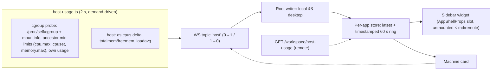

# Effective host telemetry + the sidebar glance — container-aware v2

> Slug: `host-telemetry-sidebar-widget` · Status: **draft v2.4, for lead verification** · Brief:
> `.ai/specs/briefs/2026-09-20-host-telemetry-sidebar-widget.md` · Builds on
> `.ai/specs/2026-09-20-host-resource-telemetry.md` (PR #1035, OPEN - the v1 SPEC FILE lands
> there, not in #1036, which implements it) · Review trail: units
> `461df7d3` + `d3d0e2ca` (widget subscription/store/UI), `366cf417` + `9a043744` (v2.1
> architecture and OS-level cgroup defects) — every Critical/High/Medium is folded here ·
> final verification `f450c6b4` residuals F1-F12 folded as v2.3 (quota + cpuset affinity +
> pressure pin; the local `(v2.4)` commit's content was absorbed into this same pushed v2.3
> revision, so the document's own numbering runs one step behind its git history) · Delivery:
> stacked on #1036's head while it is open (the implementation PR body
> says `Stacked on #1036 (head 0537b32e); merge #1036 first, then rebase/merge main`), as Phase 1
> (server + card) and Phase 2 (widget), one or two PRs · v2.3 re-review residuals R1-R3 folded
> (stacked-delivery wording, cpuset example count, ambient-cpuset note).

## 📝 TLDR

v1 reports host totals; in a cgroup-limited process they can read "host 64 CPU / 755 GB" while
the process is capped at 6 CPU / 16 GB. v2 makes the telemetry **effective**: the sampler resolves
the process's own cgroup (v2 first, v1 fallback), walks ancestors for the tightest finite limit,
and emits an optional `container` object **only when a real limit exists** (a finite CPU quota, a
cpuset affinity set smaller than the host core count, or a memory limit) - usage-only hosts keep
the byte-identical v1 payload, and the additive `hostCpuCount` rides only together with
`container`. The Machine card renders the effective numbers **labelled**, with host totals kept
as context. The sidebar glance renders the same effective CPU/RAM pair and its
sparkline, but it carries **no effective/host marker**: with only a memory limit it shows the
host cpu % beside effective RAM, and the card is where the labels live (review major). A per-app
external store feeds both; the v1 card keeps its
view-scoped subscription (with an `enabled` gate) as the `<md` fallback, and the root
subscription (local && desktop) feeds the widget. Adaptive admission stays out of scope; its
chain, hard-ceiling invariant and pressure-signal source (raw `memory.current`/`memory.max`,
`memory.events`, PSI) are pinned once below.

## 📝 Problem Statement

- **Host totals misread the environment.** `cpuPct` comes from `os.cpus()` deltas (host-wide),
  memory from `os.totalmem/freemem` (host), load from `os.loadavg()` (host). Only `cpuCount` uses
  `os.availableParallelism()`, which is cgroup-quota aware only from libuv 1.49 (Node 22.12+/
  23.5+/24+; Node 20 and Node 22.0–22.11 are affinity-only), so even the core count is
  version-dependent. The card's caveat is honest but the numbers are not usable for capacity.
- **Naive cgroup reads are wrong in both directions.** The dev host demonstrates the first: root
  `/sys/fs/cgroup/cpu.max` = `max`, `memory.max` = `max`, but the process's own scope has
  `memory.current`; reading the root and gating on "limit or usage" would emit a container with
  cache-inclusive usage and no limit, flipping the card to "limits detected" and replacing the
  cache-excluded host figure. The second: a systemd-limited host service (or `--cgroupns=host`)
  has a real limit on an ancestor cgroup while the root reads `max`; reading the root misses it.
  v1 `cpu.cfs_quota_us=-1` (the standard unlimited value) would produce negative cores;
  `cpu.max=max` with an unscaled `usage/wall` delta can exceed 100 % and fail the 0–100 schema.
- **A cpuset-only pin looks like an unlimited host.** `docker --cpuset-cpus` and a cgroup with a
  narrow `cpuset.cpus.effective` leave `cpu.max=max` and `memory.max=max`, so a probe that only
  reads quota and memory reports the full host capacity for a sandbox pinned to one or two cores.
  A `taskset`-style per-process mask is invisible in the cpuset files, but
  `os.availableParallelism()` already folds it into `cpuCount`. The comparison's "host core count"
  is `/proc/stat`-derived (`os.cpus().length`), so a `/proc`-masked sandbox makes it the AMBIENT
  count, not the physical one (a live dev host reports 8 of 24 and its leaf cgroup carries no
  cpuset files): the probe reads the cpuset only at the process's own cgroup, and the ancestor
  walk deliberately does not extend to cpuset - extending it would report every sandboxed dev
  host as a limit.
- **The glance is missing, and v1's card subscription is load-bearing.** The card is visible only
  on Settings → Resources and its per-view subscription is the **only** local transport
  (`useHostUsage()` never fetches in local mode); below `md` it must stay.

## 📝 Proposed Solution

1. **Probe the process's cgroup and walk ancestors (server, additive).**
   - v2: parse `/proc/self/cgroup` (`0::<path>`) and the cgroup2 mount from
     `/proc/self/mountinfo`; walk from the process cgroup up to the mount root and take the
     minimum finite `cpu.max` (`quota period`; `max` = unlimited) and `memory.max` (only the
     literal `max` is unlimited; a numeric `0` is a **zero limit**, not unlimited - it is
     degenerate for a running process and, being non-positive, is not representable in the
     positive schema, so it emits no `memLimitBytes`). Usage comes from the process's own cgroup:
     `memory.current`, `memory.stat` (`inactive_file` for cache exclusion), `cpu.stat`
     (`usage_usec`). Also read the cpuset controller's `cpuset.cpus.effective` (fallback
     `cpuset.cpus` when the effective file is absent or empty): a CPU list/ranges (`0-2,4-6,8` =
     7 cores) whose count is below the host core count is a finite CPU limit even when
     `cpu.max = max` (the `docker --cpuset-cpus` case); a wider or equal set is not a limit.
   - v1 fallback: resolve per-controller mounts from mountinfo (`cpu,cpuacct`, `memory`,
     `cpuset`), `cpu.cfs_quota_us`/`cfs_period_us` (**quota ≤ 0 / `-1` = unlimited**),
     `memory.limit_in_bytes` (the `-1` write sentinel or the huge read sentinel = unlimited; a
     numeric `0` is a zero limit as above), `memory.usage_in_bytes` + `total_inactive_file`,
     `cpuacct.usage` (**nanoseconds**, see the Sampler), and the cpuset controller's
     `cpuset.effective_cpus` (fallback `cpuset.cpus`).
   - Non-Linux ⇒ no container object, v1 host payload byte-identical. An unreadable `/proc` is a
     DIFFERENT fact and must stay distinguishable on the wire: a process that IS capped but cannot
     read its own cgroup answers `cgroupProbe: 'unavailable'`, so it is never rendered as an
     unconstrained host at full capacity (the ambiguity #1042's review 5259784047 raised as a
     major). The probe is injectable (`readCgroupFile`/`cgroupProbe` seam) and never throws.
2. **`container` only for a finite LIMIT, with `hostCpuCount` gated on it.**
   ```ts
   container: z.object({
     source: z.enum(['cgroup-v2', 'cgroup-v1']),
     cpuQuotaCores: z.number().positive().optional(),    // finite quota only
     cpuAffinityCores: z.number().positive().optional(), // finite cpuset pin only
     memLimitBytes: z.number().positive().optional(),    // finite, < host total
     memUsedBytes: z.number().nonnegative().optional(),  // only with memLimitBytes; cache-excluded
     cpuPct: z.number().min(0).max(100).optional(),      // finite CPU limit only
   }).optional(),
   hostCpuCount: z.number().int().positive().optional(), // only with container; omit when 0
   cgroupProbe: z.enum(['unavailable', 'unconstrained']).optional(), // top level, not inside container
   ```
   Usage-only (no finite limit, VERIFIED readable) ⇒ no `container` key **and no `hostCpuCount`**:
   the field exists only for the effective/host context line, so that payload stays byte-identical
   to v1. `cgroupProbe` is the one additive key an unreadable cgroup does emit, and its absence
   still means "read fine, no finite limit" - `'unconstrained'` is reserved for a future producer
   that wants to say so explicitly.
   `memUsedBytes` is emitted only when `memLimitBytes` is (nothing reads an unpaired used value,
   and it is a future scope-mixing hazard). Host fields unchanged; conditional spreading keeps
   `undefined` off the wire.
3. **One composition, no scope mixing** (documented in the spec and the module):
   ```
   hasCpuQuota    = container?.cpuQuotaCores !== undefined
   hasCpuAffinity = container?.cpuAffinityCores !== undefined
   hasCpuLimit    = hasCpuQuota || hasCpuAffinity
   hasMemLimit    = container?.memLimitBytes !== undefined
   effectiveCores    = hasCpuLimit
     ? min(cpuCount, hostCpuCount ?? Infinity, cpuQuotaCores ?? Infinity,
           cpuAffinityCores ?? Infinity)
     : cpuCount
   effectiveMemTotal = hasMemLimit ? min(memTotalBytes, memLimitBytes) : memTotalBytes
   effectiveMemUsed  = hasMemLimit ? (container.memUsedBytes ?? undefined) : memUsedBytes
   effectiveCpuPct   = hasCpuLimit ? (container.cpuPct ?? undefined) : cpuPct
   ```
   `effectiveCores` is the denominator of `container.cpuPct`, never a bare host count: a quota or
   cpuset wider than the host is bounded by the host, so a saturated 8-core host under a 100-core
   quota reads 100 %, not 8 %. `cpuCount` is `os.availableParallelism()`, which already folds a
   `taskset`-style affinity mask on every supported Node version (and the cgroup quota from Node
   22.12+), so folding it into the `min` cannot overstate capacity. A limit without its container
   value renders `—`; it never falls back to the host value.
4. **Client store + subscriptions (after the widget reviews).** A per-app context/provider owns
   `createHostUsageStore()` (`latest` + timestamped 60 s ring, dedupe by `sampledAt`, clear on
   writer change/gap, `reset` for tests), read via `useSyncExternalStore`. `useHostSubscription()`
   (local && `useIsDesktop()`) is the desktop writer; the card keeps its v1 view-scoped hook with
   an explicit `enabled: !useIsDesktop()` gate as the `<md` writer, so on desktop the root is the
   only writer. **Remote** keeps the v1 query pair as `useHostUsageRoute()` (the GET plus the
   about 2.5 s warm-up pair at #1036 `host-usage.ts:56-63/82-90`) and its effect folds every
   result into the same store. Exactly one writer is active by construction (the bus ref-counts
   listeners anyway).
5. **Sidebar widget (desktop ≥ md).** An `AppShellProps` slot wired by `AppShellContainer`
   (AppShell stays QueryClient-free): effective CPU % + sparkline + compact RAM, link to
   Settings → Resources, **conditionally unmounted** below `md` and in remote. `stale` uses a
   re-armed timeout at `lastFrameAt + 10 s` (`lastFrameAt` = the client receipt stamp kept with
   the latest sample, a TRANSPORT fact), cleared on unmount; the rendered age derives from the
   sample's own `sampledAt`, so a cockpit that stopped receiving counts up instead of freezing at
   `updated 0 s ago`. No task or run counts, and no effective/host marker: the CPU cell carries
   the effective core-count chip when a CPU limit exists (`6 CPU`, `cpuset 4 CPU`), the swap row
   keeps v1's bare label, and the load chip pairs with `hostCpuCount` only when a container is
   present.
6. **Adaptive admission — deferred; chain and hard ceiling stated once:**

   ```
   machine telemetry (host + cgroup) → cgroup probe → effective capacity
     → pressure state (hysteresis) → adaptive ceiling
     → effective = min(adaptive ceiling, DISPATCH_MAX_IN_FLIGHT (4), intent.inFlight,
                       maxParallel, projectMaxParallel, dispatchMaxConcurrent)
   ```

   The fixed cap is a **hard ceiling**: adaptive only lowers, never exceeds/removes it; stale or
   missing signal ⇒ no reduction (fail-open to the fixed cap); `dispatchMaxConcurrent` comes from
   #1034 (OPEN) and is verified after its merge. No preemption is defined as: a running child is
   never stopped by the governor — only new admissions are gated.

   Pressure input is pinned too (F12): the future spec takes it from the raw `memory.current` /
   `memory.max` counters, `memory.events` (`oom`, `oom_kill`, `high`) and PSI
   (`memory.pressure`, `cpu.pressure`) - never from the cache-excluded display value, which is a
   rendering artifact, not a control signal.

**Alternatives considered and rejected:**

| Alternative | Why it loses |
|-------------|--------------|
| Read `/sys/fs/cgroup/*` root + gate on "limit or usage" | Dev-host counterexample: root `max`/`max`, own scope usage ⇒ fake "limits detected" and cache-inclusive used. |
| v1 `quota/period` without the `-1`/0 guard | `-1/100000` ⇒ negative effective cores, violating the schema. |
| `??` fallbacks across scopes | Host-wide CPU % beside effective cores; >100 % when the quota is unlimited; host used vs container total. |
| Removing the card's per-view subscription | It is the only local transport below `md`. |
| Quota-and-memory probing only (no cpuset) | Misses cpuset-pinned sandboxes (`--cpuset-cpus`: `cpu.max=max` with `cpuset.cpus.effective=4`) and reports host capacity for a 1-4 core pin. |
| Emitting `hostCpuCount` on every payload | Breaks the byte-identical v1 claim for every host-mode user; the field is only needed when `container` is present. |
| Treating a numeric `0` memory limit as unlimited | Only the literal `max` (v2), the `-1` write sentinel and the huge v1 read sentinel are unlimited; a numeric `0` is a zero limit and must not become a host-memory claim. |
| "One site because two would duplicate frames" | False; the bus ref-counts to one frame. The real reasons are one owner and one ring writer. |
| Module-level store singleton | No change notification/test isolation; the repo uses a per-provider store + `useSyncExternalStore`. |
| Counts in the widget; CSS-hidden remote | Wrong scale/already in the quick-list; a hidden widget still fetches. |
| Modifying #1036 | Reviewed and open; v2 lands after it. |

## 📝 Architecture



**Sampler.** `HostSamplerOptions` gains `readCgroupFile`/`cgroupProbe` injection. Each tick:
resolve the cgroup dir (v2 path from `/proc/self/cgroup` + mountinfo mount; v1 per-controller
mount), read the ancestor chain's limit files (min finite), read own usage/stat, compute
`cpuQuotaCores = quota/period` only when `quota > 0` and finite, `cpuAffinityCores` from the
cpuset CPU list only when its count is below the host core count, `container.cpuPct` whenever a
finite CPU limit exists, quota or affinity (`Δusage_us / Δwall_us / effectiveCores × 100`,
clamped, zero/negative wall ⇒ omit), `memLimitBytes` only when finite and `< host total`,
`memUsedBytes` only when `memLimitBytes` exists and cache-excluded when
`inactive_file`/`total_inactive_file` is readable - otherwise the raw `memory.current`, still
paired to the limit, never a dropped number. Emit `container` only if a finite
limit exists (quota, affinity or memory) and `hostCpuCount` only together with it. Host fields
unchanged.

Units are pinned: v2 `cpu.stat` `usage_usec` is microseconds while v1 `cpuacct.usage` is
**nanoseconds**, so the v1 delta is divided by 1000 before the ratio. A literal read is 1000x
too large and clamps every v1 container to 100 %.

**Contract.** The optional `container` + gated `hostCpuCount` above; `cpuCount`'s comment
documents its libuv-version-dependent meaning. The additive note is attached to the **existing §2
host-usage bullet** from #1036 in `BACKWARD_COMPATIBILITY.md`, and the four places that still say
limits are ignored are rewritten in the same commit (F9): the BC §2 sentence
(`BACKWARD_COMPATIBILITY.md:38`), the contract comment (`packages/contract/src/host.ts:18-19`),
the reference paragraph (`docs/reference.md:516-519`) and the card copy
(`machine-card.tsx:196-201`). §3 (state files) is untouched. Parity lives in
`packages/cezar/src/server/contract-parity.workspace.test.ts`; WS frame branches need
fixture-driven topic tests (the live-machine test never exercises a container on CI).

**Client.** `HostUsageProvider` (context) owns the store instance; `useHostUsage()` /
`useHostHistory()` are `useSyncExternalStore` reads; the root writer, the card's `<md` fallback
(gated `enabled: !useIsDesktop()`) and the remote reader `useHostUsageRoute()` all write the same
instance, and each stored sample carries its client receipt stamp (`lastFrameAt`). The card's v1
component-local ring is removed.

**Shell.** The widget slot is passed only by `AppShellContainer` and rendered only in the desktop
sidebar; the wrapper returns null before the hook-bearing widget mounts below `md`/remote.

## 📝 Data Model

Server: optional `container` + `hostCpuCount` + `cgroupProbe` (above); no persistence. Client:
the per-app store keeps `latest: HostUsage | undefined`, `lastFrameAt` (the **client receipt
stamp**, a transport fact: it is what the re-armed `+10 s` stale timeout and the local `live`
label are decided from, and it definitely cannot stand in for the sample's age), and
`history: { sampledAt: string; receivedAt: number; cpuPct: number }[]` (30 points, up to ~60 s at
the local cadence, deduped by `sampledAt`, cleared on writer change or a gap of more than four
cadences). Every rendered age - the card's `updated N s ago` and the widget's count-up - derives
from the sample's own `sampledAt`, never from `lastFrameAt`: a clock-skewed server or a sparse
remote reconcile must not be able to freeze the readout at a fresh-looking `0 s`, which is the
major #1035's review (5259788097) found in the predecessor store. The shared ring is
cadence-agnostic: a point records both stamps, and a consumer that describes the span must read
the `sampledAt` values rather than assume a fixed spacing (remote reconciles are sparse).

## 📝 API Contracts

No new routes/topics; `GET /api/v1/workspace/host-usage` and the `host` topic carry the same
schema with the optional keys. `docs/reference.md`'s host-telemetry paragraph gains: the topic is
held for the desktop session in local mode; below `md` the card's own subscription is the demand;
labels distinguish effective vs host values; and its stale "container/cgroup limits are not
subtracted" sentence is rewritten in the same commit. Error/stale behavior unchanged.

## 📝 UI/UX

**Machine card.**

- With a finite limit: a `cgroup limits detected · cgroup-v2` line (not "Container" — a
  systemd-limited host service is not a container) with effective CPU (`6 CPU · 38%`) and RAM
  (`14.2 / 16 GB`) or, for a cpuset-only pin, `cpuset 4 CPU · 100%`, plus a muted
  `host 8 CPU · 32.0 GB RAM` context line using `hostCpuCount` (the shipped format: cores via
  `formatCpuCores`, one unit word).
- Without a finite limit: v1 numbers and layout, but the caveat becomes host-mode copy
  ("Host totals - no cgroup limit tighter than the host detected for this process"), replacing the stale
  "container/cgroup limits are not subtracted" wording (F9).
- Limit known but its container value missing ⇒ `—` for that value, never a host fallback.
- Load chip, one rule: without a container it pairs with `cpuCount` (exactly v1); with a
  container it pairs with `hostCpuCount` and is labelled `host`; without one it is v1's bare
  `N cores` chip. Swap keeps v1's bare row label.

**Sidebar widget (desktop ≥ md).**

- One row above the two existing footer rows (the #702 test becomes three desktop rows):
  effective CPU % + sparkline + compact RAM bar/text, whole row a link to Settings → Resources.
- States: `sampling…` before the first CPU point; `stale` after `lastFrameAt + 10 s` (`lastFrameAt`
  is the client receipt stamp stored with the latest sample; re-armed timeout, test at >15 s);
  `—` for an absent metric; unmounted below `md` and in remote. The age shown beside those states
  is `now - sampledAt`, so it counts up while nothing arrives.
- Tokens unchanged (`--pending` fill/`text-pending-strong`, danger >85 %); sparkline `role="img"`;
  compact RAM formatting (`14.2/16 GB`).

## 📝 Edge Cases & Failure Scenarios

| Scenario | Behavior |
|----------|----------|
| Normal host process, root `cpu.max=max`, `memory.max=max`, usage readable | No `container` and no `hostCpuCount`; v1 host payload byte-identical. **Regression fixture from the dev host.** |
| Limit on an ancestor cgroup (systemd scope, `--cgroupns=host`) | Ancestor walk finds the minimum finite limit; container object emitted. |
| cgroup v1 `cpu.cfs_quota_us = -1` or `0` | Unlimited; `cpuQuotaCores` omitted; effective cores = `cpuCount`. |
| `memory.max = max`, v1 `-1` write sentinel or the huge read sentinel | Unlimited; `memLimitBytes` omitted. |
| Numeric memory limit `0` (v2 `memory.max=0`, v1 `memory.limit_in_bytes=0`) | A **zero limit**, not unlimited; non-positive, so no `memLimitBytes` and no effective-memory claim. Fixture required. |
| Cpuset-only pin (`docker --cpuset-cpus`, or any `cpuset.cpus.effective` below the host count) | `cpuAffinityCores` set; container emitted; effective cores = the pin; `container.cpuPct` is relative to the pinned cores (live fixture: host 30-34 % while the pinned cores are at 100 %). |
| Wide or sparse cpuset (`0-2,4-6,8,18` on an 8-CPU host) | Not a limit; `cpuAffinityCores` omitted; the CPU list is parsed as ranges, and a wider set never inflates capacity. |
| Quota larger than the host core count (quota 100 on 8 cores) | `effectiveCores = 8`; a saturated host reads **100 %**, never 8 %. Fixture required. |
| v1 `cpuacct.usage` read literally (nanoseconds) | Pinned conversion ns/1000 to µs before the ratio; a literal read is 1000x and clamps every v1 frame to 100 %. |
| `memUsedBytes` without `memLimitBytes` | Not emitted; the used value exists only inside a memory-limit container, so no unpaired value reaches a consumer. |
| Finite quota, first tick / missing / negative `cpu.stat` delta | `container.cpuPct` omitted; effective CPU % renders `—` (never host-wide). |
| Unlimited quota with multi-core usage | No `container.cpuPct`; no >100 % frame; the host `cpuPct` stays the host figure. |
| Finite memory limit, usage unreadable | `memUsedBytes` omitted; card shows the limit and `—`; no host-used-vs-container-total. |
| Cache-heavy container | Used is `current − inactive_file` (v2) / `usage − total_inactive_file` (v1); labelled. |
| Non-Linux | No container object; v1 host behavior. |
| Capped process whose cgroup is unreadable (hardened container, no `/proc`) | NOT the same as "no limit": `cgroupProbe: 'unavailable'` on the payload, the card says "No cgroup information available for this process - host totals only.", and no host number is ever presented as the process's effective capacity. |
| Sparse remote reconcile, no frame for minutes | `updated N s ago` counts up from the sample's own `sampledAt`; the readout never freezes at `0 s`, and `stale` still flips from the transport stamp (`lastFrameAt + 10 s`). |
| Local window < md | Root writer off (`useIsDesktop()` false); the card's v1 view-scoped hook with `enabled: !useIsDesktop()` is the writer; widget unmounted. |
| Remote mode | No WS; widget unmounted; route snapshots fold into the store via `useHostUsageRoute()`. |
| StrictMode remount | Frames `subscribe, unsubscribe, subscribe` expected; one socket, one live listener. |
| Re-subscribe replays a snapshot / reconnection gap | Ring dedupes by `sampledAt`; a writer change or gap clears the sparkline. |
| No frame for >10 s | Re-armed timeout flips the widget to `stale`; no interval; cleanup on unmount. |
| `hostCpuCount` unavailable (`os.cpus()` empty) | Field omitted; the host CPU part of the context line is omitted. |
| #1036 changes before landing | Rebase; step 0 re-derives the hooks/store from the merged head. |

## 📝 Risks & Impact Review

- **Default path.** No finite cgroup limit ⇒ no `container` and no `hostCpuCount`, no change to
  existing fields; byte-identical v1 payload for every host-mode user.
- **Affinity is a limit too.** A `cpuset.cpus.effective` count below the host count bounds
  `effectiveCores` exactly like a quota, even when `cpu.max = max`; a `taskset`-style mask is
  already folded into `cpuCount`, so it never needs its own payload field.
- **Accuracy.** Limits come from the process's cgroup and its ancestors; unknown values are
  omitted (`—`/unlimited), never guessed or mixed across scopes; memory is cache-excluded when
  derivable and labelled.
- **Cost, stated honestly.** Two windows: (a) local desktop shell open ⇒ the sampler runs for the
  session (1 tick/2 s); (b) below `md` ⇒ only while the card is on screen (v1 behavior). The
  widget adds a re-armed timeout per frame, not an interval. No `CEZ_*` flag is required (same
  process, loopback, existing topic); pausing the root subscription on `document.hidden` is an
  optional decision, not a requirement.
- **Compatibility.** Additive contract fields + docs on the existing §2 bullet; no route/topic
  changes; Phase 2 is independently revertible.
- **Landing.** The spec files first (#1033, #1035 - the latter carries the v1 file this doc builds
  on), then #1034 → #1036 → this; while #1036 is open the implementation branch is stacked on
  its head `0537b32e` and the PR body carries that line (step 0); conflicts in
  `resources-section.tsx`, `docs/reference.md`, `BACKWARD_COMPATIBILITY.md`; Phase 2 may be a
  separate PR to shrink the review surface.

## ✅ Resolved assumptions (draft, for lead verification)

| # | Question | Applied answer | Rationale |
|---|----------|----------------|-----------|
| A1 | Cgroup probe scope | Process's own cgroup + ancestor minimum; CPU limit = finite quota **or** a cpuset effective count below the host count; CPU quota ≤ 0 = unlimited; memory `-1`/huge sentinel = unlimited and a numeric `0` = degenerate zero limit. | Root reads, naive quotas and cpuset-only pinning are all misread otherwise (review evidence F1/F11). |
| A2 | When `container` exists | Only with a finite limit (quota, cpuset or memory); usage-only stays host, and `hostCpuCount` is not emitted either. | Avoids fake "limits detected", cache-inclusive used and a non-byte-identical host payload (F2). |
| A3 | Effective composition | One `min`/scope rule with `effectiveCores` as the CPU denominator; a limit without its container value renders `—`. | No host/container scope mixing, no quota-vs-host denominator error (F3). |
| A4 | CPU % | Container delta with any finite CPU limit (quota or cpuset), denominator `effectiveCores`, clamped; else `—`. | Prevents >100 % frames, a quota-vs-host denominator error and host-relative % beside effective cores (F3/F4/F11). |
| A5 | Memory | Cache-excluded when derivable, else `—`; `memUsedBytes` only with `memLimitBytes`; host only without a limit. | Keeps the bar honest under page cache and keeps the payload free of unpaired values (F6). |
| A6 | Client transport | Per-app store; root writer local && desktop; card `<md` fallback gated `enabled: !useIsDesktop()`; remote folds through `useHostUsageRoute()`. | Reviews' C1/H2; one active writer, enforced rather than assumed (F5/F10). |
| A7 | Widget | Desktop-only slot, conditional unmount, CPU + sparkline + RAM, no counts, `stale` timeout from the client receipt stamp while the rendered AGE comes from the sample's own `sampledAt`. | Fits 236 px; no hidden fetches; the staleness clock and the age source are both named (F7), so a stopped feed counts up rather than freezing. |
| A8 | Contract/docs | Additive `container` + `hostCpuCount` (the latter only together with `container`) plus the top-level `cgroupProbe` discriminator on the existing §2 host-usage bullet, with the four stale limits-not-subtracted sentences rewritten in the same commit. | bc-route-inventory stays valid; §3 is state files; a verified-unconstrained host stays byte-identical to v1 while an UNREADABLE cgroup stays distinguishable from it (F2/F9). |
| A9 | Adaptive | Chain + hard-ceiling `min(...)` once; static cap never removed; stale = no reduction; no preemption defined; pressure taken from raw `memory.current`/`memory.max`, `memory.events` and PSI (F12). | The owner's safety model; display values and control signals are separate quantities. |
| A10 | Delivery | Phase 1 server+card, Phase 2 widget; one spec, possibly two PRs, after #1036. | Scope cohesion; smaller review surface. |

## 📋 Deferred (explicitly not in this spec)

- **Adaptive admission** — the chain and hard ceiling in §Proposed Solution 6. Pressure-state
  thresholds/hysteresis (`cpuHigh`/`cpuLow`, enter/exit durations), max-hold with a note, and the
  workspace-wide state in the shared semaphore are that spec's decisions; it consumes this v2's
  effective values and the pinned `min(...)`.
- **Adaptive pressure signal (F12 pin)** - the adaptive spec must **not** use the cache-excluded
  value the card RENDERS as its memory-pressure signal. It reads the cgroup files directly
  (`memory.current` / `memory.max`, `memory.events` (`oom`, `oom_kill`, `high`) and PSI
  (`memory.pressure`, `cpu.pressure`)) and keeps `memory.high` (throttle) distinct from
  `memory.max` (hard limit): the display value and the control signal are different quantities.
  Reading the files directly does not mean ignoring the kernel's reclaim model: the ratio
  subtracts reclaimable page cache (`inactive_file` / `total_inactive_file`), because a container
  that has merely read a lot of files sits at 95-99 % of `memory.max` with no pressure at all and
  would otherwise be reduced for up to the max-hold window (#1044's review, M1).
- **Swap field pairing** - `swapTotalBytes?`/`swapUsedBytes?` stay independently optional on v1's
  wire shape in this pass (a nested optional like `loadAvg`'s is the safer shape, and #1035's
  review asks for it there); tightening it here would change a v1 payload this spec does not own.
- K8s annotations beyond cgroup files, disk/network/per-core, mobile/remote widget parity,
  historical charts.

## 📋 Phasing

- **Phase 1 — effective capacity (server + card):** cgroup probe + seam/fixtures, additive
  contract, cpuset affinity as a first-class CPU limit, effective/host labels, docs/BC.
  Independently shippable; host-mode users see v1.
- **Phase 2 — the glance (client):** per-app store/context, root writer + card fallback, widget
  slot, states, footer/e2e. May ship as a separate follow-up PR.

## 📋 Implementation Plan

Every step leaves the app working and is covered by a test.

0. **Start from #1036's current head** (and #1034 once merged): while #1036 is still open the
   implementation branch is created from its head `0537b32e` and the PR body says
   `Stacked on #1036 (head 0537b32e); merge #1036 first, then rebase/merge main`; once #1036 has
   merged, re-base on the merged head instead. Re-derive the hooks/store/card from that head;
   note the collisions (`resources-section.tsx`, `docs/reference.md`, BC §2).
1. Add the `readCgroupFile`/`cgroupProbe` seam and the probe: v2 `/proc/self/cgroup` + mountinfo,
   ancestor-min limits, own usage/stat; v1 per-controller mounts; CPU quota ≤ 0 = unlimited,
   memory `-1`/huge sentinel = unlimited, numeric `0` = degenerate zero limit; plus
   `cpuset.cpus.effective` (v2, fallback `cpuset.cpus`) and `cpuset.effective_cpus` (v1,
   fallback `cpuset.cpus`) as a finite CPU limit when the count is below the host count.
2. Unit-test the probe with fixtures: root no-limit (dev-host counterexample), ancestor limit,
   Docker combined `cpu,cpuacct` mount, `-1` quota, `cpu.max=max`, numeric `memory.max=0`
   (zero-limit case), huge v1 sentinel, unreadable files, cache-heavy `memory.stat`,
   missing/negative deltas, the v1 `cpuacct.usage` ns-to-µs delta, the cpuset-only cases
   (`--cpuset-cpus`, a sparse `cpuset.cpus.effective` list) and a quota larger than the host
   core count.
3. Extend `hostUsageSchema` with `container` (incl. `cpuAffinityCores`) + gated `hostCpuCount`;
   parity in `contract-parity.workspace.test.ts`; fixture-driven `host-topic` tests for
   container-present/absent frames (CI never has a container). The rejection path is pinned where
   the bytes actually enter - the store boundary (`host-usage.test.tsx` drops a malformed frame),
   so no topic-side "rejected" fixture ships.
4. Implement the effective composition (one helper, unit-tested matrix: quota-only, mem-only,
   cpuset-only, quota > host cores, both, limit-without-value, no limit) with `—` semantics;
   assert no scope mixing and that `effectiveCores` is the `cpuPct` denominator.
5. Surface the card labels: `cgroup limits detected · <source>` + effective/host lines, load vs
   `cpuCount`/`hostCpuCount` (the single rule above), host-labelled swap; tests for
   container-present/absent/partial and for the cpuset-only label. Host mode additionally asserts
   the rows are NOT labelled effective (`machine-card.test.tsx`); the positive `(effective)`
   suffix itself is carried by the container-fixture evidence, not by a text assertion.
6. Add the per-app store/context (`createHostUsageStore`, timestamped ring, dedupe, clear,
   `reset`, the `lastFrameAt` client receipt stamp) and `useSyncExternalStore` reads; remove the
   card's component-local ring; test store sharing + the `useHostUsageRoute()` remote fold.
7. Add `useHostSubscription()` (local && `useIsDesktop()`) beside `useHealthSubscription`; keep
   the card's view-scoped hook gated `enabled: !useIsDesktop()` as the `<md` writer (desktop:
   root only); test `<md`/`≥md`/remote and StrictMode (`subscribe, unsubscribe, subscribe`, one
   socket, one live listener).
8. Add the widget slot + desktop-only conditional mount, the re-armed stale timeout (test at
   >15 s, clocked from `lastFrameAt`), the compact row (236 px budget), and update the #702
   footer test to three desktop rows.
9. Add the e2e viewport gate: 390×844 (drawer, widget absent, card still live) and 1440×900
   (widget present), plus a 264 px sidebar width check; name `npm run test:e2e` in the plan.
10. Update `docs/reference.md` (session/subscription + effective labels) and the **existing §2**
    host-usage bullet in `BACKWARD_COMPATIBILITY.md`, and rewrite the now-stale
    "container/cgroup limits are not subtracted" / "the card says so" sentences in
    `BACKWARD_COMPATIBILITY.md:38`, `packages/contract/src/host.ts:18-19`,
    `docs/reference.md:516-519` and `machine-card.tsx:196-201` in the same commit (F9); run the
    web suite with `NODE_OPTIONS=--localstorage-file=<tmp>` and the full gate.
11. Demo/conformance asset (highest ROI for the sandbox demo): a fixture matrix plus a live
    Docker conformance script covering `--cpus`, `--cpuset-cpus`, `--cgroupns=host` and the host,
    and two screenshots (host totals vs sandbox effective) attached to the PR. If #1036 is not
    merged by the demo deadline, stack on its head or cherry-pick into a demo branch; never push
    to base.

## 📚 Evidence

- v1 spec: `.ai/specs/2026-09-20-host-resource-telemetry.md`, PR #1035 (head `8e0080b5` at the
  time of this revision); its implementation is PR #1036 (head `08285c15`).
- Reviews: `461df7d3` (card fallback, justification, clock, store, footer/width), `d3d0e2ca`
  (same mechanics + store/clock/footer slot/harness), `366cf417` (limit-vs-usage, cpuPct
  denominator, transport, BC §2, min-chain/hostCpuCount, mount semantics), `9a043744`
  (process-cgroup/ancestor probe, v1 `-1`, mountinfo, `hostCpuCount`/libuv versions, scope
  mixing, test seams), `f450c6b4` (final verification, 0 Critical / 0 High; F1-F12 folded here).
- Dev-host counterexample: `/proc/self/cgroup` non-root path; root `cpu.max=max`,
  `memory.max=max`, root `memory.current` ≠ own scope's.
- Kernel sentinels (F1/F4): `page_counter_memparse` maps only the literal `max` to the unlimited
  counter (a numeric `0` is zero pages); cgroup v1 writes `-1` to `memory.limit_in_bytes` for
  unlimited and has a huge read sentinel; `cpuacct.usage` is nanoseconds (`cpuacct.rst`) while
  v2 `cpu.stat` `usage_usec` is microseconds.
- F11 live evidence: a private-cgroupns Docker run (`--cpus=2 --memory=512m` yields
  `cpu.max=200000 100000`, `memory.max=536870912`; `--cgroupns=host` puts the limits on the owned
  scope) and the cpuset-only case (`--cpuset-cpus=4` yields `cpu.max=max`, `memory.max=max`,
  `cpuset.cpus.effective=4`); `taskset -c 0-1` with two busy cores on an 8-CPU host gives
  `availableParallelism=2` and a host cpuPct of 30-34 % while both pinned cores are at 100 %.
- F5 seam evidence: the v1 remote pair lives in `packages/web/src/api/host-usage.ts:56-63/82-90`
  (the GET plus the about 2.5 s warm-up), and the card is its only caller
  (`machine-card.tsx:32-35`) - renamed `useHostUsageRoute()` and folded into the store here.
- WS doctrine: `.ai/specs/2026-07-23-websocket-subscriptions.md` (ref-counted one frame,
  session-global vs per-view, remote no WS, `createUsageStore`/`useSyncExternalStore`).
- Contract/parity: `packages/contract/src/host.ts`, `contract-parity.workspace.test.ts`,
  `host-topic.test.ts`; shell: `app-shell.tsx`/`app-shell-container.tsx`/`use-desktop.ts`.
