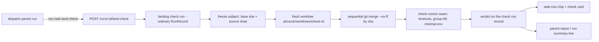

# Landing check — an engine-run check of a dispatch tree's combined change

Design-only proposal for `open-mercato/cezar`. Nothing described here exists at
HEAD `2fe68575` unless a sentence says it does; every `path:line` citation in this
document was re-verified at that HEAD. The implementation ships as the five PRs in
`## 📋 The chain`, starting with the runner hardening.

## 📝 TLDR

A dispatch parent is told to merge each accepted child into its own branch and to
re-run the repository's checks after each merge
(`packages/cezar/src/dispatch/prompts.ts:29`) — an instruction no engine code
supports, and a step nothing has ever executed: 0 `check-output` events across every
run transcript in this repo's run store (98 at the time of writing, re-verified at
HEAD `2fe68575`). This
spec proposes the **landing check**: a parent-invocable command that freezes a
subject (base sha + ordered source shas), materializes it with sequential
`git merge --no-ff` in a fresh run-owned worktree, runs the repository's own
validation commands against the command list of the frozen base, and records a
non-blocking verdict on an ordinary run record. v1 is local-first, evidence-only,
invoked by hand or by the dispatch parent, and adds no `CEZ_*` flag. It never
pushes, never opens a PR and never blocks a merge.

## 📝 Problem Statement

**Every child verifies its own branch; nothing verifies the union.** A dispatched
child runs its own gate on its own worktree and reports; the parent is then told to
merge the children and re-run the checks (`packages/cezar/src/dispatch/prompts.ts:29`). That sentence
is prose: `packages/cezar/src/dispatch/prompts.test.ts:41` pins the string, and no engine code ever
merges refs. The consequence is that the tree's combined change — the thing a
maintainer actually merges — is checked by hand or not at all.

Evidence, at HEAD `2fe68575` unless noted:

- **The primitive is dormant.** `runCheckStep`
  (`packages/cezar/src/workflows/run.ts:5470`, called once from `packages/cezar/src/workflows/run.ts:4206`) has never
  produced an event: 0 `check-output` events across every run transcript in
  `.ai/cezar/runs/*.ndjson` (98 at the time of writing; the count grows with every
  run, the zero does not — grep `"type":"check-output"`), no run in `runs.json`
  carries a command step, and this repo has no `.ai/cezar/workflows/`.
  The research lane measured the same zero across 192 runs in the 10 projects
  registered in `~/.cezar/config.json` (re-checked: 10 entries).
- **The gap is practised by hand.** The tree `06328893` carries a 103-line
  `landing-runbook.md` whose own preamble says it was re-derived "because the
  earlier runbook … was written against heads that have since moved"; it lists 8 PR
  heads, 2 hand-resolved conflicts and an explicit merge order. The `3f16f6c4` and
  `fa269252` trees executed `git merge --no-ff cez/<id8>` seven to eight times each
  and re-ran the gate by hand; the lane counted up to 88 `npm run typecheck` and 22
  `npm run build` invocations in one tree's transcripts, and a spot re-check here
  shows the same shape (single transcripts in `06328893` mention the typecheck
  command 113, 58, 34 and 33 times). Nothing recorded the exit codes as evidence.
- **Manual practice lives in PR prose too.** `open-mercato/cezar#597` records
  "Additional integration check: a reversible no-commit merge of current origin/main
  completed without conflicts; … tests passed on the combined state"; the
  `#1034`/`#1042`–`#1044` landing recipes are the same step, re-derived whenever
  heads move.
- **The PR path is not this subject.** GitHub already tests the head-union-base ref
  (`refs/pull/N/merge`) and cezar renders the rollup; what is uncovered is the local
  dispatch-tree landing, where sibling branches meet before a human merges them.
- **The org's own merge-queue workflow has the same hole.** The trackers
  `#4798` / `#4789` / `#4901` list per-PR green states and a merge order; nothing
  checks the union before the human merges it.
- **The capability was designed and deliberately cut** — see `## 📝 Lineage`. The
  cut is recorded in a spec and a PR body; the gap is not tracked as an issue
  (issue sweep `312fca6c`: 494 issues, exact matches 0; PR sweep `9ca1324d`: 666
  PRs, no implementation).

What is *not* the problem: an agent failing to run a test locally, or a PR without
CI. Those have surfaces. The problem is the absence of any recorded check between
"each child is green" and "the tree is merged".

## 📝 Who needs it

1. **A dispatch parent** — the instruction it receives today ("re-running the
   repository's checks after each") has no recorded outcome; a landing check gives
   it one the parent can quote in its report.
2. **A maintainer landing a tree or several hand-worked branches** — the runbook
   above is the manual version of this feature, re-derived every time heads move.
3. **The human at the review gate** — `ReviewPanel`
   (`packages/web/src/routes/task-thread/review-panel.tsx`) shows the diff and
   `±` totals; it carries no check evidence, and the gate is off by default
   (`packages/cezar/src/runs/review-gate.ts`; `docs/reference.md:321`).
4. **The org's merge-queue trackers** — one line per landing ("checked at tree
   `abc1234`: 5 commands, all green") in place of a hand-run recipe.

Origin: the request came from a contributor's promise to act on a review comment
(quote provenance: not public — do not claim otherwise in the PR or the docs).

## 📝 Lineage — a revival, not an invention

The idea is ranked, designed, then cut with a stated reason — and the reason does
not apply to this shape.

- **Ranked #1** of all findings in the units research:
  `.ai/specs/units-research/00-verdict.md:129` — "Engine-executed verification per
  unit … the engine runs them at settle, captures raw output, and stamps the result
  on the report."
- **Designed twice the next day**: P9,
  `.ai/specs/units-improvements/02-roles/SUMMARY.md:540` ("Have the engine run the
  child's verification commands itself"), and P1,
  `.ai/specs/units-improvements/02-roles/02-validation-and-ladder.md:124` ("stop
  trusting the child's self-report"), with `verify_commands` schemas, worktree
  execution and tests sketched from
  `.ai/specs/units-improvements/02-roles/02-validation-and-ladder.md:147`.
- **Cut by decision D3**,
  `.ai/specs/2026-09-09-units-improvements-plan.md:70`, in favour of a Review
  Centurion rank instead: "A dedicated, independent rank cannot be fooled the way a
  child re-running its own claimed command can"; the deferred item is listed again at
  `.ai/specs/2026-09-09-units-improvements-plan.md:1058`.
- **Shipped as a deliberate gap** in the dispatch feature,
  `.ai/specs/2026-09-10-dispatch.md:84` ("Not done (deliberately): Engine-executed
  verification commands …"), merged as PR #972 (`af7e8289`, an ancestor of
  v0.11.0).

**Why D3's reason does not transfer.** D3 rejected an engine that re-runs *a
command the child named*, because the child's self-report is the input and a child
can name a command that passes. A landing check has no child claim anywhere in its
input: the engine derives the sources itself, merges them itself, resolves the
command list from the **frozen base** rather than from the branch under test, and
records the exit codes it observed. The D3 objection describes a mechanism this is
not. The gap is also issue-invisible today — the deferral lives only in a PR body
and a spec — which is why this PR files the `Implement:` tracking issue.

## 📝 Proposed Solution: the v1 contract

### Trigger and entry point

- New CLI verb `cez task land-check [<run id>] [--sources a,b] [--commands "…"]
  [--wait]` in `packages/cezar/src/dispatch/task-cli.ts` (the `cez task` family,
  see the module header at `packages/cezar/src/dispatch/task-cli.ts:1-8`), and the matching control in the
  cockpit.
- New route `POST /api/v1/p/:projectId/runs/:id/land-check` (plus the boot-project
  alias, which route parity already enforces), chained into the runs family in
  `packages/cezar/src/server/server.ts`.
- **Asynchronous by default**: 201 returns the check run's id immediately; `--wait`
  polls to a terminal verdict. The check is its own run, so cancel, NDJSON, SSE,
  retention and the worktree lifecycle come from the run machinery.
- **The invoking run may still be running.** The dispatch parent is `running` when
  it calls this, so a live parent is not an error: the subject is frozen from its
  committed branch tip at request time. The only `409` is a landing check already in
  flight for the project (A3).
- `POST /runs/:id/pr` (`packages/cezar/src/server/server.ts:4753`) is untouched; no
  automatic hook fires from it in v1.
- Invoked by the dispatch parent before its own `git merge --no-ff`: one sentence in
  `DISPATCH_PROMPT` replaces the hand-run instruction, naming the verb and saying
  the verdict is evidence, not a gate.

### Subject

- The **base is the invoking run's own branch tip**, frozen at request time
  (`baseRef` is that branch name, `baseSha` the commit it resolved to). The check
  worktree is created **at `baseSha`** and every source is merged into it by sha.
  This is the candidate the dispatch parent is about to land, so the parent's own
  commits are part of the subject — never `main` plus children, which would silently
  drop them.
- The subject is **frozen and persisted before any merge**:
  `{ baseRef, baseSha, sources: [{ ref, sha }], order, commandsDigest }`. Sources are
  resolved by name and **applied by sha**; a ref that moves mid-run cannot change
  the materialized result. The install argv and the command list are resolved from
  the same frozen base.
- **Zero eligible sources** is a valid subject: the check then evaluates the base
  alone (the parent asking whether its own branch is green), records `sources: []`
  and says so in the verdict card.
- Identity is the **resulting tree sha** (two merge orders over disjoint files
  produce different HEADs and the same tree). It is stored with the verdict and
  recomputed at read time for staleness.

### Source derivation — the ledger, never ancestry alone

Sources come from one of two places, in order:

1. an explicit list (`--sources` / request body), shape-validated and bounded;
2. otherwise the tree's own order, read from `ledger.jsonl`
   (`packages/cezar/src/dispatch/tree-fs.ts:161-163`): children of the invoking run,
   filtered to those that are (a) terminal `done`, (b) not `kind: 'review'`, and
   (c) neither already landed nor empty — `!git merge-base --is-ancestor <child>
   <parent>` **and** `git rev-list --count <parent sha>..<child sha> > 0`. Deduped
   by sha.

Rule (c) is why ancestry alone is unsound: an empty child whose tip equals its fork
point is an ancestor of the parent tip, so `--is-ancestor` reports LANDED for every
empty child — the live false positive probed on tree `c603664e`, where all six
children read `ahead-of-parent=0` with `--is-ancestor` true while three were still
running. Empty is not landed. `childrenOf()`
(`packages/cezar/src/dispatch/engine.ts:44`) is not usable as the order source: it
returns `listRuns()` order, which is `createdAt` descending
(`packages/cezar/src/runs/store.ts:834`) — the reverse of dispatch order.

### Materialization

- A **fresh run-owned worktree** at `.ai/cezar/worktrees/<check run id>`, created
  at `baseSha` (`packages/cezar/src/git-worktree.ts:136`), never the parent's, never
  a shared `node_modules` (workspace symlinks would resolve to the parent tree).
- Sequential `git merge --no-ff <sha>` in source order, with three guards: a clean
  precondition (a dirty, non-overlapping tracked file merges silently otherwise),
  `MERGE_HEAD` / `git ls-files -u` after each merge, and a post-run assertion that
  the tree did not move.
- **Conflict ⇒ stop.** Record `git diff --diff-filter=U`, `git merge --abort`, run
  **no** commands, verdict `conflict` with the conflicting paths and the prefix that
  merged cleanly (marked non-subject). An agent-resolved conflict is out of v1: the
  resolution must arrive as a commit on a source branch or on the parent, and the
  check is re-run.

### Commands

Sources, in order, all resolved against the **frozen base** tree (`git show
<base>:…`), never against the branch under test:

1. an explicit list (`--commands` / request body) — replaces the others. v1 has no
   structured per-order field: source 1 is the request or the CLI flag only;
2. `.ai/agentic.config.json` → `validation.commands` (`.ai/agentic.config.json:8-15`
   in this repo; the gate is documented at `SDLC.md:83-93`). No engine reader of
   this file exists today — `rg agentic.config packages/*/src` returns nothing, and
   the installed skills read it as instructions to a *model* — so PR 3 adds one;
3. root `package.json` discovery (the `test` / `lint` / `build` scripts, which
   `detectVerifyCommands` already suggests at `packages/cezar/src/planner.ts:132`),
   promoted into the list with `source: 'package-json'` recorded;
4. none — verdict `nothing-to-check`, reason `no-commands`.

Rules: the list is **base-pinned**; if the list or the resolved script bodies differ
between base and candidate the check runs nothing and records
`nothing-to-check: commands-changed-vs-base` **with the diff** (a branch cannot
introduce a command, and a moved script body is visible); `Makefile` targets are
shown, not run; the resolved bodies are stored on the record (see `## 📝 Data Model`);
execution stops at a non-zero exit and the remaining commands are recorded `not-run`.

- **Install step.** A fresh worktree has no `node_modules` and never shares the
  parent's, so the runner installs before the gate: `npm ci` when the frozen base
  carries a `package-lock.json`, `npm install` when it carries only a
  `package.json`, nothing when it carries neither. It is its own recorded step
  (`install: { argv, exitCode, outcome }`, cheap-first position), it runs **after**
  any foreign-subject acknowledgement because it executes the candidate's dependency
  lifecycle scripts, failure yields `could-not-run: install-failed` and is never
  green, and the remaining commands are `not-run`. Cache: the package manager's own
  cache (`~/.npm`), never a shared `node_modules`.
- **Cheap-first ordering.** The engine does not reorder silently: it runs the
  resolved list in the order the source declares, and PR 3 owns the one-time edit
  that puts this repo's list in measured ascending order — `npm run test:unit`
  (6 s), `npm run build` (6 s), `npm run typecheck` (12 s), `npm run test:package`
  (14 s), `npm test` (357 s; per-command medians from the 22-run CI sample, the
  five-command sum and the long suite are in `## 📝 Risks`) — in
  `.ai/agentic.config.json` and `SDLC.md:83-93` **in the same commit**, because
  `SDLC.md:93` says the list lives in both places and changes together.

### Runner

20 minutes per command and a 45-minute gate deadline; detached spawn with a
process-group `SIGTERM → 5 s grace → SIGKILL`; a **minimal env** (drop `GH_*`,
vendor keys and `CEZ_*`; keep the toolchain allowlist, `PATH`, `HOME`, `TMPDIR`,
locale) and a non-login shell (`bash --noprofile --norc -c`), because `bash -lc`
(`packages/cezar/src/workflows/run.ts:5479`) re-reads the user's profile and would re-add what the builder
removed; `CEZ_DRY_RUN=1` spawns nothing and records `could-not-run: dry-run`; the
output cap keeps the **tail** (the failure line lives there) with an explicit
elision marker; the install step runs first (after any required acknowledgement),
under the same timeout and kill rules;
one ordinary `maxParallel` slot, **serialized per project** so two landing checks
never stack (the `#3144` precedent is run stacking).

### Verdict

`passed | failed | conflict | nothing-to-check | could-not-run`, plus a read-time
`stale` marker. Each carries: the argv list, the resolved script bodies, the install
step, the env variable **names** allowed, the user the check ran as, the tree sha,
per-command timings and exit codes, and the line that it is not a sandbox. A check that could
not run is **not green**. The verdict is evidence: it publishes no GitHub status,
disables no control, and the merge target is always the check run's own scratch
branch.

### Trust model and acknowledgement

The check executes repository-authored shell with the operator's identity — the same
class of execution sub-agents already have by default (`DEFAULT_ALLOWED_TOOLS`
includes `Bash`, `packages/cezar/src/workflows/types.ts:194`). Two brakes are kept:
the command list comes from the base the operator is on, and a **foreign subject** —
any commit in the tree whose author or committer is not the local user — stops
before execution.

The acknowledgement round-trip is explicit: (1) a check run on a foreign subject
freezes the subject, records `could-not-run: foreign-subject-needs-ack` plus a
`preview` block (resolved command list and bodies, install argv, diffstat, author
list, head sha and a `subjectDigest`) and runs **nothing**; (2) the client acks with
a second request carrying `acknowledge: { digest: '<subjectDigest>' }`, which creates
a new check run that proceeds **only** if the digest it computes equals the
acknowledged one — if the subject moved, it previews again instead of running; (3)
the ack is recorded on the run (`ack.digest`, `ack.at`). The verdict states plainly
that this is not a sandbox.

### Not in v1 (non-goals)

- No default-on or automatic trigger (including no hook at `POST /runs/:id/pr`).
- No PR-path change; no GitHub round-trip, commit status or check publication.
- No blocking gate, no merge queue, no auto-merge, no branch protection.
- No agent-resolved conflicts inside the check.
- No PR-stack subjects (base sha + ordered PR head shas; `refs/pull/N/merge` is not
  the subject) — named here as the later second subject, not built in v1.
- No rebase-as-landing mode (a tree-sha-only verdict is defined; a content
  assertion for rebases is not).
- No multi-repo subjects, no submodules, no LFS.
- No Windows shell (see `## 📝 Edge Cases & Failure Scenarios`).
- No new `CEZ_*` environment variable.

## 📝 Architecture



Existing (all verified at `2fe68575`): the run record and store
(`runs/store.ts`), the worktree machinery (`packages/cezar/src/git-worktree.ts:136`, `:572`), the
check-step executor to be hardened (`packages/cezar/src/workflows/run.ts:5470`), the check card in the thread,
the task-row list, retention (`packages/cezar/src/runs/retention.ts:14`) and prune
(`packages/cezar/src/index.ts:248`, `packages/cezar/src/server/project-context.ts:225`). New: the `check-runner` seam, the command
resolver, the landing preparation (freeze → merge → identity), and the route/CLI
verb. Nothing in this PR implements any of it.

## 📝 Data Model

One additive, optional field on the run record — **never a new `RunStatus`**:
`runs.json` is parsed as one `z.array(runRecordSchema)` (`packages/cezar/src/runs/store.ts:759`), so an
unknown enum would drop the whole index.

Naming: `verdict.md` calls this field `integration?`; the spec ships it as
`landingCheck` — a deliberate rename, for the reason lane `2dd340de` names:
"integration" already means the e2e suite (`om-integration-tests`, `npm run
test:e2e`), and a second meaning in the record would collide. The shape is
otherwise the verdict's.

```ts
landingCheck: z.object({
  ofRunId: z.string(),                       // the invoking run
  subject: z.object({
    baseRef: z.string(), baseSha: z.string(),
    sources: z.array(z.object({ ref: z.string(), sha: z.string() })),
    order: z.enum(['explicit', 'ledger']),
    treeSha: z.string().optional(),          // absent until materialized
  }),
  commands: z.object({
    source: z.enum(['explicit', 'agentic-config', 'package-json', 'none']),
    digest: z.string(),
    changedVsBase: z.boolean().optional(),
    resolvedBodies: z.record(z.string(), z.string()).optional(), // the bodies the digest covers
  }),
  install: z.object({                          // absent when the base has no manifest
    argv: z.array(z.string()), exitCode: z.number().nullable(),
    outcome: z.enum(['passed','failed','not-run']),
  }).optional(),
  ack: z.object({ digest: z.string(), at: z.string() }).optional(),
  preview: z.object({                          // present on foreign-subject previews
    subjectDigest: z.string(), authors: z.array(z.string()),
    commands: z.array(z.string()),             // what the ack would run
    installArgv: z.array(z.string()).optional(),
    headSha: z.string(), diffStat: z.string().optional(),
  }).optional(),
  verdict: z.enum(['passed','failed','conflict','nothing-to-check','could-not-run']).optional(),
  reason: z.string().optional(),             // e.g. commands-changed-vs-base, dry-run, timeout,
                                             // foreign-subject-needs-ack, install-failed
  results: z.array(z.object({
    command: z.string(), exitCode: z.number().nullable(),
    outcome: z.enum(['passed','failed','not-run','could-not-run']),
    startedAt: z.string(), finishedAt: z.string().optional(),
  })).optional(),
  envNames: z.array(z.string()).optional(),  // names only, never values
  user: z.string().optional(),
}).optional(),
```

Sensitive data: only env **names**, never values; the existing secret redaction
(`runs/store.ts`) keeps applying to the transcript. No new state file — the
acknowledgement digest lives on the run record, so `ensureDataGitignore` needs no
change (the check reuses `worktrees/`, `runs.json` and `runs/`, all already in the
allowlist, `packages/cezar/src/data-gitignore.ts:17-28`).

## 📝 API Contracts

In `packages/contract` first (zod, type inferred), then chained into the runs family
in `server.ts` through the `jsonZodValidator` trio
(`packages/cezar/src/server/validators.ts:88`):

```ts
export const landingCheckInputSchema = z.object({
  sources: z.array(z.string().min(1).max(120)).max(24).optional(),
  commands: z.array(z.string().min(1).max(200)).max(12).optional(),
  acknowledge: z.object({ digest: z.string().min(1).max(64) }).optional(),
}).optional();                                 // absent body allowed

export const landingCheckResponseSchema = z.object({
  runId: z.string(),                           // the check run
  ofRunId: z.string(),
});
```

`POST /api/v1/p/:projectId/runs/:id/land-check` → 201 with the check run's id; `404`
for an unknown run; `409` only when a landing check for this project is already in
flight (a running invoking run is the normal case — its committed branch tip is
frozen at request time); `400` on a shape violation (the validator trio, not a
handler-side parse). A foreign subject without a matching `acknowledge.digest`
returns 201 with a preview run whose `landingCheck.verdict` is `could-not-run` /
`foreign-subject-needs-ack` and whose `preview.subjectDigest` the acknowledgement
must echo. No new route family, no new verb set on
an existing route. `GET /runs/:id` picks the new field up through the existing
record schema.

## 📝 UI/UX

- The check run appears as an ordinary task row titled `Landing check — <parent
  title>`, with a chip for its state (`checking`, `passed`, `failed`, `conflict`,
  `nothing-to-check`, `could-not-run`, `stale`).
- The check card reuses the existing `check-output` transcript card per command
  (command, exit code, tail-preserving output). A `nothing-to-check` or
  `could-not-run` card renders in the neutral/pending tone and never with the
  success tone.
- The invoking run's row links to the check run; a stale verdict shows the marker
  next to the chip.
- No new attention rung and no notification change in v1: the ladder
  (`packages/web/src/lib/attention.ts:20-27`) is a documented contract, and a check
  verdict is evidence, not a lifecycle state. If a nudge is wanted later, the change
  belongs in the observed key of `diffRunTransitions`
  (`packages/web/src/lib/notifications.ts:80`) — never a second notifier.
- Empty state: a check run with no verdict yet shows "freezing the subject", then
  "merging", then per-command progress — from the run's own step rail.

## 📝 Edge Cases & Failure Scenarios

| Case | Behavior |
| --- | --- |
| Empty child (tip == fork point) | Excluded from sources; the record names it in the excluded list |
| Child already merged into the parent | Excluded (`--is-ancestor`) |
| `review` / failed / cancelled / non-terminal child | Excluded; a review verdict is not a source |
| Two sources with the same sha | Deduped; the record names the duplicate |
| Conflict on merge N | Stop; record `diff --diff-filter=U`; `merge --abort`; **no** commands; verdict `conflict` |
| Dirty worktree / pre-existing `MERGE_HEAD` | Refuse to start (`could-not-run: dirty-worktree`) |
| Source branch deleted / moving ref | Sources applied by sha; a vanished ref yields `could-not-run: source-missing` |
| Commands changed vs base | `nothing-to-check: commands-changed-vs-base` + diff; nothing executes |
| No commands | `nothing-to-check: no-commands`; never green |
| A command times out | Kill the group; that command `could-not-run: timeout`; remaining commands `not-run`; the verdict is never `passed` |
| A child ignores SIGTERM | Group `SIGKILL` after the grace; the close event still fires (probed) |
| `CEZ_DRY_RUN=1` | Spawns nothing; `could-not-run: dry-run` |
| win32 or missing `bash` | `could-not-run: unsupported-platform` with the reason; `bash -lc` is already broken there (`packages/cezar/src/workflows/run.ts:5479`) |
| Foreign subject (author not the local user) | Preview only (`could-not-run: foreign-subject-needs-ack` + `preview`), until a matching `acknowledge.digest` |
| Ack digest does not match the recomputed subject | Preview again; nothing executes |
| Base has no `package-lock.json` / no `package.json` | `npm install` / no install step; recorded, never guessed |
| Install fails (bad lockfile, registry down) | `could-not-run: install-failed`; gate commands `not-run`; never green |
| Zero eligible sources | Subject is the base alone, `sources: []`; the gate still runs and says so |
| Sources move after the check | `stale` at read time (source sha or base sha differs); the stored verdict text is not rewritten |
| Check worktree reclaimed by retention | The verdict stands; staleness falls back to comparing source shas |
| Project at `maxParallel` | The check queues like any run; a second *landing* check for the same project is refused 409 |
| Parent cancelled while the check runs | The check is its own run and finishes; nothing merges |
| `landingCheck` on an older record / unknown keys | Optional + passthrough; the index parse never drops a run |

## 📝 Acceptance Criteria for PRs 2–6

Each PR is independently reviewable and merges in order; these are the sign-off
lists.

**PR 2 — S1, check-runner hardening.** A check step cannot run unbounded, leak the
host env, or drop the failure line, with no behavior change for a passing command:
(a) the shipped behaviour changes are named and deliberate — raw `process.env` →
minimal env (`CEZ_ENV_PASSTHROUGH` stays honoured for a variable a check genuinely
needs), login shell → `bash --noprofile --norc -c`, head-kept cap → tail-kept cap,
and `CEZ_DRY_RUN=1` executes today but skips after this PR — plus a per-command
timeout and a whole-gate deadline, both overridable in tests, both producing a
non-green outcome; a passing command that needs neither the host env nor the login
profile behaves as before; (b) `SIGTERM` reaches the process group, then
`SIGKILL` after a grace, proven against a grandchild that ignores `SIGTERM`; (c) the
check env excludes `GH_*`, vendor keys and `CEZ_*`, and the shell is non-login,
proven by a probe that prints the env it sees; (d) the output cap keeps the tail
plus an elision marker; (e) `CEZ_DRY_RUN=1` spawns nothing and records a visible
non-green skip; (f) win32/missing-bash yields `could-not-run`, not an
`ENOENT`-shaped failure; (g) all of it lives behind one seam — PR 3's resolver feeds it; PR 4 and
`runCheckStep` call it; (h) each new regression
test is proven red without the fix (`git stash push -- <files>`), and guard tests
are named.

**PR 3 — S2, command policy.** The engine can resolve a command list without
executing anything: (a) precedence explicit → `.ai/agentic.config.json` →
`package.json`, each read from the frozen base and recorded with its `source`;
(b) a digest over the resolved list **and** resolved script bodies; (c) drift
against base yields `nothing-to-check: commands-changed-vs-base` with the diff and
executes nothing; (d) an absent/empty source degrades to `no-commands`, naming every
source consulted; (e) `Makefile` targets are surfaced, never run; (f) no command string from the
candidate tree is ever executed; (g) the install argv is resolved from the frozen
base's manifest (ci vs install vs none) and recorded; (h) this repo's own list is
reordered to the measured cheap-first order in `.ai/agentic.config.json` and
`SDLC.md:83-93` in the same commit.

**PR 4 — S3+S4, core.** The engine freezes, merges and records: (a) candidate
derivation includes the empty-child regression test (tip == fork point must not read
as landed) and excludes review/failed/non-terminal children; (b) the subject is
persisted before any merge and applied by sha, with the base defined as the invoking
run's branch tip frozen at request time and the worktree created at `baseSha` (a
regression test pins that the parent's own commits are in the subject); (b2) zero
eligible sources yields a base-only subject with `sources: []`; (c) the tree sha is
the identity and is recomputed at read for `stale`; (d) conflicts abort with the
U-file list and no commands; (d2) the install step runs first under the timeout/kill
rules and its failure is never green; (e) the route is chained, zod-validated as middleware, and covered by
route parity, typed-bodies and the BC route inventory; (f) `cez task land-check`
works from inside a task and exits 2 with the dispatch message when `CEZ_API_URL` is
unset (the existing convention, `dispatch/task-cli.ts`); (g) the `landingCheck`
record field is additive and the index parse never drops a run; (h) the dispatch
prompt names the verb in one sentence, and its test pins it.

**PR 5 — S5, UI.** (a) The check card renders per-command rows with exit codes and
the tail of the output; (b) a chip renders on the task row for every verdict state,
including `stale`; (c) `nothing-to-check` and `could-not-run` never render with the
success tone; (d) the invoking run links to the check run; (e) screenshots attached
to the PR.

**PR 6 — S6, docs.** (a) `docs/reference.md` gains a "Landing check" section (after
the workflow format) stating the subject, the verdict states, "a check that could
not run is not green", and the not-a-sandbox line; (b) the review-gate wording that reads as if
every changed run parks for a human is corrected at `docs/reference.md:22-24`,
`docs/reference.md:63-65`, `README.md:156` and `AGENTS.md:3` (the gate is off by
default — `docs/reference.md:321` and `packages/cezar/src/runs/review-gate.ts`); the
`CEZ_REVIEW_GATE=1` row itself is already correct and is not edited; (c) `AGENTS.md` gains a task-routing row; (d) the PR 2 behaviour changes (minimal env
with `CEZ_ENV_PASSTHROUGH`, non-login shell, tail cap, dry-run skip) are stated where
check steps are documented; (e) no new `CEZ_*` variable, so `.env.example` is
unchanged — and the PR says so.

## 📋 The chain

Six PRs against `main`, stacked in order. PR 1 is this document (design-only).

| # | Branch | What it ships | Depends on | Independently shippable |
| --- | --- | --- | --- | --- |
| 1 | `spec/landing-check` | this spec + the `Implement:` tracking issue | — | yes (design-only) |
| 2 | `fix/landing-check-step-hardening` | the check-runner seam: timeout, group kill, minimal non-login env, tail cap, dry-run skip, win32 `could-not-run` | rebase onto open PRs #1135/#1126 | yes — before any trigger |
| 3 | `feat/landing-check-command-policy` | command resolution (explicit / agentic config / package.json), base-pinning, drift rule, `nothing-to-check` semantics | PR 2 | yes |
| 4 | `feat/landing-check-core` | freeze + merge + candidate set + tree-sha identity + route + CLI verb + `landingCheck` record field + prompt sentence + BC/route inventory | PRs 2–3 | after 2–3 |
| 5 | `feat/landing-check-ui` | check card, task-row chip, stale marker | PR 4 | fast follow-up |
| 6 | `docs/landing-check` | reference section, not-green rule, review-gate default correction, AGENTS routing row | PR 4 | with/after 4 |

## 📝 Risks & Impact Review

- **Precedent says keep it local.** The org already removed a per-PR pre-merge CI
  gate because of run stacking (`open-mercato#3144`). The landing check is therefore
  local, evidence-only, non-blocking, and serialized per project; it publishes no
  required status and subscribes to no GitHub events.
- **Not a sandbox.** Repository scripts run with the operator's identity and can read
  anything that account can. The env cut reduces blast radius, nothing more, and the
  verdict says so.
- **Cost.** A landing check spends no agent tokens but costs wall-clock and one
  `maxParallel` slot. Measured: five-command CI sum median 395 s (`npm test` alone
  357 s) across 22 successful runs; a local full `npm test` 229 s on a 12-vCPU/16 GB
  box; the install step is unavoidable on a fresh worktree (this repo's
  `node_modules` is 244 MB, `npm ci` ~8 s on a warm runner cache). Cheap-first
  ordering plus stop-at-first-failure is the mitigation; the ordering edit itself is
  owned by PR 3 and lands in `.ai/agentic.config.json` and `SDLC.md:83-93` together,
  per `SDLC.md:93`.
- **The gate can be disarmed by the tree it checks** — unless the commands are
  pinned. Base pinning (list and resolved bodies) is the mitigation, and a drift
  verdict is visible rather than silent. Lifecycle hooks (`pre*` scripts) are part of
  the resolved-body digest, so a changed hook shows as drift.
- **Greens decay.** Nothing re-runs a verdict automatically; `stale` at read time is
  the honest marker, and re-running is one command. No CI watcher, no events.
- **Two construction-site trap.** `runCheckStep` has a single caller today
  (`packages/cezar/src/workflows/run.ts:4206`) but the landing check makes it a second entry point: both must go
  through the PR 2 seam, and `state.interrupt` must not be overwritten across them
  (the hook at `packages/cezar/src/workflows/run.ts:5480` is reset in both callbacks).
- **PR 2 changes a shipped mechanism (AGENTS.md § *Changing a mechanism that already
  works*).** Name what the old behaviour was load-bearing for: a check step today
  runs with the server's raw environment and a login shell, and `CEZ_DRY_RUN=1`
  executes it. After PR 2 (a) a check that depended on `GH_*`, a vendor key, a
  `CEZ_*` value or a profile-exported variable no longer sees it — the mitigation is
  the existing passthrough (`CEZ_ENV_PASSTHROUGH`, read by `buildChildEnv` at
  `packages/cezar/src/core/agent-env.ts:332-336`, honoured by the check env builder
  too) and a loud non-green failure rather than a silent one; (b) `CEZ_DRY_RUN=1`
  stops executing repo scripts — the documented look-around promise gets *more*
  honest, not less; (c) the output cap keeps the tail, so what a check step's `onFail`
  hands back to a retried agent changes (the failure line survives instead of the
  head) — a fix, and the reachable path is real (`cezar init` scaffolds a check step,
  `packages/cezar/src/index.ts:696-708`). PR 2's body names all four changes; PR 6
  documents them.
- **`#1135` / `#1126` touch this neighbourhood** (check wall-clock, check artifacts
  vs autosave). PR 2 states its compatibility with them rather than rebasing onto
  unmerged work.
- **Compatibility.** Additive optional record field (BC §3 rule), a new route
  (BC §2 inventory, test-enforced), a new CLI verb (BC §1), no new env var, no change
  to `POST /runs/:id/pr`, no change to `RunStatus`. The dispatch prompt's sentence
  changes from "re-running the repository's checks after each" to naming the verb;
  the hand-run path stays valid, so nothing is removed from the default path.

### Honest claims (public wording)

Two numbers, kept apart: **recombination, scored 6–7/10 new to this codebase**
(historian `9f7dbf32`, architect `7ceb4b78`) and **3/10 new to the world**
(ecosystem `b60caf44`). The mechanism is standard merge-queue practice
(bors/Zuul/Gerrit/Graphite; local agent variants ctx, claude-code-merge-queue,
eforge); the differentiated part is the subject and the posture: the dispatch ledger
as the subject, the verdict as non-blocking evidence on cezar's own run record, no
PR, no remote, no branch protection. Safe sentence the committee agreed on: "cezar
applies the merge-queue discipline locally to a dispatch tree: it merges the tree's
branches into a scratch worktree, runs the repository's own gate on the frozen
combination, and records the verdict as non-blocking evidence — no PR, no remote, no
branch protection required."

Avoid in the spec, the PR body and the docs: claims of being novel, first or
unique; "no one verifies the combined change"; "catches semantic conflicts"; and
guarantee language. Every local implementation in the ecosystem (ctx,
claude-code-merge-queue, eforge) *lands* the merged result; cezar deliberately stops
at evidence because the merge remains a human/parent decision and the review gate is
off by default.

## 📝 Resolved assumptions (autonomous defaults)

Written in `--autonomous` mode; each default is the most reversible option.

| # | Question | Chosen default | Why |
| --- | --- | --- | --- |
| A1 | Which record is authoritative? | The **check run's own record**; the invoking run gets a pointer (`landingCheck.ofRunId` on the check, and the check id visible from the parent row) | The check is an ordinary run: NDJSON, SSE, cancel, retention, prune and the check card come free; a second source of truth would need a reconciliation rule |
| A2 | Order source | A **new read-only reader over `ledger.jsonl`** (`packages/cezar/src/dispatch/tree-fs.ts:161-163`), with an explicit list taking precedence | `childrenOf()` returns `createdAt` descending (`packages/cezar/src/runs/store.ts:834`) — the wrong order; the ledger is the engine's own chronological record; the reader is small and writes nothing |
| A3 | Serialization | One ordinary `maxParallel` slot, **one landing check per project at a time** (a second request is 409) | Four concurrent test suites thrash 3–4×; a full gate is ~7 minutes; a 409 is less machinery than a queue and avoids the #3144 run-stacking shape |
| A4 | win32 / missing shell | `could-not-run: unsupported-platform` with the reason recorded | `bash -lc` is already broken there; a loud, honest non-green beats a false red |
| A5 | Does the verdict gate anything? | No — evidence only | Every blocking path would change somebody's default landing flow; the natural ceiling for later work is GitHub status publication, explicitly a non-goal here |
| A6 | Dry run | Skip with `could-not-run: dry-run`, never green | Keeps the offline demo honest; `README.md:140` promises a look-around under `CEZ_DRY_RUN=1` |
| A7 | Staleness | Computed at read; the stored verdict text is never rewritten | A verdict records what was observed, not a live claim |
| A8 | Conflict handling | Stop, record, abort, run nothing; no agent resolution in v1 | An agent-resolved conflict has no recorded provenance and would silently redefine the subject |
| A9 | Multi-repo / submodules / LFS | Out of scope, named here | The tooling has no cross-repo subject |
| A10 | Visibility of the check run | An ordinary visible run, titled `Landing check — <parent>` | Hiding it would need a new lifecycle; a visible record is auditable and cancelable |
| A11 | Environment identity | Record env **names** and the user; not values, not a pinned environment | Values are secrets; pinning an environment is a bigger design (containers) and a non-goal |
| A12 | Foreign subject | Preview + one acknowledgement tied to sha + digest | The zero-config default subject is the local user's own branches; the ack is a brake, not a boundary |

None of these carries `⚠ NEEDS HUMAN CONFIRMATION`: each is reversible (cancel the
check run, delete its record, re-run with an explicit list) and none changes an
existing default path.

## 📋 Phasing

- **Phase 1 — the runner can be trusted (PR 2).** Harden the dormant executor; no new
  entry point; ships alone.
- **Phase 2 — the policy is decided (PR 3).** Resolve and pin the command list
  without executing anything.
- **Phase 3 — the check exists (PR 4).** Freeze, merge, check, record, invoke.
- **Phase 4 — the verdict is visible (PR 5).**
- **Phase 5 — the docs tell the truth (PR 6).**

## 📋 Implementation Plan

**PR 2 — `fix/landing-check-step-hardening`** (est. 250–400 lines + tests)
1. Add `packages/cezar/src/workflows/check-runner.ts`: one
   `runCheckCommand({ command, cwd, env, timeoutMs, dryRun, signal })` returning
   `{ outcome, exitCode, output, timedOut, startedAt, finishedAt }`; spawn detached,
   kill the group, keep the tail, build the env through a `buildCheckEnv` sibling of
   `buildChildEnv` (`packages/cezar/src/core/agent-env.ts:308`), use
   `bash --noprofile --norc -c`. Test: `check-runner.test.ts` (timeout, group kill
   with a grandchild, env names, tail marker, dry-run, missing shell).
2. Route `runCheckStep` (`packages/cezar/src/workflows/run.ts:5470`) through the seam; keep its event contract
   and the caller at `packages/cezar/src/workflows/run.ts:4206`; fix the `state.interrupt` overwrite so both callers share
   one helper. Test: `run.test.ts` (existing check-step cases stay green plus the new
   non-green outcomes).
3. Constants and overrides: defaults live beside the runner and are injectable for
   tests; no new `CEZ_*` var (if one is unavoidable, `.env.example` and the env table
   in `docs/reference.md` change in the same commit).

**PR 3 — `feat/landing-check-command-policy`** (est. 150–250 lines + tests)
4. Add `packages/cezar/src/workflows/check-commands.ts`:
   `resolveCheckCommands({ baseSha, explicit, repoRoot }) → { source, commands,
   digest, changedVsBase, diff }`, reading `.ai/agentic.config.json` and the root
   `package.json` from the frozen base; digest over the list plus resolved bodies.
   Test: fixtures for precedence, absent, drift and hooks; no execution anywhere in
   the module.
5. Degradation vocabulary: `no-commands` names every source consulted; `Makefile`
   targets are surfaced as text. Resolve the **install argv** from the same frozen
   base (`npm ci` when a lockfile is present, `npm install` when only a manifest is,
   nothing otherwise). Test: fixtures for each manifest shape.
6. Reorder this repo's own validation list to the measured cheap-first order in
   `.ai/agentic.config.json` **and** `SDLC.md:83-93`, one commit, per `SDLC.md:93`.

**PR 4 — `feat/landing-check-core`** (est. 350–500 + 250–400 lines + tests)
7. Add `packages/cezar/src/workflows/landing-check.ts`: candidate derivation (ledger
   order, eligibility filter, dedupe, exclusions recorded), freeze (base = the
   invoking run's branch tip at request time), merge loop with the three guards,
   tree-sha identity, staleness. Test: `landing-check.test.ts` with scratch repos;
   the empty-child regression test and the base-is-the-parent test must each fail
   without the fix.
8. Wire the run: create the check run through the manager with a check-only workflow
   built from the resolved commands plus the install step; record `landingCheck`;
   refuse 409 only while another landing check for the project is in flight.
9. Contract, route and CLI: schemas in `packages/contract/src/runs.ts`, the route
   chained in `server.ts`, the verb in `dispatch/task-cli.ts` (`--wait` polls), the
   BC §2 inventory. Tests: `contract-parity*.test.ts`, `route-parity.test.ts`,
   `typed-bodies.test.ts`, `bc-route-inventory.test.ts`, `task-cli.test.ts`.
10. Prompt: one sentence in `DISPATCH_PROMPT` (`packages/cezar/src/dispatch/prompts.ts:29`) naming the
    verb and the evidence-not-gate rule; update `prompts.test.ts`.

**PR 5 — `feat/landing-check-ui`**
11. Check card per command in the thread, the task-row chip (every verdict state
    plus `stale`), the preview/ack affordance for a foreign subject, the link from
    the invoking row, neutral tone for non-green. Tests: component tests; PR
    screenshots via the browser provider.

**PR 6 — `docs/landing-check`**
12. `docs/reference.md`: the "Landing check" section (after the workflow format), the
    not-green rule, the not-a-sandbox line, the install step, and the PR 2 behaviour
    changes; correct the review-gate wording at `docs/reference.md:22-24`,
    `docs/reference.md:63-65`, `README.md:156` and `AGENTS.md:3` (not the already
    correct `CEZ_REVIEW_GATE=1` row); the `AGENTS.md` routing row; a note that no env
    var was added.

Each step leaves the app working: 1–3 change only how an existing (dormant) step
executes; 4–6 add an unexported module and one config/doc edit; 7–10 add the trigger
behind the verb; 11–12 are additive surfaces.

## 📝 Decisions in play

`.ai/agentic.config.json` exists in this repo (no `product-brief.md`), so the second
authority here is the repo's own rules: the zero-config rule (`AGENTS.md` § Zero
config — no new required config, no new `CEZ_*` var, degrade rather than fail), the
HTTP-API invariants (contract-first zod, chained route families, middleware
validation, `/api/v1` only) and the BC inventory rules. This spec supersedes no
recorded decision; it revisits D3 by design
(`.ai/specs/2026-09-09-units-improvements-plan.md:70`) and argues the difference in
`## 📝 Lineage`.
