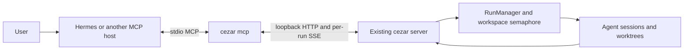

# Cezar MCP for external task supervision

## 📝 TLDR

Add `cezar mcp`, a local stdio MCP server through which an external agent such as Hermes supervises tasks in an already-running cezar cockpit. The agent discovers projects, starts workers, reads task history and changes, sends instructions, resumes or cancels tasks, and waits for worker activity. Cezar remains responsible for execution, worktrees, provider selection, scheduling and existing review gates. This specification delivers the MCP control surface and its bounded supervision loop; it does not introduce a Hermes backend or an always-on external agent scheduler.

## Resolved assumptions (autonomous defaults)

| # | Question | Applied default | Why | Confirm? |
|---|---|---|---|---|
| Q1 | Bundle the adapter, external parent runs and persistent supervisor wake-up? | Ship one capability: the MCP adapter, including bounded event waiting. External parent records and a persistent wake-up service need separate specs. | Each extension could ship independently and changes ownership/lifecycle beyond an API adapter. | ok |
| Q2 | Local stdio or remote HTTP? | Local stdio, connecting only to a loopback cockpit; explicit `CEZ_MCP=1` opt-in. | Fits the local product and the repository rule for additional process/network access; avoids inventing remote authentication. | ok |
| Q3 | Start a cockpit automatically? | Discover an existing cockpit; report unavailable or ambiguous selection. | Connecting an MCP client must not create a second execution engine or silently pick another instance. | ok |
| Q4 | Add a persisted external-author identity? | Preserve current user-role message semantics and exact text; document the limitation. | An authenticated actor/audit model is a separate contract change. A text label would not establish identity and would disrupt leading slash-skill expansion. | ok |
| Q5 | Retry mutations after transport failures? | Never automatically retry a mutation; return an explicit unknown-outcome error when acceptance cannot be established. | Existing routes provide no idempotency key. Reissuing task creation or a message can duplicate work. | ok |
| Q6 | Include Git publishing, approval and project administration? | Expose task supervision and existing child dispatch; omit publishing, merging, approval, deletion, project registration and configuration writes. | These operations are unnecessary for the requested supervisor → workers loop and can be specified independently. | ok |

All defaults are reversible design choices. No assumption weakens an existing authorization, scope or compatibility guarantee; none requires a human-confirmation merge gate.

## 📝 Problem Statement

The requested flow is **user → external AI supervisor (for example Hermes) → cezar → implementation workers**. Today an external agent must know cezar's HTTP routes, understand session states, and assemble its own event reader. A tool that only starts a worker cannot supervise it: it must also observe questions, distinguish queued messages from delivered messages, and return to tasks after they settle.

Evidence from base commit `1f40016d`:

- `packages/cezar/src/server/server.ts` exposes project discovery, run creation, paged history, messages, continuation, cancellation, diffs and SSE under `/api/v1`. These are the canonical control paths.
- `packages/contract/src/{runs,events,dispatch,projects,health,workflows}.ts` define reusable wire schemas. `continueSchema` is still handler-local in `server.ts`; extracting that exact schema is required before reusing it.
- `packages/cezar/src/workflows/run.ts`, `RunManager.dispatch`, requires an existing nonterminal parent run. It creates autonomous children and forks their worktrees from the parent's branch. An external MCP client is not itself a run.
- `packages/cezar/src/dispatch/task-cli.ts` already demonstrates a thin HTTP client with `CEZ_API_URL` and `CEZ_PROJECT_ID`; its `create` command dispatches a child of `CEZ_TASK_ID`, rather than creating an independent root task.
- `/messages` can return `delivered`, `queued` or `deferred`; a closed session returns 409. `/continue` is a distinct explicit operation.
- Per-run SSE supports `afterSeq`, `Last-Event-ID` and history cursors. Workspace SSE is a live feed, not a durable replay log; it must not become a fictional lossless global event cursor.
- [PR #1262](https://github.com/open-mercato/cezar/pull/1262) proposes an owner-bound `report_task_result` MCP tool inside workers. It is open at research time and is complementary: worker reports are data for supervision, not permission to create or control runs. This spec has no dependency on it landing.

## 📝 Proposed Solution

The external host starts one `cezar mcp` process. It speaks MCP over stdin/stdout and makes validated loopback HTTP requests to a selected running cockpit. Every task operation requires `projectId`; every existing-task operation also requires `runId`. The adapter never imports `RunManager`, opens `RunStore`, writes run files or starts workers directly.

Two supported orchestration patterns use the same tools:

1. **External supervisor:** Hermes creates ordinary root tasks, retains their returned identities and coordinates them through messages and event waits. These tasks retain ordinary scheduling and independent worktree bases; no synthetic parent or common tree budget is implied.
2. **Existing cezar dispatch tree:** Hermes addresses a real nonterminal parent with `dispatch_task`, or creates a normal commander run with a dispatch intent. Existing child caps, budgets, branch relationships and report delivery remain the engine's responsibility. A real commander uses its configured runner and has its own cost; it is not an empty container for Hermes.

The first pattern satisfies the main request without a new engine lifecycle. The second exposes capabilities cezar already has. Cezar's review state remains distinct from proof that an implementation is correct or merged.

### Research and alternatives

Research checked on 2026-10-04 against primary sources:

| Source | Adopt | Deliberately leave out |
|---|---|---|
| [Hermes MCP documentation](https://hermes-agent.nousresearch.com/docs/user-guide/features/mcp/) | A named stdio server in `mcp_servers`, discoverable tools and host-side tool filtering. Configure tool timeout above the bounded wait duration. | A Hermes-specific plugin, server-side sampling, or the assumption that an MCP notification starts a new supervisor turn. |
| [Official MCP TypeScript SDK](https://ts.sdk.modelcontextprotocol.io/v2/get-started/first-server) | The maintained SDK, Zod tool schemas and protocol error handling; Node 20 and ESM match cezar. | Hand-written JSON-RPC or a new web framework. Pin a released SDK version compatible with the repository and verify the actual Hermes handshake. |
| [MCP stdio transport](https://github.com/modelcontextprotocol/modelcontextprotocol/blob/main/docs/specification/draft/basic/transports/stdio.mdx) | Protocol-only stdout, diagnostics on stderr, host-owned process lifecycle. | A listening MCP port in the initial release. |
| [GitHub MCP server configuration](https://github.com/github/github-mcp-server/blob/main/docs/server-configuration.md) | A finite tool catalog and an optional read-only mode which removes mutations from discovery and enforces the restriction at dispatch. | A dynamic toolset framework for a small, fixed task surface. |

Alternatives rejected: shelling out for each operation would lose typed responses and complicate cancellation; direct access to stores/managers would create a competing state owner; a remote MCP endpoint requires a separate authentication and exposure design. Making Hermes a runner solves executing Hermes inside cezar, a different placement from the requested external supervisor.

## 📝 Architecture



### Components and package ownership

- `packages/cezar/src/index.ts`: dispatch the `mcp` command before the general CLI parser and any serve/run startup; lazily import its implementation.
- `packages/cezar/src/mcp/command.ts`: CLI validation, opt-in, endpoint selection and process shutdown.
- `packages/cezar/src/mcp/server.ts`: SDK registration, descriptions, annotations and structured results. SDK runtime dependencies belong to `packages/cezar`, which imports them.
- `packages/cezar/src/mcp/client.ts`: fixed-route HTTP calls, status handling, response limits and abort signals. Use `hono/client` with the service's own `AppType` through a type-only import and validate responses with contract schemas. **Do not runtime-import the private `@open-mercato/cezar-api-client` package into the published service.** Its existing helper is a design reference, not an installable production dependency.
- `packages/cezar/src/mcp/events.ts`: per-call, bounded per-run SSE observation and reconciliation. No persistent watcher or global scheduler.
- `packages/contract/src/mcp.ts`: strict MCP input/output schemas composed from existing contract schemas, with types inferred using Zod. Export through the contract barrel. It remains Node-free and SDK-free; existing `inline-contract.mjs` includes it in the published service.
- Extract `continueSchema` into `packages/contract/src/runs.ts` and make the route consume the exported value, without changing HTTP semantics. Add parity/typed-body coverage. Avoid a broad unrelated schema migration.

No new HTTP route, run status, database, cockpit screen, runner type or required state file is introduced. Future HTTP changes still require chained family builders, middleware validation, aliases and the route inventory; MCP is not an exception to those rules.

### Startup, endpoint selection and scope

Proposed CLI: `cezar mcp [--url <loopback-url>] [--read-only]`. It inherits the `cez` binary alias. `CEZ_MCP=1` enables this additional control process; absent or any other value refuses startup with a stderr explanation and exit 2. `--help` remains available without opt-in. Add the flag's exact semantics to `.env.example` and `docs/reference.md` in the implementing commit.

Endpoint precedence is explicit `--url`, existing `CEZ_API_URL`, then bounded discovery. An explicitly supplied malformed/unavailable endpoint never falls back to a different server. Permit only `http` with a parsed loopback IP literal (`127.0.0.0/8` or `::1`), no credentials, query, fragment or non-root path; reject DNS hostnames and redirects. Use canonical `127.0.0.1` in documentation. No proxy credential handling or arbitrary URL parameter is exposed to the model.

Without an explicit endpoint, probe the CLI's default port window, `127.0.0.1:4321` through `:4370`, using read-only `/api/v1/health` requests, at most five concurrent requests and a 10-second overall discovery deadline. Validate candidates against the health schema. Exactly one candidate selects it; multiple candidates return `ambiguous_server` with bounded candidate addresses; zero candidates return `server_unavailable` and the instruction to start `cezar serve`. An incomplete scan cannot select a candidate as if uniqueness were proven. A nonstandard port uses `--url`. No cockpit is started and no project is registered during discovery.

The SDK handshake and tool catalog remain available while the cockpit is unavailable; discovery is lazy on the first tool call and can be retried by another explicit call. Once chosen, pin the URL for the process lifetime. Never silently switch to another instance after disconnect. Refresh `/projects` when validating an unknown project; task URLs always use `/api/v1/p/{encodedProjectId}`. Refuse the reserved `default` alias at the MCP boundary: callers use the concrete ids returned by `list_projects`, including the boot project's synthetic unregistered entry when present. No cwd- or `CEZ_TASK_ID`-based implicit task selection.

The MCP process has the local operator's control rights. This does not create per-agent isolation against another process running as the same OS user. `--read-only` suppresses mutation tools and rejects attempts to invoke them by name. It does not modify HTTP server authentication or permissions.

## 📝 Data Model

Cezar's run records and NDJSON remain the source of truth. MCP adds **wire-only** projections and request-local state:

- `TaskRef = { projectId, runId }`; ids use the existing project/run constraints and are independently URL-encoded. Every result repeats the reference used.
- `TaskSummary`: select existing run fields for id, title, status, activity, runner/model, timestamps, branch, costs when visible, diff stat and dispatch relationship. Avoid task text, full workflow definitions and attachments in list responses.
- `TaskDetail`: summary plus current steps, bounded task text, queued-message metadata, available dispatch report/pending question, and a watch baseline. A report is a claim, not verified acceptance evidence. Preserve absence of cost data; never convert unknown cost to zero or reveal metrics hidden by capabilities. Apply metric visibility to all tool projections, including history payloads: remove hidden usage/cost fields from known event shapes and omit metric-bearing details whose safe projection cannot be established.
- `WatchBaseline = { projectId, runId, afterSeq, state }`, where `state` is the last observed projection of status, activity, current step, dispatch report and pending question. `afterSeq` is an observed durable transcript sequence, not a workspace-global offset.
- All optional fields retain their original absent-vs-present meaning. No authenticated author field is invented. `send_message` and continuation text arrive through the existing user-message path, with exact text preserved, including leading `/skill` syntax.

No migration, home config write, generated registry or adapter journal is necessary. Stopping or deleting the adapter loses no run state. Client-held baselines are hints for read reconciliation, never authorization tokens.

## 📝 API Contracts

All inputs reject unknown keys. Tool descriptions state effects, delivery semantics and recovery actions. Use the SDK's schema-derived discovery, rather than maintaining a separate JSON Schema copy. Successful results provide `structuredContent` plus a short text summary; execution failures set `isError: true`. Use a discriminated contract envelope: `{ ok: true, data, truncated: boolean }` or `{ ok: false, error: { code, message, httpStatus?, outcome: 'not_attempted' | 'rejected' | 'unknown', recovery? } }`. Invalid MCP envelopes use SDK protocol errors.

### Tool catalog

Paths below are relative to `/api/v1/p/{projectId}` unless marked workspace. Names are part of the new public MCP contract.

| Tool | Input beyond TaskRef | Existing operation and result |
|---|---|---|
| `list_projects` | No TaskRef; `limit=50` (1–100), `offset=0` | Workspace `GET /projects`; bounded projects with concrete ids, names and availability. |
| `list_workflows` | `projectId` only | `GET /workflows`; workflow names/descriptions and load issues. |
| `list_tasks` | `projectId`; optional status set and text query; `limit=20` (1–100), `offset=0` | `GET /runs`; filter then sort newest-first with id tie-break, return summaries and next offset. Includes existing tasks, not only MCP-created ones. |
| `get_task` | TaskRef | `GET /runs/:id` and latest history page; detail plus baseline using the page's `asOfSeq`. The two reads are not a transaction; subsequent waiting reconciles them. |
| `create_task` | `projectId`, `task`; optional workflow, runner, model, autonomous and dispatch intent | `POST /runs`; adapter defaults workflow to `quick-task`, forces one variant and `worktree:true`, preserves server default for autonomous when omitted. Returns immediately with task identity and actual initial status; does not wait for implementation. |
| `update_task` | TaskRef and nonempty patch `{title?,task?}` | `PATCH /runs/:id`; same queued-only initial-task editing rule and limits as HTTP. |
| `read_messages` | TaskRef, optional opaque history cursor | `GET /runs/:id/history`; bounded transcript-event page with seq/type/timestamp and payload, including user and assistant content. It is an event page, not a fabricated chat-message model. Preserve history navigation cursors. |
| `send_message` | TaskRef, nonblank `text` | `POST /runs/:id/messages`; exactly one of `delivered`, `queued` with message id, or `deferred`. No automatic fallback to continuation. |
| `continue_task` | TaskRef; optional text, runner, model | `POST /runs/:id/continue`; explicit session reopening, including server refusal reasons. |
| `cancel_task` | TaskRef | `POST /runs/:id/cancel`; preserve the `cancelled` boolean and existing dispatch-descendant behavior. |
| `finish_task` | TaskRef | `POST /runs/:id/finish`; gracefully closes an eligible open waiting session. This is not review approval or a merge. |
| `get_changes` | TaskRef; `view='summary'|'diff'` (default summary) | `/changes` or `/diff`; use server task-diff attribution and caps. No filesystem traversal or independent merge-base calculation. |
| `dispatch_task` | Parent TaskRef and existing `dispatchInputSchema` order | `POST /runs/:id/dispatch`; preserves capability, parent-state, child-cap and budget refusals. Child branch may be absent until startup; return that honestly. |
| `wait_for_events` | `watches` (1–16 baselines), `timeoutMs=25000` (0–30000) | Per-run `/events?afterSeq=…` plus current snapshots; return coalesced activity indications and updated baselines, or an ordinary timeout. |

Creation deliberately uses named workflows rather than exposing inline shell-check definitions. The tool omits system prompts, account overrides, attachments, variants and in-place execution. Existing workflow/runner defaults remain authoritative; an unknown workflow or unavailable provider is a clear server error. Dispatch intent is strict. If explicitly requested while `capabilities.dispatch` is false, refuse before creation instead of silently dropping it as the HTTP route allows; a stale capability race is reported with the actual created record, never retried. A disabled dispatch route never falls back to root creation.

Inputs reuse existing text and id bounds. Adapter-only model overrides are nonempty and bounded to 200 characters. Collection offsets are bounded integers and are not snapshot cursors; concurrent changes can move rows, so the supervisor retains task ids and deduplicates by TaskRef. All collections expose `hasMore`/`nextOffset` where applicable; if the output byte limit shortens a page, the next offset identifies the first omitted row, not the end of the requested page.

### Bounded output and errors

A tool result is capped at 64 KiB of serialized UTF-8 JSON, including its envelope; response reading is capped at 8 MiB per HTTP response and 1 MiB per SSE frame, aborting on overflow. Clip a displayed free-text field at 8 KiB on Unicode boundaries and mark its truncation. For a history page, preserve all event identities and navigation metadata, clipping payload detail to fit; a clipped payload is explicitly `{ omitted: true, reason: 'output_limit' }` when even a preview cannot fit. Do not silently drop events and advance a cursor past them. A diff returns a bounded preview with `truncated:true`; the cockpit link is the full-view fallback. Oversized upstream responses return `response_too_large`, not a partial successful parse. Test the maximum 100-event history page against the total cap.

A snapshot watch state contains bounded semantic projections; compare reports/questions through a deterministic digest of the validated full values so changes beyond a displayed preview are detectable. Numeric sequences must be safe nonnegative integers. Valid but impossible baselines (future sequence or wrong task binding) return `resync_required`; they never suppress new events indefinitely.

Map HTTP 400 → `invalid_input`, 404 → `not_found`, 409 → `conflict`, 401/403 → `access_denied`. Preserve bounded actionable server messages. An invalid response schema is `incompatible_server`; unavailable connection is `server_unavailable`. Do not include credentials, response headers or arbitrary HTML error bodies. Read operations may be repeated explicitly. Mutations make exactly one HTTP attempt: a timeout, disconnect, cancellation after send or invalid success response becomes `outcome_unknown`, with the TaskRef if already known and recovery instructions to inspect the task/list/history before another write. A timeout is not evidence that no worker started. MCP request ids are not idempotency keys.

### Event waiting and liveness

`wait_for_events` observes named tasks only; it is not an unbounded workspace subscription and does not depend on a browser tab or browser WebSocket. At most one wait call is active per MCP connection; a second receives `wait_in_progress` while ordinary reads/writes remain available.

For each watch:

1. Open its per-run SSE stream from `afterSeq`. Buffer replay/live indications under the per-call bounds, and read the current run snapshot after subscription begins. The server's own replay/listener handshake covers the transcript race.
2. Compare the current semantic state to the supplied baseline; changes in status, monitoring, step, pending question or dispatch report produce `state_changed`. Events newer than `afterSeq` produce `transcript_available` with a durable sequence watermark, without streaming token deltas into the model. Advance the watermark only from persisted event types or a fresh history page's `asOfSeq`; ephemeral deltas neither advance it nor count as replayable evidence.
3. Return on the first change, coalescing arrivals already buffered, with per-watch updated baselines and compact task summaries. Return `timedOut:true` with no events if the deadline passes. A terminal task with an unchanged baseline can time out normally; it must not cause an endless immediate-return loop.
4. On stream loss, task deletion, malformed input or server restart, close all streams and return a per-watch error or `resync_required` for affected watches, preserving successful observations for the others. There is no silent reconnect-and-claim-completeness path. The caller fetches new snapshots/history and waits again.
5. On MCP cancellation, stdin EOF, SIGINT/SIGTERM, response overflow or any return path, abort requests and release buffers/timers/listeners. Cancelling a wait never cancels a cezar task. EOF exits cleanly; invalid CLI/disabled gate exits 2; fatal protocol process failure exits 1. Tool failures keep the MCP session usable.

`afterSeq` records notification progress, not confirmation that Hermes has read the transcript. `read_messages` history cursors remain separate. Following an adapter restart, the client can submit its last baselines; following a cursor expiry or history rewrite it resynchronizes explicitly. Snapshot reconciliation guarantees current state, not every transient state transition during downtime. Workspace discovery is through `list_tasks`; this spec promises no durable global event history or push-triggered Hermes turn.

Supervisor loop: create/select tasks → get baselines → bounded wait → read changed histories → send instructions or explicitly continue → wait again. `waiting` and a pending question require a decision; `running` with `monitoring` is observation, not a reason to restart. `review`, `done`, `failed` and `cancelled` settle that execution; a continuation must be an explicit new decision. If the MCP host stops calling tools, cezar workers keep their existing lifecycle, but Hermes makes no further decisions until its host schedules another turn.

## 📝 UI/UX

No cockpit visual surface changes. Existing tasks, messages, child relationships and changes appear in their usual views. Responses include a cockpit link built from the pinned base URL and encoded concrete ids, so the user can inspect work. Tool descriptions explicitly disclose that external messages currently appear as user-role messages and that `finish_task` is not an approval action.

After implementation, the minimal Hermes connection is:

```yaml
mcp_servers:
  cezar:
    command: cezar
    args: [mcp]
    env:
      CEZ_MCP: "1"
    timeout: 60
```

Use `args: [mcp, --url, "http://127.0.0.1:4322"]` for an explicitly selected instance, and add `--read-only` for inspection. These are proposed examples, not commands available on the researched base. Hermes must be on the same machine or execute the adapter on the cezar host through a separately managed arrangement; this release adds no remote transport.

Illustrative interaction: “Implement the API and its UI in separate tasks; ask a reviewer to inspect their branches.” Hermes selects the project/workflow, creates workers, waits for progress, reads results, sends corrections, and can dispatch a review child under a real parent. Independent root tasks do not automatically share changes; integration and publishing still follow the repository workflow. No screenshot/mockup is needed because the feature adds a CLI/MCP surface and uses unchanged cockpit screens.

## 📝 Edge Cases & Failure Scenarios

| Situation | Required behavior |
|---|---|
| No cockpit, read-only home or malformed candidate health | MCP tools remain discoverable; report an unavailable/incompatible target without booting a server or writing config. |
| Multiple local cockpits or incomplete discovery | Return an explicit ambiguity/discovery error; require endpoint selection instead of picking a server by port order. |
| Missing project root or a task in another project | Preserve scoped 404/409 behavior; never fall back to the boot alias or search-and-mutate another project. |
| Worker queued, starting or closed | Preserve the three message acceptance outcomes; only explicit `continue_task` reopens a closed session. |
| Capability disabled or provider unavailable | Return the refusal; do not substitute a runner, root run or independent sub-agent. |
| Fifth child or exhausted configured parent budget | Preserve dispatch refusal; do not work around engine limits. Ordinary roots do not gain a tree budget from this adapter. |
| Concurrent human action and MCP action | Engine state is authoritative; return actual acceptance/conflict. No optimistic local state is reported as execution success. |
| Mutation accepted but reply lost | Return unknown outcome; no transparent replay and no exactly-once claim. |
| Host cancels a creation call | Abort waiting for the HTTP reply; report unknown outcome if sent. Do not cancel a potentially created task without its known id and an explicit cancel call. |
| Hidden metrics or secret-bearing logs | Respect capability projections; never log payloads or attachments to stderr. Readable history is operator data, not a promise of universal secret redaction. |
| Prompt injection inside worker output | Return it only as tool data; never parse it into adapter commands or change project/endpoint selection. |
| Adapter crash or upgrade | Existing workers continue; restart adapter, rediscover the pinned target explicitly if necessary and reconstruct observations from API/history. |
| Worker structured-report feature lands | Preserve its ownership restrictions and verification semantics; do not expose its internal reporting capability as a supervisor tool. |

## 📝 Risks & Impact Review

The main risk is mistaken task control: wrong instance/project, duplicate creation on retry, or treating queued input as execution. Explicit identities, pinned endpoints, no automatic mutation retry and precise delivery states address these directly. A local API adapter grants the external host the control available to the local operator; `CEZ_MCP=1`, optional read-only mode and the fixed catalog make that grant explicit without changing the cockpit's existing default path.

Cost and concurrency remain engine semantics. The four-child cap is per parent; ordinary roots follow workspace/project scheduling, and unconfigured budgets are uncapped. Existing budget enforcement at turn boundaries is not a prepaid hard spend ceiling. This adapter does not promise a cross-root budget or a global maximum number of tasks created by the supervisor.

Compatibility: all existing CLI/HTTP/event/storage behavior remains valid. The new MCP command, tool names, envelopes and environment switch become protected surfaces in `BACKWARD_COMPATIBILITY.md`; malformed MCP-only inputs may be stricter than HTTP without tightening existing HTTP clients. Contract extraction for continuation must be wire-identical. Contract inlining and a tarball install test prevent private-workspace imports from breaking published installations.

Rollback: disconnect the host or unset `CEZ_MCP`; cezar runs remain visible and controllable in the cockpit. Remove the additive command on an unshipped branch without state migration. After publication, tool removal or renaming follows the repository's deprecation policy. Cancelling a task stops execution under existing rules but does not undo its branch changes; resuming is explicit. No automatic rollback, branch deletion or merge is implied by MCP failure.

### Acceptance criteria

- A real stdio MCP client initializes the packaged command, lists tools, selects a project, starts a dry-run worker, observes progress, reads history, sends a message, explicitly resumes a settled task and cancels a run.
- Tool results distinguish accepted/queued/deferred input, task status, report claims and implementation verification; no success summary invents a stronger outcome.
- A supervisor can observe at least two workers concurrently through one bounded wait, react to a question and continue coordinating until both settle.
- Invalid scope, redirects, disabled gate, read-only mutations, oversized output, stale cursors, ambiguity and unknown mutation outcome are covered with zero unintended side effects.
- Disconnecting the MCP client releases all adapter resources and leaves cezar workers following their existing lifecycle.
- The default `serve`, `run`, dispatch and cockpit paths have no MCP startup, listener or discovery work unless the new command is explicitly invoked.

### Architectural review

Critical: none after resolving scope and preserving the local-only boundary. High: none remaining in the design; implementation must prove packaging, wait cleanup and unknown-outcome behavior. Medium: current message attribution remains user-role, global event replay is unavailable, and always-on supervisor wake-up is outside this capability; each limitation is explicit above.

| Review item | Verdict and evidence |
|---|---|
| Architectural diff | Pass — adds a CLI adapter and contract projections; engine execution remains behind HTTP. |
| Scope cohesion | Pass — independent fresh-context review confirmed one MCP supervision capability, with separate lifecycle and transport extensions deferred. |
| Canonical mechanisms | Pass — existing routes, Zod contracts, task diff attribution, SSE and scheduler remain authoritative. |
| Contracts and compatibility | Pass — additive MCP surface; continuation extraction must preserve the existing wire shape. |
| Reversibility | Pass — disconnect removes adapter activity without migrating or deleting task state. |
| Boundaries and coupling | Pass — no store/manager runtime import or private api-client runtime dependency. |
| Sensitive data | Pass — local operator scope, no credential/config writing, bounded logs and explicit history-data limitations. |
| Failure scenarios | Pass — every transport, mutation and wait has a defined error/termination path. |
| Testability | Pass — phased acceptance tests cover lifecycle, protocol, scope and packaging. |

## 📋 Phasing

1. **Read-only MCP connection:** opt-in CLI, endpoint selection, strict contracts, bounded task inspection and published-package smoke coverage.
2. **Task control:** creation, messages, continuation, editing, cancellation, finish and existing dispatch, with accurate result semantics.
3. **Supervision:** bounded event waits, transcript reconciliation, Hermes walkthrough and complete validation.

Each phase keeps the application working and exposes only implemented tools. Phase 1 is useful for inspection; the complete requested supervision loop is delivered only after Phase 3. Remote HTTP, a persistent external wake-up service, authenticated sender identity, durable mutation idempotency and external parent entities remain separate future specifications, not unchecked steps of this one.

## 📋 Implementation Plan

### Phase 1 — Read-only connection

**Step 1.1 — Define reusable contracts.** Add `packages/contract/src/mcp.ts` with strict inputs, projections, result envelopes and watch baselines, composed from existing schemas. Extract continuation input unchanged into `runs.ts` and reuse it in the handler. Verify Node-free compilation, schema cases, both-direction parity and typed request coverage.

**Step 1.2 — Add the CLI and transport.** Implement the lazy `mcp` subcommand, `CEZ_MCP` gate, SDK lifecycle, fixed catalog and stderr-only diagnostics. Select and pin compatible released SDK dependencies in the service workspace/lockfile. Test help without opt-in, gated startup, initialization/tools discovery, invalid protocol messages, EOF/signals and a cockpit-unavailable handshake.

**Step 1.3 — Connect and inspect.** Implement validated loopback endpoint selection, bounded discovery, the typed HTTP seam and read tools. Test ambiguous/incomplete scans, explicit endpoint precedence, URL rejection/redirects, concrete project scoping, response validation, bounded histories/diffs and hidden metrics. Check list pagination under concurrent inserts without promising snapshot consistency.

**Step 1.4 — Verify installed behavior.** Extend the existing package tests to install a built tarball in a temporary directory and run MCP initialization/read discovery with no monorepo dependencies. Confirm inlined contracts and lazy SDK imports; document the switch in `.env.example`, CLI help, `docs/reference.md` and protected surfaces. No ordinary command may start MCP work.

### Phase 2 — Task control

**Step 2.1 — Implement mutations over existing routes.** Add creation, update, send, continue, cancel, finish and dispatch with schema-derived descriptions and accurate MCP mutation annotations. Enforce read-only mode at registration and call dispatch. Use real `createApp` test wiring and fake runners to prove the same manager paths, scoped routes and defaults as the cockpit.

**Step 2.2 — Pin delivery and failure semantics.** Exercise queued → starting → live → closed races, message bounds, leading slash skills, explicit continuation, dispatch-off/root-parent/child-cap/budget refusals and optional absent child branches. Prove a server that accepts a request then drops its reply receives exactly one mutation; test unknown outcome after cancellation/timeout and invalid success payloads. Verify tool result clipping cannot remove the created TaskRef.

### Phase 3 — Supervision and release

**Step 3.1 — Implement bounded waits.** Add per-run SSE observation, semantic state comparison and baselines with one active wait per MCP connection. Test append during subscription, replay deduplication, unchanged terminal snapshots, multi-worker coalescing, large replay, timeout, disconnect, deleted task, malformed frame, future sequence, server restart and cancellation. Assert all streams/listeners/timers are released on every path and that waiting never consumes an execution slot.

**Step 3.2 — Verify the external supervisor loop.** Through the real SDK client and packaged stdio process against a sandboxed `CEZ_DRY_RUN=1` cockpit, create two tasks, observe/read them, handle a waiting question, send a correction, explicitly continue and stop a task. Record an actual Hermes handshake/tool-call smoke test when available; if unavailable, label interoperability as unverified rather than treating the SDK test as Hermes evidence. Keep user task data and real home state out of fixtures.

**Step 3.3 — Publish operator guidance and run the gate.** Document the Hermes configuration, wait-loop recipe, nonstandard-port selection, current author attribution, normal-root vs dispatch semantics, unknown-outcome recovery and rollback. Run the configured validation commands in order: `npm run typecheck`, `npm test`, `npm run test:unit`, `npm run build`, `npm run test:package`. Include changed-env documentation, contract inlining, backward-compatibility inventory and installed MCP smoke checks in the implementation PR evidence.
