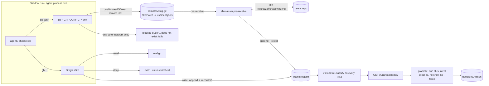

# Shadow Runs: real agents, zero outward side effects

> Slug: `shadow-runs` · Status: **proposed; Phase 1 (server, contract, tests) implemented on branch `feat/shadow-runs`** · Date: 2026-10-06 · Builds on: spec 006 (worktree per task), #427 / #456 (least-privilege agent env), `2026-09-10-dispatch`, `2026-09-14-automations-redesign` · Relates: #475 / #1027 (permission modes), #1031 (execution targets, withdrawn), #1293 (untrusted PR heads), #1155 / #1156 (governance RFCs)

## 📝 TLDR

A worktree already isolates what an agent does to FILES. Nothing isolates what it does to the
WORLD: the same task that edits a worktree can `git push`, open a pull request, comment on an
issue, or merge, with the user's own credentials, and with automations and dispatch on by default
it can do so with no human in the loop at all. That is the single biggest reason a team does not
point cezar at its real repository on day one, and the reason an enterprise does not switch an
automation on.

A **shadow run** is an ordinary task - same agent, same tools, same worktree, same budget - with
one property: its outward side effects are **captured instead of executed**. Every `git push`
from any process in the run's tree lands in a local *shadow remote* whose hook records the ref
update and rejects it; every `gh` command that would change GitHub hits a shim on the run's PATH
that records it and prints "recorded". Each captured attempt is an **intent** in an append-only
ledger. A human reviews the intents in the cockpit and **promotes** the ones they want (cezar runs
exactly that one, with the user's credentials), **discards** the rest, or copies the exact
command to run by hand.

Zero configuration and no daemon: the push redirect is git's own URL rewriting injected through
`GIT_CONFIG_*` environment entries, the gh boundary is one PATH entry, and the run refuses to start
unless git itself confirms - with the final environment - that every remote now pushes into the
shadow. Ordinary runs are byte-for-byte unchanged.

Phase 1 (this branch): the boundary, the ledger, the trust model, promotion, the three routes,
the run/automation/dispatch wiring, and the tests, the core of them against a real git. Phase 2 is
the cockpit surface.

## Resolved assumptions (autonomous defaults)

Written without a human in the loop. Each row carries the conservative default applied; override
on this spec's PR before Phase 2 starts.

| # | Question | Applied default | Why conservative | Confirm? |
|---|---|---|---|---|
| Q1 | A per-task property, or a global mode? | **Per task**, like `autonomous`: `POST /runs { shadow: true }`, persisted as `RunRecord.shadow: true`, inherited by variants and by every task a shadow run dispatches; automations get a per-definition `task.shadow`. No `CEZ_*` flag. | It NARROWS exposure, so § Zero config does not ask for a flag, and a property of the task cannot surprise anyone whose tasks do not set it. | - |
| Q2 | What does Phase 1 capture? | `git push` from **any** git process in the run's tree; `gh` writes resolved through PATH; tracker (Jira/Linear) credentials are **withheld** from shadow runs. | These are the doors cezar's own features use and the ones agents actually reach for. Everything else is listed under "Not captured" rather than implied. | - |
| Q3 | Accept a shadowed push into the shadow remote, or reject it? | **Record, then reject** (`pre-receive` exits 1). | An ACCEPTED push makes git update `refs/remotes/<remote>/<branch>` in the user's repository, and `resolveBaseRef` (`git-worktree.ts:109`) would then fork later tasks from a commit origin does not have. A rejected push leaves no trace outside the ledger. Cost: the agent sees a failed push, answered by its system prompt and the hook's own message. | - |
| Q4 | Strip `GH_TOKEN`/`GITHUB_TOKEN` from a shadow run's environment? | **Not in Phase 1.** | Read-only `gh` must keep working, and some users authenticate gh by env token only. Phase 3 strips them when `gh auth status` shows a stored login, closing the raw-HTTP door for most users. | ⚠ NEEDS HUMAN CONFIRMATION |
| Q5 | What may a human promote with one click? | `click`: a new branch or fast-forward push (never to the default branch), `pr create/comment/edit/ready/close/reopen/review` (not `--approve`), `issue create/comment/edit/close/reopen`. `manual` (command shown, never run by cezar): merges, approvals, all of `gh api` writes, releases, repo settings, workflow runs, force pushes, deletions, tags, unknown commands. `never`: credential and gh-setup commands, which the shim refuses outright. | Mirrors AGENTS.md: cezar never auto-merges. A click runs only what closing or editing can undo. | - |
| Q6 | What do the run-level `POST /runs/:id/pr`, `/git/push` and `/open-in-cli` do for a shadow run? | **409** naming the Shadow panel. | One door out, per intent. A "publish everything" button would be promotion without review, and a terminal resuming the session with the user's own environment would be the session continuing unshadowed. | ⚠ NEEDS HUMAN CONFIRMATION |
| Q7 | Arm once and cache, or arm on every spawn? | **Every spawn** (first turn, Continue, restart recovery, each check step), with re-verification. | A cached arming living on one construction path is exactly the #811 shape. Cost: a dozen local git calls per spawn. | - |
| Q8 | Where is a verdict decided? | In the shim (to decide what to EXECUTE) and again on the server on **every read** (to decide what may be PROMOTED). The ledger stores raw argv/refs only. | The ledger is written by processes the agent controls. | - |
| Q9 | Promotion in hosted mode (`CEZ_REMOTE`)? | **No new gate**, consistent with `POST /runs/:id/pr` and `/git/push`, which already push with server-side credentials. | The routes inherit the `/api/*` origin guard and the deployment's auth perimeter; a narrower gate later is additive. | ⚠ NEEDS HUMAN CONFIRMATION |
| Q10 | How long do intents live? | Until the run is **deleted**; deletion removes the ledger and the commit pins together. Worktree retention (#483) never touches them. | The ledger is the audit trail of what an agent wanted to do; it is small. | - |
| Q11 | May a shadow run create automations? | It is **not taught to**: the automations prompt is withheld from shadow runs. Refusing `cez automation` mutations made FROM a shadow run server-side needs the CLI to send its task id - Phase 2. | An automation it set up would launch ORDINARY runs later: the same way around the boundary that dispatch inheritance closes for `cez task`. | - |
| Q12 | `task.shadow` on a tracker automation? | **Refused** at definition validation. | A tracker task must read its issue with tracker credentials, which a shadow run never gets: the pair would launch runs that stop at their first step. | - |

## 📝 Problem Statement

Three facts in the current code combine into the gap:

- **The agent environment carries publishing credentials by design.** `buildChildEnv`
  (`packages/cezar/src/core/agent-env.ts:318`) forwards `GITHUB_TOKEN`, `GH_TOKEN` and
  `GH_ENTERPRISE_TOKEN` to every backend (`GH_ALLOW_NAMES`, line 248), because draft PRs and agent
  workflows need gh. #427 removed every OTHER host secret; this one stays on purpose.
- **Autonomy is now the default posture.** Dispatch (`2026-09-10-dispatch`) and automations
  (`2026-09-14-automations-redesign`) are default-on; dispatched children are `autonomous: true`
  (the dispatch `startRun` call in `workflows/run.ts`); the review gate is OFF by default
  (`runs/review-gate.ts:16-22`). A task can push and open a PR with no human between the prompt
  and GitHub.
- **There is no reversible way to say "do the work, but don't touch the world".** `CEZ_DRY_RUN=1`
  replaces the agents with mocks, so it proves nothing about the work. Permission modes (#475,
  approved, unbuilt, #1027 open) gate tool calls interactively, per backend, and only where the
  backend honors them (Codex, OpenCode, Cursor and Junie auto-approve). Nothing records what an
  agent WOULD have published and lets a human publish exactly that.

Who feels it: a new user who will not aim an unfamiliar tool at a production repository; a team
lead asked to approve "agents with write access"; anyone rolling out a new automation, who today
can only find out what it does by letting it do it.

Verified absent on `47cc6e1d` (code, `.ai/specs/`, and every open and closed issue and PR): no
shadow, canary or side-effect capture of any kind. The nearest items are listed under Relates.

## 📝 Proposed Solution

### What a shadow run is

A task started with `shadow: true`. Nothing about how it runs changes - not the worktree, not the
agent, not its tools, not its budget, not its lifecycle states. What changes is where its outward
actions go:

| The agent does | What happens |
|---|---|
| `git push origin feature` (any git process, any cwd) | The push lands in `.ai/cezar/shadow/<runId>/remotes/<slug>.git`, whose `pre-receive` hook pins the commit, appends an intent, prints `cezar shadow: recorded ... Nothing was sent to origin`, and rejects the push. |
| `git push https://elsewhere/x.git` | Rewritten into a directory that does not exist: the push fails, nothing is recorded, nothing leaves. |
| `gh pr view 12`, `gh run view`, `gh api repos/o/r` (GET) | Runs normally through the real gh. |
| `gh pr create ...`, `gh issue comment ...`, `gh pr merge ...` | The shim appends an intent (capturing any `--body-file`), prints `recorded`, exits 0. Nothing runs. |
| `gh auth token`, `gh secret set`, `gh extension install` | Refused (exit 1); the attempt is logged with its values withheld. |
| Uses Jira/Linear credentials from an automation | There are none: a shadow run is spawned without tracker credentials. |

The agent is told all of this in its system prompt (`SHADOW_INSTRUCTIONS`,
`packages/cezar/src/shadow/setup.ts`), placed after the run's own extra prompt so a project
default cannot talk it out of shadow mode. Cooperation is the first line of defense; the shim and
the redirect are the second.

### Not captured (Phase 1), stated plainly

Shadow mode is a **seatbelt against accidental side effects**, the same kind of guarantee a
worktree gives for files - not a sandbox against an agent trying to escape. In Phase 1 it does not
catch:

- a process that clears its environment or passes its own `git -c url.*` config;
- an absolute path to the real `gh`, and a `gh` that an agent's OWN tool shell puts ahead of the
  shim: a login profile that rewrites PATH (Debian's `/etc/profile`), macOS `path_helper` or
  `brew shellenv`, and - on Windows - any program that spawns `gh` without a shell, which resolves
  `gh.exe` and never sees `gh.cmd`. Check steps are covered: their wrapper re-asserts the shim
  after the profiles run and refuses to start unless `gh` resolves to it;
- raw HTTP calls to a forge API with a token from the environment (Q4);
- other publishing CLIs (`glab`, `hub`, `npm publish`, `docker push`, `terraform apply`, `kubectl`);
- pushes through an ssh host alias that no configured remote uses (`gh:o/r` with `Host gh` in
  `~/.ssh/config`), and a `git remote set-url --push` made mid-turn, until the next spawn re-arms;
- an agent that already knows `cez automation` and creates an ordinary automation (Q11).

Each is either deliberate, closed by Q4 in Phase 3, or a Phase 2 item.

### Alternatives considered

- **Permission modes' `ask` rules for `git push` / `gh pr create` (#475).** Rejected as the
  mechanism: interactive (the agent blocks on a human mid-turn), configuration (rules to write),
  and per-backend (four of seven backends auto-approve). Shadow mode is backend-agnostic because it
  lives below the agent, in git and PATH. The two compose: permission modes govern tool calls,
  shadow governs what leaves the machine.
- **A sandbox or container (#1031, withdrawn).** A real boundary, but a daemon, an image and a
  platform matrix - everything § Zero config asks to avoid - and it still needs a recording layer
  to be useful. Shadow mode is the recording layer; a future execution target can carry it.
- **A `pre-push` hook in the user's repository.** Rejected: it edits the user's repo, `--no-verify`
  skips it, and `core.hooksPath` (husky, secret scanners) silently disables it.
- **Strip credentials and let pushes fail.** Rejected as the only measure: nothing is recorded, so
  there is nothing to promote, and agents treat auth failures as problems to solve.
- **Accept pushes into the shadow remote.** Rejected per Q3: it pollutes `origin/*` tracking refs.
- **A `git` wrapper on PATH.** Rejected: scripts and tools call git by absolute path, and env
  config already reaches every git process without one.

## 📝 Architecture



**Takeaway:** the only process that can publish anything is the cezar server, one intent at a
time, after a human click; everything inside the run can only ever append to a ledger.

### New modules (`packages/cezar/src/shadow/`)

| File | Role | Runs where |
|---|---|---|
| `gh-policy.ts` | The gh policy table: `classifyGh(argv) -> {effect, promotable, command, reason}`, `ghFileReferences`, `ghTargetRepo`. Pure, fail-closed. | shim + server |
| `git-redirect.ts` | Remote discovery, the `GIT_CONFIG_*` redirect plan, and `verifyPushRedirect`, which asks git where each remote now pushes. | server |
| `ledger.ts` | Paths, `shadow.json`, intent ids, append-only writers, body capture, value withholding. Node builtins only. | shim + server |
| `ledger-store.ts` | Bounded, schema-validated read of the ledger and decisions (zod). | server |
| `shim.ts`, `shim-main.ts` | The program behind `bin/gh` and the shadow remotes' `pre-receive`. | agent's tree |
| `setup.ts` | `prepareShadowRun` (arming), `SHADOW_INSTRUCTIONS`, `withEnvOverrides`, `findExecutable`, `removeShadowState`. | server |
| `view.ts` | Ledger -> `ShadowIntent[]`, re-derived on every read, secrets redacted for display. | server |
| `promote.ts` | `promoteShadowIntent`, `discardShadowIntent`: the only executors. | server |
| `routes.ts` | The Hono family, chained into `v1`. | server |
| `packages/contract/src/shadow.ts` | Wire schemas, types inferred. | everywhere |

### Changed files

| File | Change |
|---|---|
| `packages/contract/src/runs.ts:178-182`, `:913-916` | `RunRecord.shadow?: true`; `createRunInputBaseSchema.shadow?: boolean` (which `automationTaskSchema` inherits). |
| `packages/cezar/src/runs/store.ts:190-194`, `:979-1002` | The persistence twin of the record field; `createRun` takes and stores it. |
| `packages/cezar/src/workflows/run.ts:1312` | `startRun` persists `shadow` on the record. |
| `packages/cezar/src/workflows/run.ts:1222-1280` | `agentEnvForStep` arms the run (`armShadow`), merges its env LAST, withholds tracker credentials; `armShadow` re-arms and re-verifies per spawn and announces once per process. |
| `packages/cezar/src/workflows/run.ts` (both `agentEnvForStep` callers) | `ShadowSetupError` fails the step before spawn, exactly like `AgentTempDirError` - in `execute` AND in the Continue path. |
| `packages/cezar/src/workflows/run.ts:3957`, `:4882` | `SHADOW_INSTRUCTIONS` in both `composeSystemPrompt` sites. |
| `packages/cezar/src/workflows/run.ts:5688` | `runCheckStep` arms too: a check script that pushes hits the shadow. |
| `packages/cezar/src/workflows/run.ts:2202` | A dispatched child of a shadow run is a shadow run. |
| `packages/cezar/src/server/server.ts:659`, `:692`, `:4173` | `POST /runs` accepts and forwards `shadow`. |
| `packages/cezar/src/server/server.ts:4776`, `:4805` | `/runs/:id/git/push` and `/runs/:id/pr` answer 409 for a shadow run. |
| `packages/cezar/src/server/server.ts:4861` | `DELETE /runs/:id` removes the shadow state and pins. |
| `packages/cezar/src/server/server.ts:6238` | `.route('/', shadowRoutes())` in the `v1` chain. |
| `packages/cezar/src/automations/types.ts`, `task-template.ts:150` | Storage schema and launch mapping for `task.shadow`; a tracker automation with `task.shadow` is refused (Q12). |
| `packages/cezar/src/automations/prompts.ts` | `shadow` documented in the definition reference agents read. |
| `packages/cezar/src/workflows/run.ts` (`prepareAutomationsSession`, both call sites) | The automations prompt is withheld from shadow runs (Q11). |
| `packages/cezar/src/server/server.ts` (`/runs/:id/open-in-cli`) | 409 for a shadow run (Q6). |
| `packages/cezar/src/data-gitignore.ts:31` | `shadow/` is run data. |
| `.env.example` | `CEZ_SHADOW`, `CEZ_SHADOW_BIN`, `CEZ_SHADOW_COMMAND` and the `GIT_CONFIG_*` entries, in the block of variables cezar sets for child processes. |
| `BACKWARD_COMPATIBILITY.md` §2, §3 | The routes and the state directory, inventoried. |

### Arming

`prepareShadowRun({dataDir, runId, repoRoot})` (`setup.ts`), called from `armShadow` on every
spawn:

1. Read the remotes (`git config --get-regexp '^remote\..*\.(url|pushurl)$'`) and the common git
   dir (`git rev-parse --path-format=absolute --git-common-dir`).
2. Per remote, ensure a bare shadow remote at `remotes/<slug>.git` with
   `objects/info/alternates` pointing at the user's object store - every commit the agent made in
   its worktree is already there, so a push transfers nothing - `core.hooksPath` pinned to its own
   `hooks/` (a global hooks path would otherwise silence the hook), and a generated `pre-receive`.
3. Build the redirect plan (below) as `GIT_CONFIG_COUNT/KEY_n/VALUE_n`.
4. **Verify**: for each remote, `git remote get-url --push --all <name>` under the final env must
   print the shadow path; and a probe `git push --dry-run https://shadow-probe.invalid/... :ref`
   must fail naming the blocked prefix (a remote defined only in env config is invisible to
   `remote get-url`, so the probe is a real dry-run push of a ref deletion: rewritten it fails on a
   missing local path, not rewritten it fails on a host that cannot resolve - nothing is sent
   either way). The probe runs from `probe.git`, a scratch bare repository of the run's own,
   addressed with `--git-dir`, so it works outside any repository and under
   `safe.bareRepository=explicit` (every git call on a bare repository here uses `--git-dir`). Any
   other answer throws `ShadowSetupError`. This is also where git older than 2.31 (no
   `GIT_CONFIG_COUNT`) is caught.
5. Resolve the real `gh` on PATH (skipping the shim dir; a directory named `gh` is not a binary,
   #1066; on Windows only `.exe`/`.com`, never a shell-requiring `.cmd`), write `shadow.json`,
   `bin/gh` (sh) and `bin/gh.cmd`.
6. Return `{ env: { GIT_CONFIG_*, PATH: <bin>:<host PATH>, CEZ_SHADOW: '1' }, remotes, realGh }`.

### The push boundary (`git-redirect.ts`)

Longest prefix wins, which is git's own rule for `insteadOf`:

1. `url.<shadow repo>.pushInsteadOf = <each remote URL>` and its `.git`-twin.
2. A remote with an explicit `pushurl` ignores `pushInsteadOf`, so its push URLs are rewritten
   with `url.<shadow repo>.insteadOf` instead - refused if any fetch URL starts with that push URL,
   because `insteadOf` would then break the agent's fetches.
3. `url.<blocked-push>/.pushInsteadOf` for `https://`, `http://`, `ssh://`, `git+ssh://`,
   `ssh+git://`, `git://`, `ftp(s)://`, `git@`, and each remote's scp `user@host:` and bare
   `host:`. `blocked-push/` never exists, so these pushes fail.

Remotes are read with `git config -z`, so a remote name containing a space is not skipped.

Cezar owns `GIT_CONFIG_COUNT` inside a shadow run: a host value is superseded, not extended,
because the curated agent environment drops the host's `GIT_CONFIG_KEY_n` (#427) and an extended
count would point at keys the child does not have. Verification runs with exactly that
superseding environment.

### The gh policy (`gh-policy.ts`)

Read the table in the file; it is one screen. Its properties:

- **Canonical argv only.** gh resolves subcommands with cobra, which reads an UNKNOWN flag before
  the subcommand as taking a value: in `gh pr -t create merge 42` gh runs `merge`, while a reader
  that skips flags sees `create`. So a group must come first, and only `-R/--repo` may sit between
  it and its subcommand; anything else is `manual`. pflag also accepts clusters and attached values
  (`-ab`, `-a=true`, `-Fbody.md`), so refinements look for a short flag inside any cluster, and a
  `click` command spelled with one is downgraded to `manual` - written out in full, the same
  command is promotable.
- **Fail closed.** An unknown group or subcommand (a newer gh, an extension, a user alias) is a
  `manual` write: recorded, never executed.
- **`gh api`** by method: `-X/--method`, else POST as soon as `-f/-F/--field/--raw-field/--input`
  appears (gh's own rule), in every spelling pflag accepts (`-XPOST`, `-X=POST`, `-fkey=val`); GET
  and HEAD read, everything else `manual`. Options are matched against an explicit list: an option
  the table does not know, or a cluster such as `-iXPOST`, is `manual`. GraphQL always POSTs, so it
  is read by its inline query: `mutation` is a write; a query from a file cannot be read and fails
  closed.
- **Help is narrow.** `--help` makes a command a read only when help flags are all there is: `gh
  issue create --body -h` is a write whose body is `-h`, not help.
- **Refinements:** `pr review --approve` and `--delete-last` are `manual`; `auth status
  --show-token` is denied.
- **`-F` is per group.** It means `--body-file` for pr/issue writes and `--field` under `gh api`.

### The shim (`shim.ts`)

`node shim-main.js gh <shadowDir> <args...>` and `node shim-main.js pre-receive <shadowDir>
<remote>`. Imports Node builtins and its two siblings only (no zod, no contract package), because
it runs under a bare `node` inside the agent's tree. In a source checkout the entry is
`shim-main.ts` (Node 23.6+ strips types by default; 22.6+ gets the flag), in a build `shim-main.js`
- the same pair the cockpit already hands agents as `CEZ_BIN`.

In `pre-receive` mode, the `git update-ref` that pins a commit runs with every `GIT_*` variable
removed: inside a hook git sets `GIT_DIR` and the quarantine and object-directory variables for the
SHADOW repository, and an inherited one would pin into the wrong repository.

Before a gh write reaches the ledger, the shim cuts argv to the server's own bounds (256 tokens,
100 000 characters each, flagging `truncated`) - a line the server would skip would be an intent
the agent was told is "recorded" that silently never existed - and redacts secret values and
token shapes from argv and captured bodies with the same `redactSecrets` the run's event log uses
(flagging `redacted`). The ledger never holds a secret; a redacted intent is manual-only.

### Trust (`ledger-store.ts`, `view.ts`)

- The ledger is parsed line by line against closed, bounded schemas; an invalid line is skipped,
  never fatal; duplicated ids keep the first line; reads stop at 4 MiB / 500 intents with
  `truncated: true`.
- The server never reads a verdict from disk. `promotable` and `reason` are re-derived from raw
  argv (gh) or from the ref and this machine's remote-tracking refs (push) on every read.
- `shadow.json` (writable by the agent) is never read by the server for anything it executes:
  promotion resolves gh on the server's own PATH.
- Decisions live in a separate file only the server writes; `promoted` and `discarded` are final,
  `failed` can be retried.
- Display strings (summary, command, body previews, output) pass through `redactSecrets` with the
  host's secret values. A click never publishes what the reviewer was not shown: an intent whose
  argv or body the shim redacted, that the server's own redaction would change, whose argv was cut,
  or whose body is longer than the 16 000-character preview, is `manual`.

### Promotion (`promote.ts`)

One intent per call, serialized per run (two clicks never run a command twice):

- Only `click`; `manual` answers 409 with the exact command, `never` answers 409.
- **Push:** the remote must still be configured, the ref must be a valid `refs/heads/*`; then
  `git push --porcelain <remote> <sha>:<ref>` from the repository root - never `--force`, never a
  deletion. The remote has the final word on anything stale since the last fetch.
- **gh:** `pr create` is refused while one of the run's click-class pushes is pending ("promote the
  push first"); which argv tokens carry a body file is re-derived from the argv itself
  (`ghFileReferences`), and the ledger's own `index`/`flag` must agree with it one for one, or the
  intent is refused; the bodies are written to a scratch dir and swapped into argv; `execFile(gh, argv)` - an array,
  no shell - from the run's worktree (or the repo root when it is gone), 120 s timeout, prompts
  disabled.
- The outcome becomes a decision line; a failure is `failed` (retryable) and a 409 carrying the
  manual command.

## 📝 Data Model

`.ai/cezar/shadow/<runId>/` (gitignored; inventoried in `BACKWARD_COMPATIBILITY.md` §3):

```ts
// intents.ndjson - append-only, written by the shim and the hooks (untrusted)
{ v: 1, type: 'intent', id: 'mg6c3x2k-0f1e2d', at: '2026-10-06T12:00:00.000Z',
  kind: 'push', remote: 'origin', ref: 'refs/heads/cez/1a2b3c4d',
  sha: '<40 hex>', oldSha: '<40 zeros>', pinned: true }
{ v: 1, type: 'intent', id, at, kind: 'forge' | 'denied', tool: 'gh',
  argv: ['pr', 'create', '--title', 'Fix login', '--body-file', 'body.md'],
  cwd: '<worktree>', files: [{ flag: '--body-file', index: 5, inline: false,
  name: 'body.md', content: '...', bytes: 21, truncated: false }],
  redacted?: true, truncated?: true }     // both make the intent manual-only

// decisions.ndjson - append-only, written by the server only
{ v: 1, type: 'decision', intentId, at, decision: 'promoted' | 'discarded' | 'failed', detail? }

// shadow.json - rebuilt on every arming
{ v: 1, runId, repoRoot, realGh: '/usr/bin/gh' | null }
```

Also under the run's directory: `bin/` (the shim wrappers), `remotes/<slug>.git` (the shadow
remotes) and `probe.git` (the arming probe's scratch repository) - all rebuilt on arming.

Pins: `refs/cezar/shadow/<runId>/<intentId>` in the user's repository, so `git gc` cannot collect
a recorded commit before a human decides. `pinned: false` means the commit was never in this
repository (a push from a separate clone); such an intent is `manual`.

`RunRecord.shadow?: true` - set at creation, never changed, absent on every ordinary run.

## 📝 API Contracts

All three routes are chained into the project-scoped `v1` table, so they answer under `/api/v1`
and `/api/v1/p/:projectId`, and both path params are validated as middleware
(`shadowIntentParamSchema`, `packages/contract/src/shadow.ts`).

### `GET /api/v1/runs/:id/shadow`

```ts
export const shadowLedgerResponseSchema = z.object({
  shadow: z.boolean(),
  intents: z.array(shadowIntentSchema),
  truncated: z.boolean(),
});
```

- `200` for every run. An ordinary run is `{ shadow: false, intents: [], truncated: false }` and
  the disk is not touched.
- `404 { error: 'not found' }` for an unknown run.

`ShadowIntent`: `{ id, at, kind: 'push' | 'forge' | 'denied', summary, command, promotable:
'click' | 'manual' | 'never', reason, state: 'pending' | 'promoted' | 'discarded' | 'failed',
decidedAt?, detail?, push?: { remote, ref, sha, relation: 'new' | 'fast-forward' | 'diverged' |
'delete' | 'unknown', pinned }, forge?: { tool: 'gh', argv, repo?, files: [{ flag, name, bytes,
truncated, preview }] } }`.

### `POST /api/v1/runs/:id/shadow/intents/:intentId/promote`

- `200 { promoted: true, intent }`, and a `note` event in the run's transcript.
- `409 { error, manual? }`: not a shadow run; `manual`/`never` class; already decided; `pr
  create` ahead of its branch push; a captured body that no longer matches argv; gh not installed;
  and any execution failure (recorded as `failed`).
- `404` for an unknown run or intent; `400` for a malformed intent id.

### `POST /api/v1/runs/:id/shadow/intents/:intentId/discard`

- `200 { discarded: true, intent }`; `409` when already decided or not a shadow run; `404`; `400`.

### Changed

- `POST /api/v1/runs` accepts `shadow?: boolean` (additive).
- `POST /api/v1/runs/:id/pr`, `POST /api/v1/runs/:id/git/push` and `POST
  /api/v1/runs/:id/open-in-cli` answer `409` for a shadow run (Q6). Every other run is unchanged.

`contract-parity.shadow.test.ts` asserts all three 200 shapes against `AppType` in both
directions.

## 📝 UI/UX (Phase 2)

- **Composer:** a `Shadow` toggle next to Autonomous and Worktree, with the one-line explanation
  "Agents work normally; pushes and GitHub changes wait for your approval." Persisted through the
  existing `composerDefaults` (spec `2026-07-25-configurable-composer-run-defaults`) so a team can
  start every task in shadow during its first week - no new setting type.
- **Run header and task rows:** a `Shadow` chip, and `N to review` while intents are pending.
- **Shadow tab** on the task: intents oldest first. Each row shows the summary, the target
  repository when `-R` names one (highlighted), the reason, a body preview for gh writes, and
  `Promote` (click class, one confirmation), `Copy command` (manual), `Discard`. Pushes sort
  before the PRs that need them; `Promote` on such a PR explains the order.
- **Review gate:** on a shadow run the gate's "Create draft PR" becomes "Review intents".
- **Automations editor:** a `Shadow` toggle per definition; the run-provenance link already shown
  on automation tasks also shows the chip.
- Promoting a `gh pr create` whose output names a pull request records it on the run as a
  `created` PR reference, so the existing chips light up.

## 📝 Edge Cases & Failure Scenarios

| Scenario | Behavior |
|---|---|
| git older than 2.31 | `GIT_CONFIG_COUNT` is ignored; verification sees the real URL and throws `ShadowSetupError`; the step fails before spawn with the reason. Never runs unshadowed. |
| A remote whose `pushurl` equals its fetch URL | Refused at arming (rewriting it would break fetches); the run fails with the remote named. |
| Repository with no remote | Armed: the gh shim and the catch-all block still apply; nothing to redirect. |
| Not a git repository | Armed: no remotes, no common dir; the probe verifies the catch-all from its own `probe.git`. |
| A login profile rewrites PATH in a check step | The check wrapper puts the shim back in front, then refuses to run the check (exit 97) unless `gh` resolves to the shim. |
| Cancel while a check step is being armed | The check does not start. |
| A gh body containing a secret-shaped value | Redacted before it reaches the ledger; the intent is manual-only. |
| A gh body longer than the 16 000-character preview | Manual-only: a click never posts unseen text. |
| A gh command with combined or attached short flags (`-dF x`, `-tTitle`) | Manual-only; written out in full, the same command is promotable. |
| Agent pushes, sees the rejection, retries with `--force` | Recorded again as a second intent; the view marks it `diverged` and `manual`. |
| Agent pushes to the default branch | Recorded; `manual` ("work lands there through review"). |
| Agent adds a new remote at runtime and pushes to it | A URL with a scheme, `git@` or a known remote host matches a catch-all: the push fails, nothing is recorded. An ssh host alias no remote uses is not caught ("Not captured"). |
| Push from a separate clone in TMPDIR | Recorded if its URL matches a remote; the pin fails (objects not in the repo); `manual`. |
| `gh` not installed | Reads exit 127 with a clear message; writes are still recorded; promotion of gh intents answers 409. |
| `--body-file -` (stdin) | Captured from stdin, up to 256 KiB. |
| Body larger than 256 KiB, or unreadable | Captured truncated; the intent is `manual`. |
| A forged ledger line (the agent writes the file itself) | Same power as calling gh: re-classified on read; a fabricated `click` intent is still a human click away from running, with its full command and body visible. |
| Two promote clicks race | Serialized per run; the second sees `promoted` and answers 409. |
| Continue on a shadow run, restart recovery | Re-armed and re-verified on that spawn (Q7). |
| The worktree was reclaimed (#483) | Intents and pins are untouched; gh promotion runs from the repo root. |
| Run deleted | `removeShadowState` deletes the directory and every `refs/cezar/shadow/<runId>/*` pin. |
| `CEZ_DRY_RUN=1` | Works unchanged: the mock agents never push, the arming still runs. |
| Global `core.hooksPath` (husky, scanners) | The shadow remote's own config pins its hooks; the user's repository is not touched. |
| Windows | Hooks run through Git for Windows' sh with forward-slash paths; `gh.cmd` for cmd/PowerShell, `gh` (sh) for Git Bash. A program that spawns `gh` without a shell resolves `gh.exe` and bypasses the shim ("Not captured"). All Phase 1 tests ran on Windows 11 + git 2.55. |

## 📝 Risks & Impact Review

- **Default path (AGENTS.md § Changing a mechanism that already works).** Additive. With `shadow`
  absent: the agent environment is byte-identical (pinned by `shadow-wiring.test.ts` "leaves an
  ordinary run exactly as it was"), the check-step environment is `process.env` as before, no
  directory is created, `/runs/:id/pr` and `/git/push` behave as before, and the new GET answers
  empty without touching the disk.
- **Transitions.** No new run status. Intents have their own small machine: `pending ->
  promoted | discarded | failed`, `failed -> promoted | discarded`. Who fires them: a human, and
  only a human. That is not a dead end because nothing waits on an intent: it holds no slot, parks
  no run, blocks no settle. A run whose intents are never reviewed simply ends with them recorded.
- **Every construction site.** Arming sits in `agentEnvForStep`, the one async path both `execute`
  and the Continue path call before every spawn, plus `runCheckStep`; `ShadowSetupError` is caught
  at both `agentEnvForStep` call sites. `shadow` is read from the RECORD everywhere, never from the
  original input, so restart recovery and Continue see it.
- **Fail-closed helpers.** The gh policy fails to `manual`; arming fails to "no spawn"; ledger
  parsing fails to "skip the line". The empty/absent-input guard tests exist for each
  (`classifyGh(['frobnicate'])`, the no-remote arming case, the corrupt-line case).
- **Security review.** The new executor (`promote.ts`) runs only what a human selected, only
  click-class, through `execFile` without a shell, with gh resolved server-side, never with
  `--force`. The shim runs as the agent and gains it nothing it did not have. The ledger's
  untrusted status is explicit and tested; verdicts are never stored, so there is none to forge.
- **Honest limits** are listed under "Not captured". Marketing this as a sandbox would be the bug.
- **Cost.** Arming is a dozen local git calls per spawn; the Phase 1 real-git suite (10 cases, each
  creating a repository, arming and pushing through real hooks) runs in about 7.5 s on Windows.
- **Interaction with in-flight work.** #1164/#1182 (bounded, scrubbed check-step env): shadow
  merges its env through `withEnvOverrides`, so a scrubbed base keeps working. #1027 (permission
  modes): orthogonal, composes. #847/#1226 (GitLab adapters): Phase 3 adds `glab` rows to the
  policy. #1291 (check credentials): a shadow run should not receive them either - Phase 2 wiring.

## 📋 Phasing

- **Phase 1 - Boundary and API (this branch).** Arming, the push redirect with verification, the
  gh shim and policy, the ledger and trust model, promotion and discard, the three routes, run /
  dispatch / variants / automation / check-step wiring, cleanup, BC inventory. Usable through the
  API and `cez automation` definitions today.
- **Phase 2 - Cockpit.** Composer toggle and default, chips, the Shadow tab, the review-gate
  button swap, the automations editor toggle, PR reference recording on promotion, check-step
  credentials withheld (#1291), automation templates carrying `task.shadow`.
- **Phase 3 - Hardening.** Strip forge tokens when gh has a stored login (Q4); `glab` and `hub`
  rows; optional shims for `npm publish` / `docker push`; a dashboard insight ("intents promoted
  vs discarded per automation" - the number that tells a team when to take an automation out of
  shadow).

## 📋 Implementation Plan

Each step leaves the application working and is verified by a test.

### Phase 1 - Boundary and API (done)

1. **Contract.** `packages/contract/src/shadow.ts`; `shadow` on `RunRecord` and
   `createRunInputBaseSchema`. *Test:* `contract-parity.shadow.test.ts`, `contract-parity.runs`,
   `contract-parity.automations` (compile-time, both directions).
2. **gh policy.** *Test:* `gh-policy.test.ts`, 66 cases: reads, click writes, manual writes,
   denials, GraphQL, help-as-body, `-R` before the subcommand, unknown commands.
3. **Redirect + verification + arming.** *Test:* `setup.test.ts` against a real git: a push is
   recorded, rejected, pinned, and leaves no `origin/<branch>`; other URLs and scp pushes are
   blocked unrecorded; an explicit `pushurl` is rewritten while fetch is untouched; a `pushurl`
   equal to the fetch URL refuses to arm; arming twice keeps working; the shim entry records a gh
   write; a repository with no remote arms.
4. **Ledger.** *Test:* `ledger-store.test.ts`: the shim's id regex equals the contract's; invalid
   lines skipped; first line wins per id; final decisions are final; the cap truncates; denied
   values withheld.
5. **Promotion.** *Test:* `promote.test.ts` with a local bare repository as the remote: a new
   branch is really pushed and never twice; a default-branch push is refused with its command; a PR
   waits for its branch push and runs with the captured body and no shell; a manual intent returns
   its command; discard is final; unknown ids 404.
6. **Routes.** *Test:* `shadow-api.test.ts` through the real app: ordinary runs answer empty and
   refuse decisions; malformed ids are a 400 from middleware; discard round-trips; `/pr` and
   `/git/push` 409 on a shadow run; unknown runs 404.
7. **Run wiring.** *Test:* `shadow-wiring.test.ts` at the `agentEnvForStep` seam: an ordinary run's
   env is unchanged; a shadow run's env leads PATH with the shim, redirects origin (asked of git),
   and announces once across two spawns; an unprovable redirect throws before any env exists.
8. **Docs.** `BACKWARD_COMPATIBILITY.md` §2 and §3; `data-gitignore.ts`; `.env.example`. *Test:*
   `bc-route-inventory.test.ts`, `data-gitignore.test.ts`.
9. **Review fixes** (an `om-code-review` pass: 1 blocker, 4 majors, 8 minors and nits). Canonical
   argv and cluster handling in the gh policy; secret redaction and argv bounds in the shim;
   preview-length and redaction downgrades; file references re-derived at promotion; the check
   wrapper and the cancel guard; the automations prompt withheld; tracker automations refused;
   `open-in-cli` 409; the probe repository; `--git-dir`; `git config -z`; the missing URL schemes.
   *Test:* the review's argv list pinned in `gh-policy.test.ts`; secret, preview and tampered-index
   cases in `promote.test.ts`; arming outside a repository and the wrapper under a replaced PATH in
   `setup.test.ts`. Two tests were proved red without their fix: the "no remote-tracking ref" case
   with the hook accepting pushes, and the canonical-argv case with the old skip-the-flag reading.

### Phase 2 - Cockpit

9. API client methods (`getShadowLedger`, `promoteShadowIntent`, `discardShadowIntent`) and
   queries; the ledger refetches on the run's `note` events.
10. Composer toggle + `composerDefaults.shadow`; chips; the Shadow tab; the review-gate swap; the
    automations toggle. Component tests per surface; one browser e2e: start a shadow task under
    `CEZ_DRY_RUN=1`, record an intent, promote it.
11. Record a promoted `gh pr create`'s URL as a `created` PR reference on the run.

### Phase 3 - Hardening

12. Token stripping behind a `gh auth status` probe (Q4), with a test that the env carries no
    forge token when a stored login exists.
13. `glab`/`hub` policy rows (with #1226), and optional publishing-CLI shims.

## 📝 Review limits

- **Verified by reading the code on `47cc6e1d`:** every file and line cited above, the absence of
  any shadow, canary, side-effect capture or `refs/cezar/*` use in the codebase, and the absence of
  any overlapping issue, PR or spec (all 772 PRs and 540 issues were swept, open and closed).
- **Observed, not inferred:** the Phase 1 suites pass on Windows 11 with git 2.55 and Node 25 (158
  shadow, route, wiring and guard tests), `npm run typecheck` is clean across all four workspaces,
  and an independent `om-code-review` pass was run against `CODE_REVIEW.md`, its findings fixed.
- **The full gate is red on this host either way.** On Windows the full `npm test` reds ~110 files
  and `npm run test:unit` fails on `/bin/sh`, on the untouched merge base as on this branch; the
  failing sets differ only by load-dependent flakes in both directions (#701), so Linux CI is the
  gate of record.
- **Not verified:** macOS and Linux runs of the real-git suites (the hook scripts are POSIX sh and
  `chmod 0755`'d, which is the path those platforms take); behavior with git 2.31-2.40
  specifically; every agent backend driving a real push (the boundary sits below the agent, so the
  backend should not matter, but no live agent run was made).
- **Pre-existing, unrelated:** three `route-parity.test.ts` cases about non-boot projects fail on
  this Windows machine on a clean `main` as well (checked with the change stashed).
- **No visual evidence:** Phase 2 has no mockup yet; the UI/UX section is prose.
