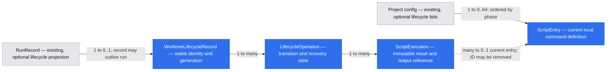

# Worktree lifecycle events

## 📝 TLDR

Cezar users need local resources to follow their task worktrees. This proposal adds two local, ordered command lists: **after worktree creation**, before the agent starts, and **before worktree removal**, while its files still exist. Failures pause the transition with explicit recovery choices; retries read the **current configuration**, and commands receive shell-safe template variables such as `{{ root_path }}` and `{{ worktree_path }}`.

Projects with no lifecycle commands retain today's behavior. This is one worktree-lifecycle capability, not a general task-event/plugin system or a Docker orchestrator.

## 📝 Problem Statement

The requesting user wants to build/start Docker Compose resources before an agent uses a worktree and remove those resources, including volumes, before the directory disappears. Users may need different commands for the same project. Workflow-only setup and manual cleanup are disconnected from automatic worktree reclamation. This is a directly reported need; broad demand and time savings have not been measured.

The current implementation has several distinct transitions:

| Existing transition | Evidence and load-bearing behavior |
|---|---|
| Task record → execution | `packages/cezar/src/workflows/run.ts:1358` creates the record before execution prepares a worktree (`:4307`). Queuing a task is not worktree creation. |
| Continue after reclamation | `runs/retention.ts:55` and `workflows/run.ts:3724` recreate the directory from the retained branch and clear `worktreeReclaimedAt`. Existing prepared directories must not rerun setup merely on Continue. |
| Finished-worktree retention | `runs/retention.ts` selects `done`, `failed`, `cancelled`; keeps branches/records; excludes review and live tasks. This bounds disk usage without losing continuation. |
| Explicit worktree/task deletion | `server/server.ts:4938` preserves distinct branch/task outcomes. `removeWorktree` is best-effort; its return is not proof that removal succeeded. |
| Variant selection | `server/server.ts:5110` cancels/discards losing variants and removes their worktrees. This must not bypass teardown. |
| Boot / lazy project initialization | `index.ts:256`, `server/project-context.ts:231` perform cleanup. Hook execution must not become a prerequisite for a listening server or a usable project context. |
| Restart recovery | `workflows/run.ts:1770` treats existing run states as agent/workflow states. An interrupted script must not enter automatic agent continuation. |

Archiving and finishing without removing a directory do not emit either hook. No hooks execute for worktree-less or non-Git tasks.

## 📝 Decisions and scope

Source brief: [Local worktree lifecycle scripts](briefs/2026-10-10-worktree-lifecycle-scripts.md), decisions D01–D09. Owner: requesting user. The user's specification answers on 2026-10-10 resolve the skeleton's gate:

| Decision | Confirmed answer / resulting rule |
|---|---|
| Cancellation after partial setup | Keep the directory and any resources already created; cleanup is explicit. No automatic rollback. |
| Configuration changes | Always use current saved lists, including Retry. A historical snapshot is audit data, never the retry execution source. This supersedes brief/prototype A05 and the skeleton's frozen-list recommendation. |
| Interrupted command | Await an explicit user choice; never automatically rerun a command with uncertain completion. |
| Startup orphans | Apply the same teardown gate to feature-managed worktrees. Missing lifecycle context preserves a known-managed directory for user action. |
| Command format | Arbitrary shell command text, including multi-line commands and script invocations. No executable allowlist or Docker-only API. |
| Context delivery | First-class template variables, explicitly including `{{ root_path }}` and `{{ worktree_path }}`. No required user-facing environment-variable substitute. |

The existing agreement to avoid repeating successful entries is reconciled with current configuration through entry identity and execution fingerprints, below. That reconciliation is a technical design rule, not a claim that editing a file on disk can be detected automatically.

**Included:** local project configuration and UI; ordered setup/teardown; progress and bounded output; retry/bypass/cancel/keep/force; initial creation and recreation; manual/task/variant/retention/orphan removal; restart recovery; CLI and GUI consistency; template discovery/validation; additive contracts and tests.

**Excluded:** archive/read/unread/task-completion hooks; shared committed hook lists; global inheritance; native Docker resource/port/volume management; a templating language with loops, filters or arbitrary evaluation; background fire-and-forget hook semantics; public plugin subscriptions; automatically cleaning up unrelated external worktrees; production implementation in this document-writing activity.

No critical product question remains open. Shell/timeout/API/storage details below are proposed implementation choices within that scope, not additional user-confirmed requirements. The earlier brief's restriction against writing a specification applied to the prototype activity; the user has now explicitly authorized this spec.

## 📝 Proposed Solution

Project Settings → Worktrees contains **After worktree creation** and **Before worktree removal**, each an ordered list with stable entry IDs, optional display name, command text and an optional timeout override. Empty lists are valid. Adding commands is the local user's opt-in to execute them with the Cezar host user's privileges; there is no mandatory config file or new `CEZ_*` switch.

Cezar controls when commands run and records their outcomes. A project-level lifecycle coordinator owns the worktree transition. It must await setup before any agent/workflow step starts and await teardown before the filesystem/branch/task removal commit. Notifications alone cannot provide this ordering.

1. Resolve the project's current configuration and worktree context.
2. Persist the operation intent and validate all pending command templates before starting a child process.
3. Run pending entries sequentially, persisting each entry's start and result.
4. On failure, stop and release execution capacity; preserve the directory and expose the appropriate choices.
5. On completion or an explicit bypass, perform the original lifecycle transition exactly once at the coordinator's commit boundary, verifying its result.

### Retry uses current configuration

Every entry has a stable `id`. An edit or reorder preserves it; adding/duplicating creates a new one. A success is reusable only for the same **operation, worktree generation, entry ID and execution fingerprint**. The fingerprint includes exact command text, resolved template values and renderer/shell contract version. Display-name changes and timeout increases alone do not invalidate an already successful command. Historical output is immutable.

On Retry, reload and validate current project configuration, then walk its current ordered list:

| Current entry compared with this operation's history | Retry behavior |
|---|---|
| Same ID and fingerprint, durably succeeded | Show “Already completed”; do not rerun. |
| Failed, interrupted, never run, new ID, or edited command | Run the current command in its current position. |
| Removed from the current list | Do not run it; history remains visible as removed. |
| Reordered without changing command/context | Current order governs the remaining work; recorded successes stay completed. |
| Both lists/current phase deliberately cleared and saved | Explicit Retry acknowledges the current empty list and completes the gate; saving alone does not resume a paused operation. |
| Referenced script file edited, command text unchanged | A failed entry reruns and reads that file's current contents. Successful entries are not invalidated by arbitrary filesystem dependency changes; remove/re-add an entry to deliberately give it a new identity. |

Immediately before each not-yet-started command, re-read the current list. A running child finishes using the command it was launched with; an edit never hot-patches it. Replan remaining entries against recorded results when configuration changes. Immediately before committing the lifecycle transition, check the current config revision again under the same short project-config mutation lock. Newly added/edited pending commands prevent commit until executed. Never hold this lock while a command runs.

A failed or interrupted sequence does not resume merely because configuration changed. **Save → Retry** is explicit. If configuration cannot be read/validated, enter `needs_attention`; do not treat a corrupt file as an intentionally empty list. Missing configuration with no managed operation retains the existing empty-default behavior. Limit repeated replans to 10 per operation activation; continued churn pauses with “Configuration kept changing; retry when edits are finished.”

Example: setup `[prepare ✓, start ✗, ready not run]`; the user fixes `start`, inserts `migrate`, and retries. Execute the current `start`, `migrate`, `ready` order; retain `prepare`'s success. If `prepare` itself was edited, run its new command first. No stale command snapshot can undo the user's correction.

### Template variables

These tokens are available in both lists, with optional whitespace inside braces:

| Token | Value |
|---|---|
| `{{ root_path }}` | Canonical absolute root of the selected Cezar project, not the task's cwd or another project's root. |
| `{{ worktree_path }}` | Canonical absolute directory being prepared/removed; it exists at invocation. Never silently substitute the project root. |
| `{{ worktree_id }}` | Persisted shell/resource-friendly identity `cez-<lowercase UUID>` for this logical worktree. Stable across reclamation/recreation, distinct across tasks/projects. |
| `{{ task_id }}` | Original task/run ID, retained in lifecycle context even when its task record is absent. |

For example, separate setup entries can be:

```sh
cp {{ root_path }}/.env.local {{ worktree_path }}/.env.local
```

```sh
docker compose --project-directory {{ worktree_path }} -p {{ worktree_id }} up -d --build
```

And separate teardown entries:

```sh
docker compose --project-directory {{ worktree_path }} -p {{ worktree_id }} stop
```

```sh
docker compose --project-directory {{ worktree_path }} -p {{ worktree_id }} down --volumes
```

These are examples, not automatically installed defaults. Users remain responsible for their Compose file and resources. The same identity is available during setup, removal and recreation; no environment variable names must be memorized.

**Rendering contract:**

- Treat template values as data. Render each recognized placeholder once with the existing POSIX `shellQuote` primitive in `core/shell-env.ts`; never raw-interpolate paths or evaluate expressions. Do not rescan substituted values as templates.
- Place tokens **unquoted in ordinary shell words**, e.g. `cp {{ root_path }}/file {{ worktree_path }}/file`. Shell quoting is added by Cezar; wrapping the placeholder in quotes is a validation error. Static prefixes/suffixes may form a shell word around the safely quoted value.
- Template tokens inside quotes, backticks, command substitutions, here-documents, shell arithmetic, comments or other ambiguous grammar contexts are rejected before execution with an actionable position/message. Commands without template tokens retain their normal Bash syntax. Use a small conservative lexer with explicit unsupported-context rejection, not a regex that guesses shell context; it need not interpret arbitrary Bash programs. Complex nested scripts can receive values as ordinary arguments from the outer command.
- To pass literal double-brace syntax to another tool, use `\{{` in the command editor. The template lexer consumes this escape and emits literal `{{`, without interpreting that occurrence. This works inside quoted literals; documentation gives a Docker-format example. A JSON-authored config escapes the backslash as usual.
- Unknown names, malformed/unclosed template delimiters and unavailable context fail validation. No silent empty expansion. Do not touch the existing workflow/automation prompt renderers: their prose interpolation is not shell-safe and their syntax compatibility is separate.
- Reject NUL/control characters in context paths and values rather than producing a changed value. Spaces, apostrophes, quotes, dollar signs, semicolons, Unicode and backticks in paths must round-trip as inert data in supported placement.
- Preview shows the selected worktree, working directory and resolved command, with sensitive-value redaction. It performs no command execution or shell expansion and does not show shell-derived output. Clearly mark example preview values when no worktree is selected.

## 📝 Research and alternatives

Research checked on 2026-10-10; these sources inform the design, not user requirements.

| Reference | Useful lesson | Deliberately omitted |
|---|---|---|
| [Worktrunk hooks](https://worktrunk.dev/hook/) | Distinguishes blocking hooks from background hooks, supports ordered hook pipelines, and shell-escapes template values. Cezar adopts a blocking boundary, explicit variable discovery and quoting rules. | Its larger hook vocabulary, Jinja expressions/filters, shared project command approval store and concurrent pipeline steps are unnecessary for two local lists. |
| [Dev Container lifecycle commands](https://github.com/devcontainers/spec/blob/main/docs/specs/devcontainerjson-reference.md#lifecycle-scripts) | Separates lifecycle stages and defines which stages clients wait for; a failed stage prevents subsequent scripts. Cezar explicitly waits for setup before the agent. | Container provisioning, attach/start stages, prebuild lifecycle and multiple command representation formats. |
| [Coder workspace lifecycle](https://coder.com/docs/user-guides/workspace-lifecycle) | Distinguishes lifecycle failure from usable workspace state and provides an explicit way to delete while leaving resources behind. Cezar makes forced cleanup bypass visible and attributable. | Terraform infrastructure, accounts, cloud orchestration and workspace billing/resource models. |

Building nothing remains possible with workflow commands and manual cleanup, but does not cover retention or orphan removal. Docker-specific management would require ownership/health/port policies the user did not request. A notification-only event bus could announce removal after the files were gone; it cannot enforce the required teardown gate.

## 📝 Architecture

### Ownership and integration

Introduce `packages/cezar/src/worktree-lifecycle/` with focused modules: contract-backed config reading, template rendering, durable store, command executor and coordinator. The coordinator has structural interfaces for worktree I/O, run ownership/queue operations and redacted event delivery; it must not import the Hono server. Server/CLI/project-context code composes it. Keep low-level `git-worktree.ts` usable without a server or lifecycle singleton.

| Existing owner | Integration responsibility |
|---|---|
| `config.ts`; contract `workspace.ts` | Add optional `worktreeLifecycle` lists. Preserve raw config keys and empty defaults. Lifecycle reads distinguish absent from malformed/unreadable config instead of inheriting fail-open fallback at a destructive boundary. |
| `git-worktree.ts` | Add an internal creation outcome indicating newly materialized vs reused/repaired existing directory. Gate callers through coordinator; keep public/protected existing outputs stable. Verify actual removal, not a void helper return. |
| `workflows/run.ts` | Initial execution and every continuation/restart construction path share the preparation gate. Preserve queued input/continuation intent until permission to launch; no fabricated agent session or workflow-step completion. |
| `runs/retention.ts` | Keep selector/count/branch rules; the enforcer requests lifecycle removals, skips already pending/suppressed generations, and continues other candidates. |
| `server/server.ts` | Existing removal, delete and variant paths cannot call physical removal around the gate. Add a chained project-scoped lifecycle family and live state projection. |
| `index.ts`, `server/project-context.ts` | Reconcile metadata before ordinary run recovery; enqueue feature cleanup after server/project context is usable. Await no user script on the boot critical path. |
| `runs/store.ts`, event sink, `core/secret-redaction.ts`, `runs/stream-redaction.ts` | Reuse redaction and transcript ordering; lifecycle history survives loss of a run. Project-level orphan events use the same redaction implementation. |
| `workspace/semaphore.ts` | Account for executing commands in the existing workspace budget; paused operations release capacity. No second unbudgeted worker pool. |
| Web Worktrees settings, task Session, `api/global-events.tsx` | Config editor and variable help; lifecycle progress/recovery; orphan rows; demand-driven updates and reconciliation. |

### Preparation and execution ownership

- A physical materialization allocates a generation under the worktree's stable identity. An idempotent `createWorktree` result for an existing prepared generation does not rerun setup. A crash between materialization and durable setup completion cannot be mistaken for prepared.
- Persist the creation intent **before** physical creation whenever hooks apply. Then materialize, seed personal agent configuration, persist actual worktree context, and execute setup. Arm autosave/start workflow only after the gate; do not autosave half-finished setup while a script is modifying files.
- Rematerialization must use the same preparation sequence, including seeding and setup, before the resumed agent receives a cwd. If recreation fails, fail/pause visibly; for a hook-managed isolated task there is no fallback execution in the project root.
- Active setup uses the manager's existing task ownership and slot, not a second slot. On pause persist lifecycle state and pending launch intent, project run status as `waiting` plus the optional lifecycle projection, then release active execution resources without invoking ordinary workflow-success/terminal cleanup. No child-completion or retention notification is emitted as a side effect of parking setup.
- `recover`, `continueRun`, `deliverMessage`, automated nudges, queued dispatch and both streaming/non-streaming terminal handlers must recognize the lifecycle gate before their normal agent logic. Ordinary messages cannot bypass it. Retry/Start anyway reacquire admission through the normal queue and restore the original initial/continuation intent; they do not append a fabricated prompt or consume a workflow retry.
- Teardown is independent of agent-session state and does not rewrite a finished task as failed. It acquires the existing workspace resource admission for its duration through a lifecycle participant, with FIFO wakeups and per-project limits. No slot is held while waiting for a user. One worktree operation at a time; unrelated projects/worktrees may proceed within the global limit.
- Per-worktree ownership excludes agent continuation, git mutations and removal against the same directory while teardown runs. For a discarded active variant, cancel the agent and **await confirmed process quiescence** before teardown. Calling `manager.cancel()` alone is not sufficient evidence.
- A keep/cancel decision suppresses automatic cleanup for that generation, so the next retention pass cannot immediately undo the user's choice. Explicit removal/reclaim of that item remains possible; creating a new generation clears the suppression. Ordinary unrelated retention continues.

### Worktree transition states

Operation phase is `setup` or `teardown`; the removal intent is separate from script outcome.

| State | Entry / allowed exits |
|---|---|
| `queued` | Intent durably accepted, waiting for resource admission. → `running`; Stop → `needs_attention` with reason `stopped`, without cancelling the task or suppressing cleanup; restart can safely requeue only if no child start was recorded. |
| `running` | A command is recorded as started. Exit 0 → next entry/current-list replan; error/nonzero/signal/timeout → `needs_attention`; host interruption/uncertainty → `interrupted`; Stop terminates the child, then parks. |
| `needs_attention` | No command is running; error/config/storage/context failure visible. Retry → current-list validation/queue; setup Start anyway → `bypassed`; setup Cancel → `cancelled`; teardown Keep → `kept`; teardown Force → `committing`. |
| `interrupted` | Previous completion is uncertain. Same explicit choices as failure, but first prove the old executor has exited; no automatic replay or removal. |
| `committing` | Scripts satisfied or explicitly bypassed; no new child. Verify/commit preparation or original removal intent. I/O failure → `needs_attention` with `failureStage: commit`; successful reconciliation → `completed`. |
| `completed`, `bypassed`, `cancelled`, `kept` | Terminal operation outcomes. A new explicit lifecycle operation or physical generation is required to do more work; stale browser actions return conflict. |

Setup bypass marks the generation prepared-by-user and records skipped pending entries. Cancel leaves the generation unprepared and suppresses automatic reclamation. A later Continue cannot silently treat it as prepared: offer current setup or the explicit bypass again. A setup failure/interrupt never becomes an indefinitely live agent session with no wake source.

Teardown Force skips pending commands but **does not** bypass active-agent exclusion, process quiescence, path containment or filesystem errors. It preserves original intent: reclaim keeps branch/record; remove-worktree removes directory and managed branch; delete-task also removes the record; orphan removal removes only verified managed artifacts. Record user/time and skipped IDs before commit. If files cannot be removed, retain the attention state and retry removal without re-executing already satisfied commands unless the current list contains changed/new work.

### Process execution and bounded failure

Use a supervised noninteractive Bash command (`bash -c`, no login profile) in the worktree cwd. This follows the existing check-step Bash runtime while deliberately avoiding login-shell side effects. Commands may invoke any locally available tool or interpreter; Bash missing on a host is a visible spawn failure, never an install, boot failure or fallback to a differently parsed shell. Show the runtime in editor help, including on Windows. Empty-list projects do not probe/spawn Bash.

Use the inherited host process environment as existing workflow checks do, without loading repository `.env` files or injecting managed tracker/account credentials. Template variables are the documented context interface. Do not duplicate them as user-facing `CEZ_*` variables. Reuse secret-value discovery/redaction for inherited credentials; never print the environment. Users may intentionally source a dotenv file inside their own command.

Each entry defaults to a 30-minute wall-clock timeout; optional `timeoutSeconds` permits 1–86,400 seconds. No inactivity timeout: a quiet Docker build is not evidence of a hang. At timeout/Stop, terminate the supervised process tree, wait up to 5 seconds, then force termination where supported. Persist terminal/quiescent status before releasing directory ownership or permitting Force. Stdin is closed; interactive prompts cannot block indefinitely. A service must detach intentionally (e.g. Compose `-d`); Cezar does not become its daemon supervisor.

On graceful shutdown, terminate owned children and record interruption, without restarting scripts. For crash recovery, use the repository's process identity facilities where suitable, recording host/process-start identity rather than trusting a reused PID. If an old executor may still be running and its exit cannot be proven, preserve the worktree, release no destructive action, and explain that the user must stop that process before Retry/Force. Do not kill an arbitrary PID from stale JSON.

Bound combined stdout/stderr to 1 MiB retained per command execution, preserving a truncation marker while continuing to drain the process pipes. Limit individual frames to 16 KiB and batch live output at most every 100 ms; completion flushes pending redaction/output first. Keep a maximum of 100 execution records / 10 MiB retained output per operation, pruning oldest completed output with visible markers while retaining success identity/outcome needed for retries. Metadata/input persistence failures stop launching more commands and preserve recovery context; if state cannot be durably recorded before spawn, do not spawn.

### Orphans and startup

Lifecycle metadata is stored outside the removable directory and independently of the task record. Track even a worktree with teardown-only configuration at creation; lazily enroll a legacy materialized worktree before its first configured teardown. A feature-managed orphan can therefore render current templates from its project/worktree/task identity without resurrecting a task.

Startup first classifies worktrees and lifecycle records, then ordinary run recovery checks those gates. Known managed records that are corrupt/missing required context become attention items, not deletion candidates. With configured hooks, an otherwise unclassified managed-path orphan is conservatively retained for explicit recovery; never run commands based on guessed context. Hook-free legacy orphans with no lifecycle evidence keep the existing prune behavior. Record this boundary explicitly: deleting all local lifecycle state and config can erase ownership evidence; Cezar does not claim to reconstruct externally created resources from nothing.

Serve health/UI first, then admit queued cleanup. Lazy project contexts use the same coordinator/reconciliation behavior. A missing project root, unreadable directory, missing branch, malformed config or lifecycle-store failure degrades to an attention item for that project. It cannot prevent another project from working.

## 📝 Data Model

All request/response/data shapes use Zod with inferred TypeScript types. Put Node-free shared definitions in `packages/contract/src/worktree-lifecycle.ts`, re-export via contract/api-client; filesystem execution stays in the service. Persisted readers accept additive future fields and salvage independent records. There is no database or mandatory migration.

| Entity | Fields and relations |
|---|---|
| Existing project config | Optional `worktreeLifecycle: { afterCreate: ScriptEntry[], beforeRemove: ScriptEntry[] }`. Absent → empty. Lists are local to the canonical project root; never read a copied config from inside the agent's worktree. |
| `ScriptEntry` | `id` (UUID), optional `name` (≤120 chars), `command` (nonblank, ≤32 KiB; preserve authored whitespace), optional `timeoutSeconds`. Maximum 32 entries per phase; IDs unique across both lists. |
| `WorktreeLifecycleRecord` | `schemaVersion: 1`, `worktreeId` (UUID; the template emits it with a `cez-` prefix), original `runId`, `projectRoot`, verified `worktreePath`, managed `branch?`, `generation`, `preparedBy?: completed|bypassed`, `autoCleanupSuppressed`, `activeOperationId?`, timestamps. One record per logical worktree; generation increments only for physical recreation. Context independent of task survival. |
| `LifecycleOperation` | `id`, `worktreeId`, `generation`, `phase`, `intent` (`create`, `recreate`, `remove-worktree`, `delete-task`, `reclaim`, `discard-variant`, `orphan`), `state`, `revision`, timestamps, pending-launch reference for setup, `failureStage?`, `error?`, explicit decision actor/time, current-plan revision and executed-entry history. |
| `ScriptExecution` | `id`, operation/entry IDs, fingerprint, ordinal at launch, redacted label/command preview, attempt number, state (`running`, `succeeded`, `failed`, `interrupted`, `skipped`), started/finished times, exit code/signal/reason, output offsets/truncation and supervised process identity. Do not persist another executable raw command snapshot; current config is authoritative. |
| Existing `RunRecord` | Optional `worktreeLifecycle` projection: worktree/generation/active operation IDs, phase/state and attention flag. Summary only; authoritative operation data stays independent. No new closed run-status enum values. Include projection in relevant task-summary contracts. |

Storage under `.ai/cezar/lifecycle/`: `worktrees/<runId>.json`, `operations/<operationId>.json`, and bounded redacted `output/<operationId>.ndjson`. Update the data-directory ignore allowlist and its cross-check test in the same implementation change. Use safe validated IDs, project containment and atomic write/rename, private file permissions where supported. Existing run projections are optional and rebuilt from authoritative lifecycle state after restart; no user-authored migration is required.

Operations are persisted before destructive actions; commit completion is persisted before acknowledging success. A short per-worktree lock plus operation revision/CAS makes duplicate user actions idempotent across browser tabs. Reuse the repo's cross-process lock pattern for multiple Cezar processes rather than treating an in-memory map as exclusion. A task delete cannot delete the independent lifecycle record before directory commit/verification.

Completed removal operation/output history remains locally available for 7 days, then prunes opportunistically at boot/terminal cleanup. The worktree identity/generation record persists while its task survives, including when reclamation has removed the directory: recreation must reuse that identity even months later. Active/failed/interrupted operations and records for retained directories are never age-pruned. Only when the task and directory are both gone and all operations are terminal may the identity record expire after the same 7-day period. Old generation history is bounded, but current-generation preparation/success facts are preserved.

Clearing scripts explicitly is valid; corrupt configuration is not clearing. Unknown lifecycle keys/records are preserved, diagnosed and not interpreted as permission to remove. A read-only state directory prevents new hooked operations safely but does not fail server boot. With no hooks/managed record the original operation path remains usable under its previous guarantees.



The worktree record survives task deletion long enough to finish/recover cleanup; command history references current entry identities without freezing their definitions.

[Interactive data-model view](../data-model/2026-10-10-worktree-lifecycle-events.html) uses the same entities and relations; the Mermaid diagram above is authoritative.

## 📝 API Contracts

Use a **chained project family**, mounted once under `/api/v1` and scoped aliases `/api/v1/p/:projectId`, with schema middleware for JSON, params and queries. API-client re-exports contract types; no handwritten server/client payload interfaces. Every error is the existing `{ error: string }` shape.

### Configuration

Extend existing `GET/PUT /config` with optional `worktreeLifecycle`. GET omits the key when absent to keep untouched responses stable; consumers default to empty lists. PUT omission preserves; `null` explicitly clears; a supplied object replaces both ordered lists atomically. Duplicate IDs, invalid commands/template placement or limits → 400 without partial write. Generate stable IDs client-side for new entries and preserve through edits; hand-authored config must provide IDs. Saving never executes commands.

Local config reads/writes preserve unrelated raw keys. Add an optional `worktreeLifecycleRevision` only when configured for optimistic edits; a lifecycle settings write includes its last-read revision (or `null` for absent). Stale lifecycle writes → 409; unrelated legacy config PUTs remain compatible. The runtime fingerprint check, not this UI revision alone, also detects direct file edits.

### Lifecycle family

Schema names below are contract exports; spelling is normative for implementation. IDs are validated bounded UUIDs except original run IDs, which use the existing run-id schema.

| Route | Input | Response |
|---|---|---|
| `GET /worktree-lifecycle` | Query `attentionOnly?: boolean`, `cursor?: string`, `limit?: 1..100` (default 50) | 200 `{ worktrees: WorktreeLifecycleSummary[], nextCursor?: string }`; includes known managed orphans. |
| `GET /worktree-lifecycle/:worktreeId` | Verified ID | 200 `{ worktree: WorktreeLifecycleDetail }`, including current active operation/recent history; 404 unknown. |
| `POST /worktree-lifecycle/operations` | `StartLifecycleRemovalInput`: `{ requestId, runId, intent: remove-worktree|delete-task|reclaim }` or `{ requestId, worktreeId, intent: orphan }` discriminated union | 202 `{ operation: LifecycleOperationView }`; repeated same request ID/body returns that operation, mismatched reuse → 409. Server resolves all paths and deletion scope. |
| `GET /worktree-lifecycle/operations/:operationId` | ID | 200 `{ operation: LifecycleOperationView }`. |
| `POST /worktree-lifecycle/operations/:operationId/actions` | `{ requestId, expectedRevision, action: retry|start-anyway|cancel-task|keep-worktree|force-delete|stop }` | 202 `{ operation: LifecycleOperationView }`; invalid phase/state, stale revision or unsafe live process → 409. `stop` terminates current script and parks, never commits removal. |
| `GET /worktree-lifecycle/operations/:operationId/output` | Query `afterSeq?: integer ≥0`, `limit?: 1..200` (default 100) | 200 `{ items: LifecycleOutputFrame[], nextSeq: number, truncated: boolean }`; frames include `seq`, time, execution ID, `stream: stdout|stderr|system`, redacted text. |
| `POST /worktree-lifecycle/preview` | `{ command, worktreeId?: UUID }` | 200 `{ renderedCommand, variables, cwd, illustrative: boolean }`, redacted; invalid template → 400. Without a worktree use explicitly fictitious context, never launch a shell. |

`LifecycleOperationView` exposes phase/intent/state/revision, timestamps, current entry summaries, history and `allowedActions`; omit unavailable optional keys rather than writing `undefined`. It never sends raw process handles, command environment or stored credential material. `WorktreeLifecycleSummary` includes identity, nullable existing task reference/title, on-disk/prepared/attention state and active operation summary. Paginated lifecycle history and GET list reconcile state after reconnect; output sequence is durable and deduped.

Existing worktree/task removal routes retain their success payloads for no-hook operations. When a lifecycle gate applies, a legacy caller receives **409 `{ error }` before mutation**, explaining the lifecycle endpoint; do not return `{ removed: true }` for merely queued cleanup and do not hold an HTTP request open for a long script. The new cockpit uses the operation API. This opt-in refusal is documented as a compatibility impact; no configured commands means no change in existing shapes/status behavior.

Bulk reclaim schedules gated operations and returns the existing list of actually reclaimed IDs only; never count queued operations as reclaimed. Keep existing group-pick winner response shape: variant choice can finish while losing variants have explicit cleanup attention; archive losers after stopping their agents, but retain directories/branches until their own operations complete. Success messages must distinguish selection/archive from actual cleanup. All bypasses converge on the same internal coordinator commit path.

### Live updates and CLI

Add a schema-defined `worktree-lifecycle` invalidation event to the existing workspace SSE stream, containing project ID, worktree/operation IDs and revision only. Emit on state/output-batch change, not polling. Existing per-run transcript notes use store/sink ordering/redaction; do not invent agent tool calls. Detail readers fetch bounded pages on relevant invalidations, reconcile on SSE reconnect/focus and unsubscribe on leaving the view. Use the current remote-authenticated HTTP/SSE path; no new browser WebSocket or CORS widening. Extend workspace event parsing explicitly; older clients ignoring unknown event names continue working.

Headless `cezar run` uses identical hooks. A script needing user recovery leaves a durable operation, prints its ID and a short recovery instruction, and exits 1; it never waits forever for a browser or silently starts the agent. Preserve exit 0 on normal done/review and dry-run semantics. An additive CLI recovery subcommand is not required for this slice: the running cockpit/API can resolve the operation. `CEZ_DRY_RUN=1` must never spawn user commands or delete real worktrees through the new executor.

Hosted/remote mode retains current authenticated API/origin safeguards. Local means configuration and execution on the Cezar host, not the visiting browser. Do not introduce a less-protected arbitrary-command endpoint: only persisted local config drives lifecycle execution, with project-bound identities; preview is non-executing and same-origin. Existing ability to launch arbitrary agent/check work remains the authorization baseline; no unrequested shared-command trust registry.

## 📝 UI/UX

Prototype: .ai/prototypes/discovery/worktree-lifecycle-scripts/revision-001/index.html

Reference [prototype context](../prototypes/discovery/worktree-lifecycle-scripts/revision-001/README.md). Revision 001 remains historical and unchanged. It demonstrates the agreed flow, not final implementation fidelity. **Required deltas:** the spec replaces its frozen retry snapshot with current-list reconciliation and adds template insertion, help and preview; its test controls are not product UI.

### Configure

Project Settings → Worktrees retains existing retention controls and worktree table. Add the two list sections using `SettingsField`, explicit Save and existing input/button conventions. Each entry has optional name, multi-line command, move up/down and remove. Advanced timeout is optional; show Bash runtime/cwd and concise local-project scope copy.

A “Variables” disclosure lists the four tokens and their meanings. Selecting one inserts it at the editor caret; explain “Values are shell-escaped; do not wrap these tokens in quotes.” Preview uses a selected worktree or clearly labelled example values. Highlight unknown variables, unsupported placement and empty commands next to the correct entry; keep draft/order on save failure. Saving changed scripts never claims a pending failed operation has been retried. Link back to that operation with “Saved. Retry uses these commands.”

### Run and recover

Task Session shows lifecycle progress before ordinary agent activity, including command name, pending/running/succeeded/failed/interrupted/already-completed/skipped status, attempt count, elapsed time and expandable bounded output. Clearly separate “Worktree ready” from “Agent started.” No implied agent usage/cost while only setup is running.

- Setup failure/interrupt: **Retry**, **Edit scripts**, **Start task anyway**, **Cancel task**. Retry explains current settings are loaded; bypass confirms an incomplete environment; cancel confirms retained worktree/resources.
- Teardown failure/interrupt: **Retry**, **Edit scripts**, **Keep worktree**, **Force delete**. Force confirmation names the actual object and explains skipped commands and possible containers/volumes left behind. Do not describe reclaimed branches as deleted.
- Queued/running: **Stop scripts** parks the operation with recovery choices; while running, terminate and confirm process quiescence first. Stop alone does not cancel the task or suppress cleanup; no Force while a process could still use the directory.
- Commit failure: explain that scripts completed but directory/branch/record removal did not; Retry revalidates current config and retries the remaining commit safely.
- Missing/corrupt context: show an honest recovery reason, verified path if available, and only actions allowed by context validation. Force never accepts an arbitrary user-supplied path.

Worktrees settings and task list surface “Cleanup needs attention” persistently without unsolicited dialogs. Orphans have their own row and operation detail even without a task page. Retention can temporarily exceed the limit; show why. Keep suppresses automatic attempts for that generation and is labelled accordingly. Returning to the page or restarting Cezar reconstructs the same unresolved operation.

Follow existing accessible dialog and focus patterns, keyboard-operable reordering, associated error/help labels, status announcements and narrow-screen layout. Do not announce every output chunk to screen readers. After editing, Retry returns focus to the updated operation status. Raw commands/output stay out of workspace-global WS topics and cross-origin discovery responses.

## 📝 Edge Cases & Failure Scenarios

| Trigger | Required behavior |
|---|---|
| Task queued for minutes | No setup until physical preparation starts. |
| Empty hooks, no metadata | Original default path, no Bash/dependency probe or new boot blocker. |
| Non-Git or `worktree:false` | Neither phase runs; preview/current context cannot pretend there is an isolated directory. |
| Existing/repaired directory after restart | Use persisted generation/preparation status; do not rerun completed setup or skip unfinished setup. |
| Reclaimed branch cannot be reattached | Visible preparation failure; no hooked agent fallback to repo root. |
| Config edited after failure | Retry reads the edits; removed entries disappear from pending work; unchanged successes retain credit. |
| Config changed while a script runs | Current child finishes, future entries replan; final commit rechecks revision. |
| Config malformed/unreadable | Preserve managed directory and pause; never interpret parse failure as empty teardown. |
| Script missing, executable missing, permission denied | Failed entry with useful spawn/exit diagnostics; preserve current worktree; current-config Retry works. |
| Silent/hung build | Wall-clock timeout, supervised termination, explicit retry; no idle-timeout false positive. |
| Crash after child exit but before result persistence | Interrupted/uncertain, no automatic retry. Exactly-once side effects are not promised. |
| Old process possibly alive after crash | Retain directory; refuse overlapping Retry/Force until quiescence is verified. |
| Concurrent Retry/Force, retention and Continue | Per-worktree lock + expected revision; one transition wins, stale action 409. |
| Partial teardown then Keep | Retain directory, suppress automatic cleanup; explain environment may already be partly stopped. |
| External deletion of directory | Do not run teardown in repo root; attention for potential orphan resources. Explicit commit reconciliation can mark directory absent while handling the original branch/task scope safely. |
| Teardown exit 0 but filesystem removal fails | Do not clear paths/branch or delete record prematurely; commit-stage attention. |
| Variant discarded during setup/agent activity | Stop current executor, wait quiescence, then use teardown; no direct delete shortcut. |
| Project removed from workspace registry | Stop/dispose coordinator as existing context disposal requires; persist operations; re-registering resumes reconciliation, not uncertain execution. Do not expand project removal into an implicit external-resource purge. |
| Deleted-task cleanup history | Independent bounded history remains for 7 days; no resurrection of the task. |
| Secrets straddling output chunks | Redact before disk/live boundaries using shared buffering; plain-text render untrusted output. |
| Headless/dry-run/remote | No wait forever, no real commands in dry-run, no alternate unauthenticated execution surface. |

## 📝 Risks & Impact Review

**Default guarantees:** retention still bounds hook-free worktrees, branch preservation survives reclamation, initial and continuation preparation use the same gate, and startup becomes usable before user scripts run. Failed hooks intentionally trade temporary disk retention for preserving cleanup inputs; the UI names that tradeoff. Every paused state has explicit actions and holds no execution slot.

**Command effects:** arbitrary commands are intentional local opt-in, not sandboxed. Successful commands can change the filesystem or launch long-lived resources; Cezar cannot roll them back. Current configuration plus result identity permits repairs without silently replaying known successful entries. Context is quoted data, but the user's command is trusted executable code. Do not promise generic secret detection for arbitrary user output beyond existing known-value/token redaction.

**Compatibility:** config/run fields are additive and optional; old records continue to parse. New family routes and SSE event are additive, inventoried in `BACKWARD_COMPATIBILITY.md`. Hook-enabled legacy destructive requests intentionally receive a pre-mutation 409 instead of bypassing the new gate; document the migration to operation APIs. No existing successful response is broadened to mean “queued.” No new mandatory file, dependency installation, `CEZ_*` env var or database.

**Rollback:** older binaries do not understand pending gates and may delete worktrees without commands. Before downgrading, finish/keep/explicitly force pending operations and disable configured hooks; document that older executables cannot enforce this feature's external-resource guarantees. Normal removal of metadata after its retention period does not affect task records. Deleting all Cezar state cannot undo external resources; missing known context degrades to attention rather than guessed cleanup.

**Prototype limitations:** current-list retry and variable insertion were added after revision 001. They need implementation QA against this spec, not a claim that the existing prototype validated them. Its browser checks establish only the earlier simulated flow. No production feature tests have run during specification authoring.

**Specification review:** proceed to implementation planning; no unresolved product decision or known architectural blocker. A fresh-context scope review found two medium-severity ambiguities, now resolved: Stop while queued parks consistently with Stop while running, and reclaimed worktree identity survives history pruning while the task exists. Review covered the brief, user decisions, current integration seams, contracts, defaults and recovery transitions. It did not validate an implementation or prove cross-platform process supervision; the acceptance plan below requires that evidence.

## 📋 Phasing

1. **Contracts, durable lifecycle core and shell-safe templates:** additive primitives and tests; no hooks exposed/executed until integration is complete.
2. **Lifecycle integration and recovery APIs:** all creation/removal/restart paths through one gate; empty-default behavior stays intact.
3. **Project settings and recovery experience:** current-list editing, variables, progress, explicit decisions and orphan attention.
4. **End-to-end hardening and documentation:** crash/concurrency/platform cases, compatibility and package validation.

These phases deliver one capability. Do not expose runnable configuration between setup-only and teardown-only integration: a user's resource setup must not ship without removal coverage.

## 📋 Implementation Plan

### Phase 1 — Contracts and core

1. **Define contract schemas and optional configuration/projections.** Add the new contract module and re-exports; raw-preserving config writes, stable entry IDs, bounded lists and revision conflicts. Pin missing/empty/corrupt distinction, no whole-config reset, and Node-free typechecks. Existing routes keep original response shape until opt-in fields are present.
2. **Build renderer/preview validation.** Use shared `shellQuote`; test both spacing forms, unknown/unclosed/literal braces, quoted/nested/heredoc rejection, static suffixes and malicious-looking path characters. Execute harmless argv-echo fixtures in tests to prove values round-trip literally and do not become extra commands. No production script is executed by validation/preview.
3. **Implement durable generation/operation store.** Atomic writes, validated containment, private modes, per-worktree cross-process locks, revision/CAS, current-list reconciliation, output/history bounds and ignore entries. Test corrupt records independently, persisted successes after reorder/edit/remove, state-write failure before spawn, request idempotency, and recreation after history expiry retaining the same worktree identity. No lifecycle hooks wired yet.
4. **Implement supervised executor.** Noninteractive Bash, bounded chunk-redacted output, wall-clock timeout, process identity/quiescence, stop/shutdown and dry-run. Use tiny local fixtures for success/nonzero/spawn failure/hang/child processes; no Docker dependency. Prove secret split across frames never reaches disk or live callbacks. Runtime missing preserves usable server/default path.

### Phase 2 — Complete integration

5. **Gate initial creation and rematerialization.** Add internal materialization outcome, generation checkpointing, seeding-before-setup, agent admission only after setup and persisted pending-launch intents. Cover initial/continuation/restart `ActiveRun` construction, reused worktrees, non-Git/opt-out, recreation failure and no duplicate agent launch.
6. **Route every removal intent through coordinator.** Manual task/worktree removal, retention/manual reclaim, variant losers and feature-managed orphan cleanup. Preserve branch/record differences and verify physical commit. Static call-site inventory plus behavioral tests must prove no eligible direct `removeWorktree` bypass remains. Test active variant cancellation waits for quiescence.
7. **Implement parking/recovery and resource accounting.** Restart lifecycle reconciliation before generic run recovery; uncertain children await user. Test `maxParallel=1` and two projects so failed/kept operations release slots, unrelated tasks progress, Retry reacquires admission and cleanup cannot race Continue. Test every allowed/forbidden state-action pair and final config-revision recheck.
8. **Expose chained operation/preview/read/action APIs and live invalidations.** Zod middleware for every input, exact schema/route parity, scoped aliases, paginated output, idempotency, stale-state 409, same-origin/remote safeguards. Test legacy no-hook responses and hook-enabled pre-mutation 409; verify no route can force an arbitrary path. CLI prints recoverable operation and exits 1 on attention; dry-run stays inert.

### Phase 3 — Cockpit flow

9. **Extend Worktrees configuration UI.** Ordered multi-line entries, explicit Save, stable IDs, validation, retained drafts, timeout disclosure, variable insertion and illustrative/real previews. Test editing a failed command then returning to Retry; no stale execution source. Existing retention fields remain functional.
10. **Add lifecycle progress and recovery views.** Task Session plus independent orphan detail; statuses, bounded output, allowed actions, current-list/edited-entry explanation and destructive confirmations. Test all setup/teardown choices and commit failures. Avoid manufacturing agent events or usage for shell work.
11. **Wire attention and demand-driven live updates.** Task lists/worktree table, suppressed-retention explanation, reconnect/focus reconciliation, unsubscribe on view exit. Verify remote mode uses existing HTTP/SSE only, orphan updates need no task record, and output does not leak into public/global discovery surfaces.

### Phase 4 — Acceptance and release readiness

12. **Run the end-to-end lifecycle matrix.** Use an isolated Git repo and fixture scripts: creation success; second-of-three failure; repair current config; retry with add/remove/reorder; changed successful entry; bypass; partial-setup cancel; manual deletion; task deletion; auto reclamation + recreation; orphan with missing context; legacy hook-free prune; variants; force preserving original intent; actual removal failure; interrupted command and stale double-click; invalid root/path; no-worktree/no-hooks/dry-run; hosted auth; script runtime unavailable. Assert directory existence and task/branch outcomes, not only UI labels.
13. **Verify UI and document contracts.** Browser-check desktop/narrow keyboard flows including the new variables/current-list behavior. Update user reference, compatibility inventory and `.ai/cezar/` ignore contract. No `.env.example` change is needed unless implementation introduces/changes a `CEZ_*` variable; if it does, update it and the reference table in the same commit. Document Bash requirements, finite timeout, unsafe downgrade, local privileges, skipped leftovers and no exactly-once guarantee.
14. **Run configured validation and architecture review.** `npm run typecheck`, `npm test`, `npm run test:unit`, `npm run build`, `npm run test:package`, plus focused lifecycle/UI tests above. For regressions in existing mechanisms, demonstrate a meaningful guard test fails without the corresponding fix using an isolated worktree or safe temporary source reversal; never stash someone else's edits. Review canonical mechanisms, two-way contract parity, all lifecycle construction/removal paths and zero-config behavior before enabling the UI.
