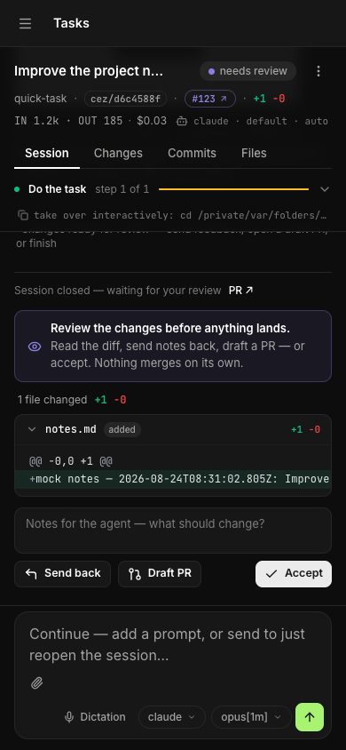

<div align="center">
  <h1>Cezar：编排数百个 AI 编程智能体，7×24 小时不间断。</h1>
</div>

<h4 align="center">
  <a href="https://www.youtube.com/watch?v=nNLJm9gArnE">演示</a>&nbsp;·
  <a href="#快速开始">快速开始</a>&nbsp;·
  <a href="docs/reference.md">文档</a>&nbsp;·
  <a href="https://github.com/open-mercato/cezar/issues">问题反馈</a>
</h4>

<p align="center">
  <a href="README.md">English</a> | 简体中文 | <a href="README.zh-TW.md">繁體中文</a>
</p>

> 本文译自 README.md @ 33aee0ee；如有出入，以英文版为准。

<div align="center">
  <h2>
    一个面向 Claude Code、Codex、OpenCode 及其他编程智能体的控制台。<br />
    在本地或 VPS 上运行智能体，自动化多步骤工作流，<br />
    并让它们在你离开时继续工作。
  </h2>
</div>

<p align="center">
  <a href="LICENSE">
    </a>
  <a href="https://www.npmjs.com/package/@open-mercato/cezar">
    </a>
  
  <a href="https://github.com/open-mercato/cezar/pulls">
    </a>
</p>

<p align="center">
  <a href="https://openmercatocloud.com/247agentic-cear" target="_blank" rel="noopener">
    </a>
</p>

<div align="center">
  <a href="https://www.youtube.com/watch?v=nNLJm9gArnE" target="_blank" rel="noopener">
    
  </a>
  <p align="center"><em>▶ 观看视频：认识 cezar，你的全新并行编程工具。</em></p>
</div>

## 功能特性

- 💯&nbsp;免费且开源。
- 🖥️&nbsp;使用你自己的 `claude`、`codex`、`opencode` 或 `pi` 登录账号，无需 API key。
- ☁️&nbsp;在 VPS 上轻松部署，合上笔记本后智能体也能继续工作。
- 📱&nbsp;完整响应式设计，在手机上就能启动和审查任务。
- 🔀&nbsp;每个任务都有自己的 git worktree，多个智能体可以同时开工；多出来的任务会排队等待。
- 🤖&nbsp;打开 **Autonomous**（自主运行）后，任务不会再停下来提问，而是一口气跑完。
- 📡&nbsp;实时观看运行过程：智能体输出、工具调用、token 与费用。
- 🏁&nbsp;同一个任务跑 2 份或 3 份，对比 diff，留下最好的那个。
- 🧩&nbsp;Skills 是 Markdown 文件，工作流是简短的 YAML 文件。每一步都可以换成不同的智能体。
- 🐙&nbsp;直接针对 GitHub issue 运行智能体。不会自动合并任何内容。
- 📂&nbsp;一个驾驶舱管理所有项目。
- 💾&nbsp;无需数据库。所有内容都以普通文件的形式保存在 `.ai/cezar/` 中。

## 截图

**并行任务** —— 运行并排队大量任务，每个任务都有自己的 git worktree。

[](docs/screenshots/task-view.png)

**实时运行** —— 每一步、每次工具调用和每个 token，都实时呈现。

[](docs/screenshots/live-run.png)

**多版本对比** —— 同一个任务跑 2 份或 3 份，保留最好的 diff。

[](docs/screenshots/variants-compare.png)

**工作流** —— 把 Skills 和检查拖成一条链路，保存为 YAML。

[](docs/screenshots/workflow-builder.png)

**GitHub** —— 一键把打开的 issue 交给智能体。

[](docs/screenshots/github-issues.png)

**Skills + Autonomous** —— 选一套现成的流程，打开 Autonomous 就可以走开了。

[](docs/screenshots/skills-autonomous.png)

**手机端** —— 同样的驾驶舱，从任务列表一直到 diff。

<table>
  <tr>
    <td width="33%"></td>
    <td width="33%"></td>
    <td width="33%"></td>
  </tr>
</table>

## 快速开始

你需要 **Node 20+**，以及至少一个已登录的 agent CLI：
[Claude Code](https://github.com/anthropics/claude-code)、[Codex](https://github.com/openai/codex)、
[OpenCode](https://opencode.ai) 或 [pi](https://github.com/badlogic/pi-mono)。
`git` 和 `gh` 是可选的。

```bash
cd your-repo
npx cezar-cli
```

这会在 `http://localhost:4321` 打开驾驶舱。输入任务、选择工作流，然后点击 **Start**。

```bash
npx cezar-cli run "add a --json flag to the export command"   # headless, no browser
npx cezar-cli init                                            # scaffold .ai/cezar/
npx cezar-cli@nightly                                         # try tonight's build
```

> 只是想先随便看看？运行 `CEZ_DRY_RUN=1 npx cezar-cli`。它使用内置的 mock agent，无需登录。

### 部署到服务器

```bash
npx cezar-cli server-install --platform ubuntu-vps
```

它会配置好 HTTPS、登录认证和系统服务，让你可以从任何地方打开驾驶舱，包括手机。
我们提供了 [Ubuntu VPS](docs/server-install/ubuntu-vps.md) 和 [macOS + ngrok](docs/server-install/macosx-ngrok.md) 两份指南。

## 工作原理

1. **你描述一个任务。** 直接输入、附加文件，或从 GitHub issue 开始。
2. **cezar 运行工作流**（agent 步骤加 shell 检查），在全新的 git worktree 中使用你自己的 agent CLI 执行。
3. **驾驶舱会实时推送每一步。** 如果检查失败，智能体会看到错误并重试。
4. **你检查结果。** 阅读 diff、回传修改意见，或者开一个 draft PR。

工作流是 `.ai/cezar/workflows/` 下的一个小型 YAML 文件：

```yaml
name: fix-and-verify
steps:
  - id: implement
    prompt: "{{task}}"
    skill: project-conventions   # optional: a Markdown skill from .ai/skills
    runner: codex                # optional: which agent runs this step
  - id: verify
    command: "npm test"          # exit 0 = pass
    onFail: { retry: implement, max: 2 }
```

内置的 `quick-task` 工作流无需任何配置即可运行。

## 文档

更详细的内容都在[参考文档](docs/reference.md)里：
[配置](docs/reference.md#configuration-optional)、
[环境变量](docs/reference.md#how-it-runs-agents)、
[agent 后端](docs/reference.md#coding-agent-backends)、
[多项目](docs/reference.md#multiple-projects-one-cockpit)、
[远程访问](docs/reference.md#remote-access-host-cezar-on-a-server)和
[本地开发](docs/reference.md#local-development)。

## 参与贡献

- 发现了 bug 或者少了什么功能？[提交 issue](https://github.com/open-mercato/cezar/issues)。
- 想参与贡献？欢迎提交 PR。可以先从[本地开发](docs/reference.md#local-development)入手：

```bash
git clone https://github.com/open-mercato/cezar.git && cd cezar
npm install
npm run dev
```

## 许可证

**MIT** © Patryk Lewczuk。完整内容见 [LICENSE](LICENSE)。

## Jira 与 Linear

在设置中接入项目的 issue 追踪服务，即可浏览 issue、启动工作流并配置事件自动化。参见[设置、权限与恢复](docs/issue-trackers.md)。
